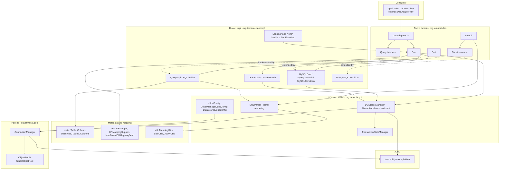
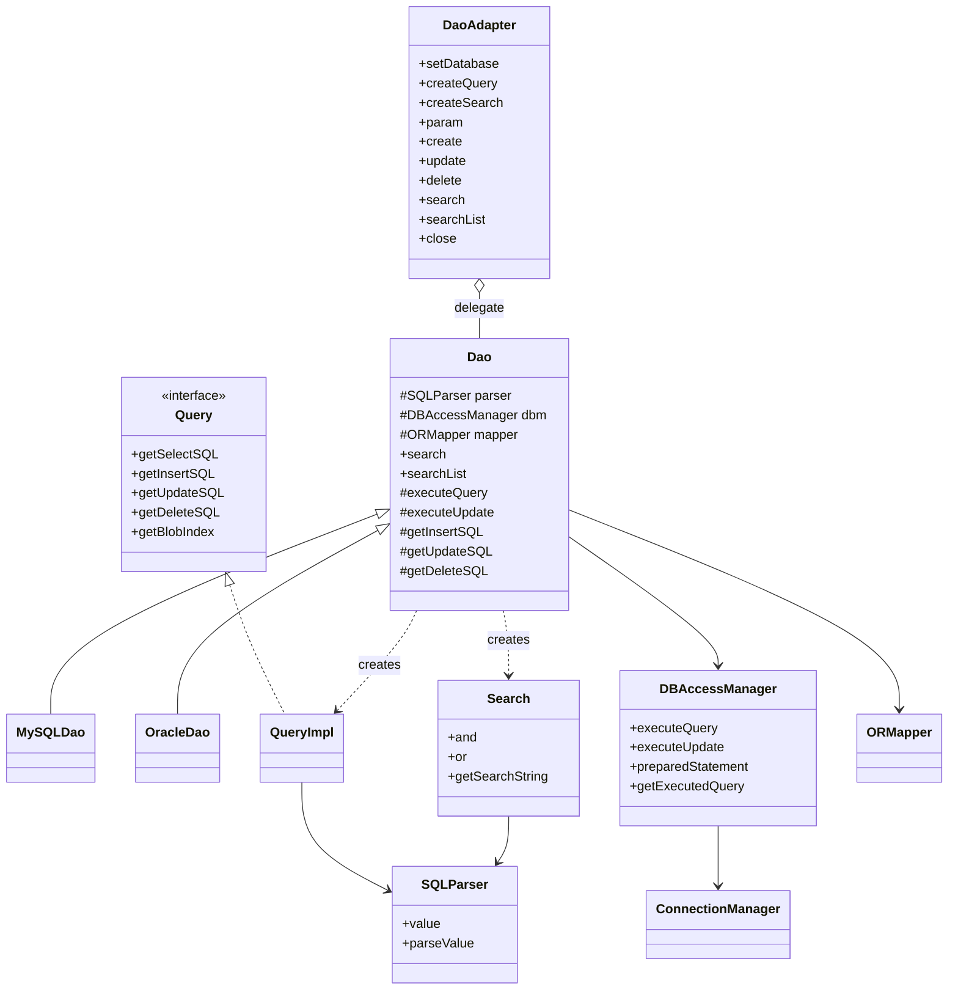
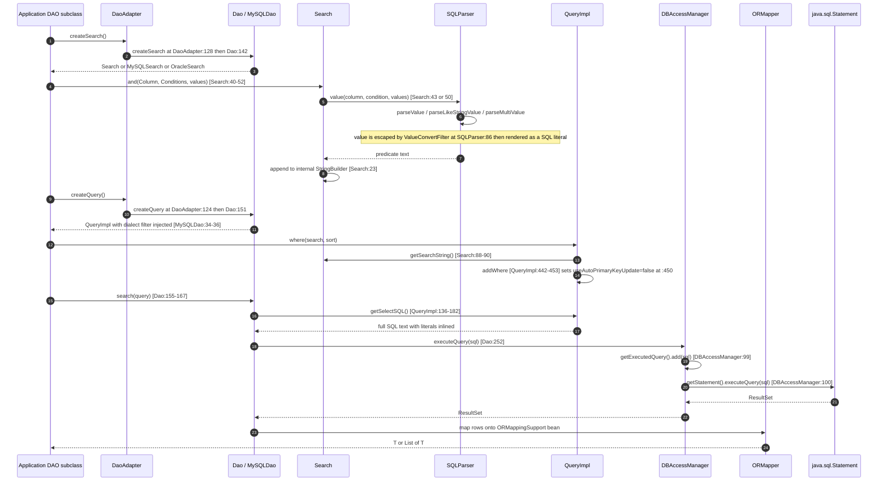
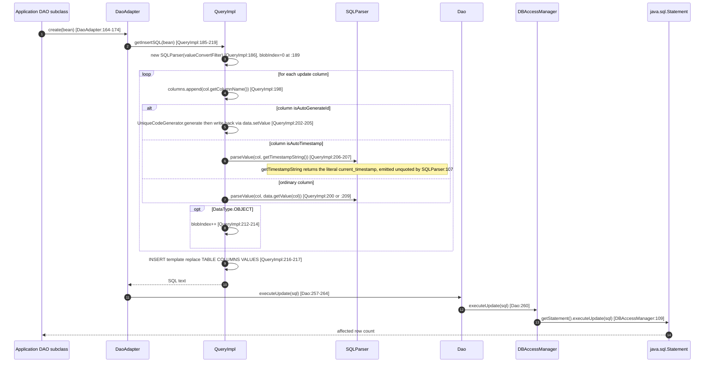
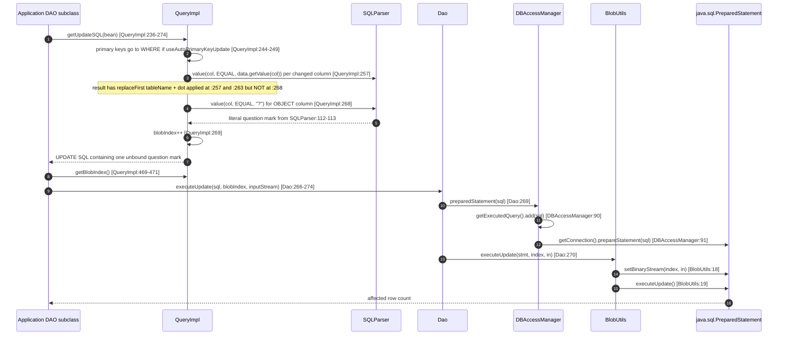
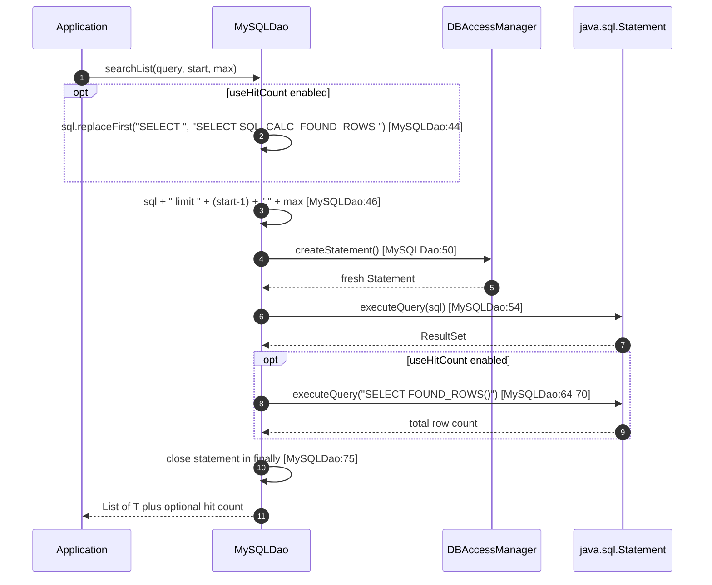
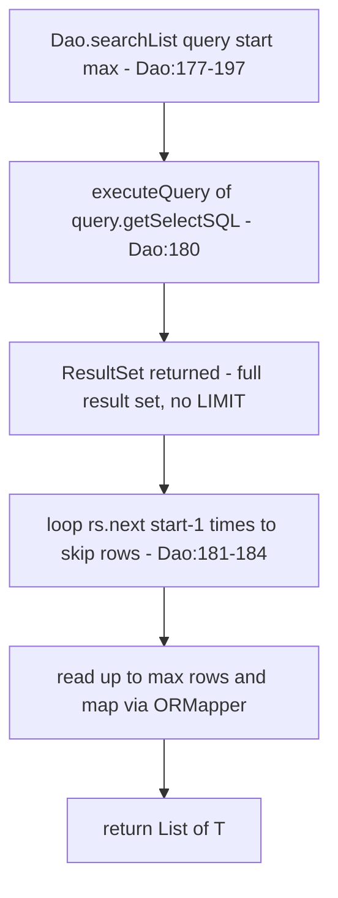
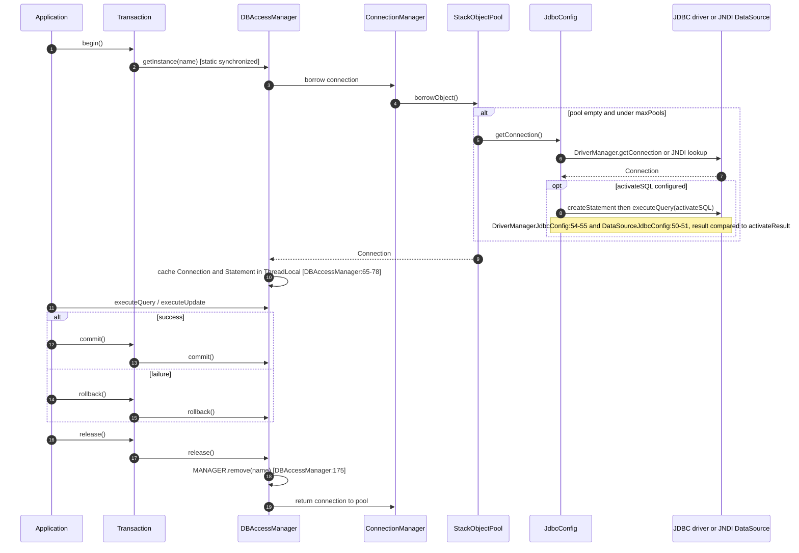
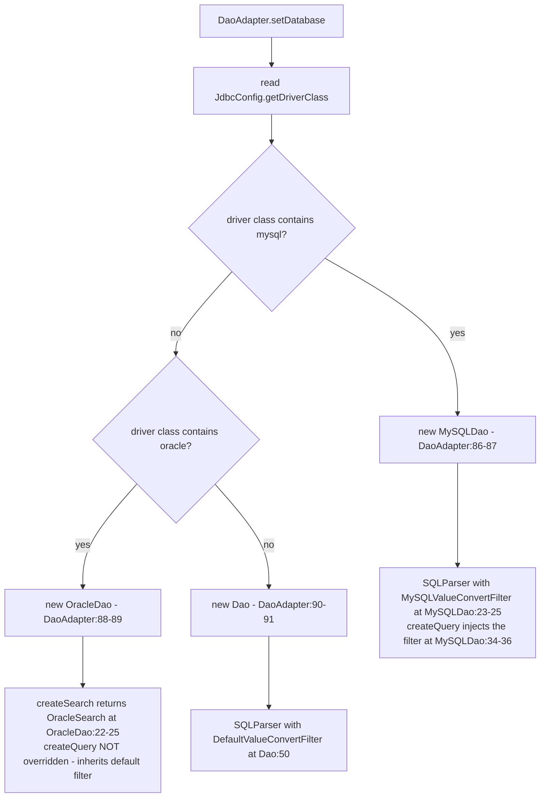

# Architecture — tamacat-dao

> Reverse-engineered from commit `e51c32739506565c572fed458c1fbba51bbab846`, branch
> `v2.0`. This document describes the architecture **as built**. It records design facts,
> including the SQL-string-concatenation design, without proposing alternatives.

## Architectural Style

A **single-module layered library** with a **template-method + strategy** core:

- **Layered.** Four horizontal layers — public facade, SQL assembly, JDBC session, and
  connection pooling — with a metadata model and an O/R mapper sitting alongside.
- **Template method.** `Dao` defines the execute-and-map algorithm; `MySQLDao` and
  `OracleDao` override selected steps (parser construction, pagination, hit count).
  `DaoAdapter<T>` composes rather than inherits: it holds a `Dao` delegate and forwards.
- **Strategy.** `Search.ValueConvertFilter` (escaping), `Search.Conditions` (operator
  vocabulary), `validation/Validator`, `event/DaoExecuteHandler`,
  `event/DaoTransactionHandler`, `pool/PoolableObjectFactory`, and `sql/JdbcConfig` are
  all interface-typed extension points swapped per dialect or per deployment.
- **Runtime dialect dispatch by string match.** `DaoAdapter.setDatabase`
  (`DaoAdapter.java:86-92`) selects the dialect from a substring of the configured driver
  class name: `"mysql"` → `MySQLDao`, `"oracle"` → `OracleDao`, otherwise plain `Dao`.
- **XML dependency injection at the edge.** `tamacat-core`'s `DI`/`DIContainer` reads
  `db.xml` (and `orm.xml`) to instantiate `JdbcConfig` beans; nothing else in the library
  is container-managed.

There is **no** ORM framework, no proxy generation, no annotation processing, and no code
generation. Everything is plain Java 8 executed directly.

## The Central Design Fact: SQL Is Built by String Concatenation

Values supplied by the caller are **rendered into the SQL text as literals** and the
finished string is handed to `java.sql.Statement`. Two primitives in
`org/tamacat/sql/SQLParser.java` perform every value interpolation in the system:

| Primitive | Location | Role |
|---|---|---|
| `parseValue(Column, String)` | `SQLParser.java:85-117` | Renders one value as a SQL literal, per `DataType` |
| `value(Column, Conditions, String...)` | `SQLParser.java:39-73` | Builds one predicate — column name + operator + rendered value(s) |

`parseValue` behaviour by `DataType`:

| DataType | Rendering | Line |
|---|---|---|
| STRING, BOOLEAN | quote-wrapped after the escape filter; `null` passes through unquoted | 87-91 |
| NUMERIC, FLOAT | empty → `null`; regex-validated then emitted bare; non-numeric → `InvalidParameterException` | 93-101 |
| TIME, DATE | empty or `"NULL"` → `null`; the exact literal `current_timestamp` emitted bare (marked `//TODO` at 107); otherwise quote-wrapped | 104-110 |
| OBJECT | returns the literal `"?"` — the one pre-existing bind placeholder | 112-113 |
| FUNCTION and fallback | emitted bare, unquoted, unfiltered | 115 |

The only sanitization is `ValueConvertFilter.convertValue` applied at `SQLParser.java:86`.
Three implementations exist:

| Filter | Location | Transformation | Null-safe |
|---|---|---|---|
| `Search.DefaultValueConvertFilter` | `Search.java:99-107` | `'` → `''` | yes |
| `MySQLSearch.MySQLValueConvertFilter` | `MySQLSearch.java:11-20` | `'` → `''` and `\` → `\\` | yes |
| `OracleSearch.OracleValueConvertFilter` | `OracleSearch.java:11-15` | `'` → `''` | **no** |

An ordering detail at `SQLParser.java:57`: the raw value is substituted into the
condition's `replaceHolder` **first**, and the combined string is then passed to
`parseValue`, which applies the escape filter to the whole result. For `EQUAL` this is
equivalent; for `LIKE_*` holders (`%#{value1}%`) the framework's own `%` wrappers are
inside the string handed to the filter.

Template tokens are `#{value1}`, `#{value2}`, `#{values}` (`SQLParser.java:21-24`),
carried on the `Conditions` enum constants (`Condition.java:11-24`).

### Where bind parameters do exist

Exactly one live bind path in `src/main` (excluding `org.tamacat.mock`):

1. `SQLParser.parseValue` returns `"?"` for `DataType.OBJECT` (`SQLParser.java:112-113`).
2. `QueryImpl.getInsertSQL` emits that `?` in the VALUES list and increments `blobIndex`
   (`QueryImpl.java:200-214`); `QueryImpl.getUpdateSQL` emits it explicitly at
   `QueryImpl.java:268` and increments at `:269`.
3. The caller reads the position via `Query.getBlobIndex()` (`QueryImpl.java:469-471`)
   and calls `Dao.executeUpdate(sql, index, in)` (`Dao.java:266-274`).
4. `DBAccessManager.preparedStatement(sql)` (`:88-95`) creates the only non-mock
   `PreparedStatement` in `src/main` at `:91`.
5. `BlobUtils.executeUpdate` calls `stmt.setBinaryStream(index, in)`
   (`BlobUtils.java:18`) — **the only `PreparedStatement.setXxx` call in `src/main`**.
   There is no `setString` / `setInt` / `setDate` / `setNull` anywhere.

Other `?` characters in the codebase are **not** bind placeholders:

- `SQLParser.ESCAPE = " escape '?'"` (`SQLParser.java:27`) — the `?` is a placeholder for
  the escape character, always substituted before emission by `ESCAPE.replace('?', e)`
  at `SQLParser.java:134`.
- `OracleDao.searchListForOracle` emits genuine `?` at lines 44 and 46 which are never
  bound; that method is dead (see `code-quality-assessment.md`).
- MySQL pagination concatenates ints directly: `sql + " limit " + (start - 1) + "," + max`
  (`MySQLDao.java:46`).

## Layer Diagram

<!-- Text fallback: Six layers top to bottom. (0) Consumer: an application DAO subclass extending DaoAdapter<T>. (1) Public facade org.tamacat.dao: DaoAdapter, Dao, Query interface, Search, Sort, Condition enum. (2) Dialect implementations org.tamacat.dao.impl: QueryImpl (the SQL builder), MySQLDao/MySQLSearch/MySQLCondition, OracleDao/OracleSearch, PostgreSQLCondition, and the event handlers. (3) Metadata and mapping: meta package (Table, Column, DataType, factories), orm package (ORMapper, ORMappingSupport, MapBasedORMappingBean), util package (MappingUtils, BlobUtils, JSONUtils). (4) SQL and JDBC org.tamacat.sql: SQLParser (literal rendering), DBAccessManager (ThreadLocal connection and statement), the JdbcConfig family, TransactionStateManager. (5) Pooling org.tamacat.pool: ConnectionManager over ObjectPool/StackObjectPool. (6) The JDBC driver. Flow: the application calls DaoAdapter, which delegates to Dao and creates Query objects; Dao creates QueryImpl and may be a MySQLDao or OracleDao; Search and QueryImpl both call SQLParser; QueryImpl reads the meta model; Dao uses the orm package for row mapping and DBAccessManager for execution; DBAccessManager borrows from ConnectionManager which is configured by JdbcConfig and backed by ObjectPool; both DBAccessManager and ConnectionManager talk to the JDBC driver. -->

## Component Relationships

<!-- Text fallback: DaoAdapter<T> holds a Dao<T> delegate (composition, not inheritance). Dao<T> is subclassed by MySQLDao and OracleDao. QueryImpl implements the Query interface. Dao creates QueryImpl and Search instances. Both QueryImpl and Search depend on SQLParser for value rendering. Dao depends on DBAccessManager for execution and ORMapper for row mapping. DBAccessManager borrows connections from ConnectionManager. -->

## Interaction Diagrams

These depict how the library's business transactions are actually implemented across
components. Every line number below is from the scanned source.

### 1. SELECT with a WHERE predicate (read transaction)

<!-- Text fallback: The application asks DaoAdapter for a Search (DaoAdapter:128 to Dao:142), which returns the dialect-appropriate Search. Each and()/or() call routes to SQLParser.value, which escapes the value via ValueConvertFilter at SQLParser:86 and renders it as a SQL literal, appending the predicate to Search's internal StringBuilder at Search:23. The application then asks for a Query (DaoAdapter:124 to Dao:151); MySQLDao injects its own value-convert filter at MySQLDao:34-36. Query.where pulls Search.getSearchString() and routes through addWhere (QueryImpl:442-453), which also sets useAutoPrimaryKeyUpdate to false at line 450. Dao.search calls query.getSelectSQL() (QueryImpl:136-182), producing SQL text with all values already inlined as literals, and passes that string to DBAccessManager.executeQuery (Dao:252). DBAccessManager records the SQL in its ThreadLocal executed-query list at line 99 and calls Statement.executeQuery at line 100 — a plain Statement, not a PreparedStatement. The ResultSet flows back to ORMapper, which populates the application's bean. -->

### 2. INSERT (write transaction, non-BLOB)

<!-- Text fallback: DaoAdapter.create (line 164-174) calls QueryImpl.getInsertSQL (185-219). That method constructs a fresh SQLParser carrying the dialect filter at line 186 and resets blobIndex at 189. For each update column it appends the bare column name at line 198 and selects a value: auto-generate-id columns get a UniqueCodeGenerator value written back onto the bean (202-205); auto-timestamp columns get getTimestampString(), which returns the literal string current_timestamp that SQLParser line 107 emits unquoted; ordinary columns go through parseValue (200 or 209). OBJECT columns increment blobIndex (212-214). The template INSERT INTO ${TABLE} (${COLUMNS}) VALUES (${VALUES}) is filled by string replace at 216-217. The finished string goes to Dao.executeUpdate (257-264) and then DBAccessManager.executeUpdate, which calls plain Statement.executeUpdate at line 109. -->

### 3. UPDATE with a BLOB column (the one bind-parameter path)

<!-- Text fallback: QueryImpl.getUpdateSQL (236-274) puts primary keys into the WHERE clause when useAutoPrimaryKeyUpdate is still true (244-249), renders each changed column through SQLParser.value with Condition.EQUAL (line 257) applying replaceFirst on the table-name prefix, and for an OBJECT column emits SQLParser.value(col, EQUAL, "?") at line 268 — note that this branch omits the replaceFirst, so a BLOB column stays table-qualified — then increments blobIndex at 269. The returned SQL contains one unbound question mark. The caller reads its position with getBlobIndex (469-471) and calls Dao.executeUpdate(sql, index, inputStream) (266-274), which routes to DBAccessManager.preparedStatement (line 91, the only non-mock prepareStatement call in src/main; note the SQL is recorded at line 90 before any parameter is set) and then BlobUtils.executeUpdate, which calls setBinaryStream at BlobUtils:18 — the only PreparedStatement.setXxx call in src/main — and executeUpdate at line 19. -->

### 4. MySQL paginated search with hit count

<!-- Text fallback: MySQLDao.searchList optionally rewrites the leading SELECT into SELECT SQL_CALC_FOUND_ROWS via replaceFirst at line 44, then appends a LIMIT clause by concatenating the integer start-1 and max at line 46. It acquires a fresh Statement from DBAccessManager.createStatement at line 50 (rather than the shared ThreadLocal one), executes at line 54, optionally issues a second constant query SELECT FOUND_ROWS() at 64-70 to obtain the total, and closes the statement in a finally block at line 75. -->

### 5. Generic (non-MySQL) pagination

<!-- Text fallback: For every dialect except MySQL, Dao.searchList (177-197) executes the unlimited SELECT at line 180, then implements the offset by calling rs.next() in a loop to skip start-1 rows (lines 181-184) before reading up to max rows and mapping them. This is a full row-scan pagination. -->

### 6. Connection acquisition and transaction lifecycle

<!-- Text fallback: Transaction.begin obtains a DBAccessManager instance via the static synchronized getInstance(name). DBAccessManager borrows a connection from ConnectionManager, which borrows from a StackObjectPool; if the pool is empty and below maxPools, the JdbcConfig creates a new connection through DriverManager or a JNDI DataSource lookup, and when activateSQL is configured it runs that probe statement and compares the result to activateResult (DriverManagerJdbcConfig:54-55, DataSourceJdbcConfig:50-51). DBAccessManager caches the Connection and a lazily created Statement in ThreadLocals (lines 65-78). The application then executes queries and updates. On success Transaction.commit is called, on failure Transaction.rollback. release() removes the manager from the static MANAGER map at DBAccessManager:175 and returns the connection to the pool. -->

## Dialect Architecture

Dialect selection happens once, at `DaoAdapter.setDatabase` (`DaoAdapter.java:86-92`), by
substring match on the configured driver class name.

<!-- Text fallback: DaoAdapter.setDatabase reads JdbcConfig.getDriverClass(). If the class name contains "mysql" it builds a MySQLDao (lines 86-87), which wires MySQLValueConvertFilter both into its own SQLParser field (MySQLDao:23-25) and into every Query it creates (MySQLDao:34-36). If it contains "oracle" it builds an OracleDao (88-89), which overrides createSearch to return an OracleSearch (OracleDao:22-25) but does NOT override createQuery — so INSERT and UPDATE literals use the default filter while WHERE predicates use the Oracle one. Otherwise it builds a plain Dao (90-91) using the DefaultValueConvertFilter (Dao:50). Note: DataSourceJdbcConfig.getDriverClass() returns null (DataSourceJdbcConfig:92-94), so a JNDI-datasource configuration reaches this branch with a null driver class. -->

Per-dialect behaviour differences:

| Concern | Generic (`Dao`/`Search`) | MySQL | Oracle | PostgreSQL |
|---|---|---|---|---|
| Selection | fallback, `DaoAdapter.java:90-91` | `:86-87`, driver class contains `mysql` | `:88-89`, contains `oracle` | no dialect class — falls to generic |
| Escape filter | `DefaultValueConvertFilter`, `'`→`''` (`Search.java:99-107`) | `MySQLValueConvertFilter`, `'`→`''` and `\`→`\\` (`MySQLSearch.java:13-19`) | `OracleValueConvertFilter`, `'`→`''`, no null guard (`OracleSearch.java:12-14`) | uses `DefaultValueConvertFilter` |
| Query factory | `QueryImpl()` no filter (`Dao.java:151-153`) | `QueryImpl(MySQLValueConvertFilter)` (`MySQLDao.java:34-36`) | **not overridden** — inherits `Dao.createQuery()`, so INSERT/UPDATE literals use the default filter while `createSearch()` returns an `OracleSearch`. Asymmetric. | n/a |
| Parser field on `Dao` | `new SQLParser()` (`Dao.java:50`) | `new SQLParser(MySQLValueConvertFilter)` (`MySQLDao.java:23-25`) | not set — inherits default | n/a |
| Pagination | `rs.next()` row-skip loop (`Dao.java:181-184`) | `sql + " limit " + (start-1) + "," + max` (`MySQLDao.java:46`); optional `SELECT SQL_CALC_FOUND_ROWS` via `replaceFirst("SELECT ", ...)` (`:44`) | `searchListForOracle` rownum wrapper with unbound `?` (`OracleDao.java:38-47`), **not wired into `searchList`** | inherits generic |
| Hit count | none | `SELECT FOUND_ROWS()` second query (`MySQLDao.java:64-70`), gated on `useHitCount` | commented out (`OracleDao.java:64-68`) | none |
| Extra conditions | `Condition` enum only | `MySQLCondition.REGEXP(" regexp ")`, `RLIKE(" rlike ")` | none | `PostgreSQLCondition.REGEXP(" ~ ")` |
| Statement acquisition | shared ThreadLocal `Statement` (`DBAccessManager.java:65-78`) | fresh `createStatement()` per call, closed in `finally` (`MySQLDao.java:50, 75`) | inherits generic | inherits generic |

`getTimestampString()` returns the literal `"current_timestamp"` for all dialects
(`QueryImpl.java:463-466`); `SQLParser.parseValue` special-cases that exact string at line
107 (marked `//TODO`) so it is emitted unquoted.

## Predicate Construction Patterns

### LIKE

`Condition.LIKE_HEAD(" like ", "#{value1}%")`, `LIKE_PART(" like ", "%#{value1}%")`,
`LIKE_TAIL(" like ", "%#{value1}")` (`Condition.java:11-13`).

The LIKE branch at `SQLParser.java:48-50` is taken only when the column is STRING or
BOOLEAN **and** `condition.getCondition().indexOf(" like ") >= 0`. A `LIKE_*` condition on
a NUMERIC / DATE / TIME column falls through to the generic branch at line 57 and does
**not** get wildcard escaping.

`parseLikeStringValue` (`SQLParser.java:119-139`) observed behaviour:

- `null` becomes `""` at line 120, so `like null` renders as `like ''`.
- An `escape 'X'` clause is emitted **only when the value itself contains `%` or `_`**
  (line 124); otherwise line 138 takes the plain path with no escape suffix. Asserted by
  `SQLParserTest.java:114-121`.
- The escape character is chosen dynamically from the candidate set `$ # ~ ! ^`
  (line 125) — the first one not already present in the value. Asserted by
  `SQLParserTest.java:114` (`$`) and `:116` (falls through to `#`).
- If the value contains **all five** candidates, the `for` loop completes without
  returning and control falls to line 138: `%` and `_` are then emitted **unescaped** as
  active wildcards with no `escape` clause. No test covers this.
- Ordering: wildcards are escaped at line 128 **before** the LIKE `%` wrappers are added
  at 129, so the framework's own wrappers are not escaped; the quote filter runs at 130,
  after both.

### IN and BETWEEN

`Condition.IN(" in ", "(#{values})")` (`Condition.java:23`). Two entry paths, both landing
in `parseMultiValue` (`SQLParser.java:75-83`):

- Single value: `SQLParser.java:51-52`, guarded by
  `condition.getCondition().equals(" in ")` — an **exact string equality** check, so a
  custom `Conditions` implementation with different spacing bypasses the IN path.
- Two or more values: `SQLParser.java:66-68`.

`parseMultiValue` renders each element through `parseValue` individually (line 80) and
joins with commas, then substitutes into `(#{values})` at line 82. The term count varies
with argument count. Pinned by `SQLParserTest.java:125-140` and `SearchTest.java:60-77`:
string columns yield `('abc','def','xyz')`, numeric `(123,456,789)`, a null argument
`(null)`, an empty string `('')` for STRING and `(null)` for NUMERIC.

`Condition.BETWEEN(" between ", "#{value1} and #{value2}")` (`Condition.java:16`) is
expanded at `SQLParser.java:62-65` and asserted at `SQLParserTest.java:107-110`.

### Raw-SQL escape hatches

Several paths append caller-supplied text into the SQL verbatim, bypassing `SQLParser`
entirely:

| Path | Location | What is appended raw |
|---|---|---|
| `Query.where(String)` / `and(String)` / `or(String)` | `Query.java:130-134`, `QueryImpl.java:374-386` | the caller's SQL fragment, through `addWhere` |
| `QueryImpl.andIn` / `andNotIn` / `andExists` / `andNotExists` | `QueryImpl.java:389-406` | the child query's full `getSelectSQL()` text, inlined into the parent WHERE |
| `Sort.sort(Object k, Object o)` | `Sort.java:47-60` | when `k` is not a `Column`, line 57 appends `k.toString() + " " + o.toString()` into ORDER BY |
| `QueryImpl.andOuterJoin` | `QueryImpl.java:351-356` | `search.getSearchString()` into the join clause |
| `Column.getFunctionName()` | `QueryImpl.java:152` | emitted raw into the SELECT list |
| `DataType.FUNCTION` values | `SQLParser.java:115` | emitted bare, unquoted, unfiltered |

Function names and `DataType.FUNCTION` columns are developer-supplied metadata rather than
runtime values.

### The `useAutoPrimaryKeyUpdate` coupling

`QueryImpl.useAutoPrimaryKeyUpdate` (`QueryImpl.java:52`) starts true. **Any** call to
`addWhere` (`:442-453`) — reached from every `where(String)`, `and(Search,Sort)`, `join`,
`andIn`, `andExists` — sets it to `false` at line 450, which suppresses the automatic
primary-key predicate in `getUpdateSQL` / `getDeleteSQL`. The `where` field is a single
shared `StringBuilder` (`QueryImpl.java:48`) that is **never reset**, so a `QueryImpl`
instance is single-use: calling `getUpdateSQL` twice appends the primary-key predicate
twice.

## Execution Surface

Every JDBC execution site in `src/main` (excluding `org.tamacat.mock`):

| File:line | Call | Statement kind |
|---|---|---|
| `DBAccessManager.java:100` | `getStatement().executeQuery(sql)` | `Statement` |
| `DBAccessManager.java:109` | `getStatement().executeUpdate(sql)` | `Statement` |
| `DBAccessManager.java:91` | `getConnection().prepareStatement(sql)` | `PreparedStatement`, BLOB path only |
| `DBAccessManager.java:69`, `:82` | `createStatement()` | `Statement` |
| `MySQLDao.java:50` | `dbm.createStatement()` | `Statement` |
| `MySQLDao.java:54` | `stmt.executeQuery(sql)` | `Statement` |
| `MySQLDao.java:65` | `stmt.executeQuery("SELECT FOUND_ROWS()")` | `Statement`, constant SQL |
| `OracleDao.java:51` | `executeQuery(sql)` where the SQL contains unbound `?` | `Statement` — broken, dead code |
| `BlobUtils.java:19` | `stmt.executeUpdate()` | `PreparedStatement` |
| `DriverManagerJdbcConfig.java:54-55` | `con.createStatement()`, `stmt.executeQuery(activateSQL)` | `Statement`, config-supplied SQL |
| `DataSourceJdbcConfig.java:50-51` | same | `Statement`, config-supplied SQL |

## Cross-Cutting Concerns

- **Session state.** `DBAccessManager` is a per-name singleton held in a static `MANAGER`
  map, with `executedQuery`, `running`, `con`, and `stmt` all held as `ThreadLocal`
  fields on that shared instance. `getInstance` is `synchronized` on the class; `release`
  is `synchronized` on the instance yet mutates the static map at `:175`.
- **SQL audit trail.** `DBAccessManager.getExecutedQuery()` (`:181-188`) is a
  `ThreadLocal<List<String>>` populated at `:90` (prepared), `:99` (query), and `:109`
  (update). It records **only SQL text**; no companion structure records bound parameter
  values, and the prepared entry at `:90` is added before any parameter is set. This list
  is the de-facto assertion channel for the end-to-end tests.
- **Events.** `event/DaoExecuteHandler` (4 methods) and `event/DaoTransactionHandler`
  (8 methods) are the observation SPI; `impl` ships `Logging*` and `None*`
  implementations plus `DaoEventImpl`.
- **Errors.** `DaoException extends RuntimeException`;
  `InvalidParameterException extends IllegalArgumentException`;
  `InvalidValueLengthException`. `Dao.handleException` is the funnel.
- **Logging** goes through `tamacat-core`'s `Log`/`LogFactory`; there is no direct
  slf4j or logback import in `src/main`.

## Stated Unknowns

Carried forward from the code scan without inference:

- The contract of `Query.getBlobIndex()` — 1-based JDBC parameter position or a count of
  OBJECT columns — is **not determined**. No caller exists in this repository and no test
  asserts it.
- Whether the JNDI `DataSourceJdbcConfig` path is exercised anywhere is **not
  determined**. `DataSourceJdbcConfig.getDriverClass()` returns `null`
  (`DataSourceJdbcConfig.java:92-94`), which would NPE at `DaoAdapter.java:86`; the scan
  did not trace whether that path is reachable in the one passing
  `DataSourceConnectionManagerTest`.
- Whether any dialect beyond MySQL / Oracle / generic is used in production is **not
  determined**.
- The intended fix behind the `TODO: bugfix` on `OracleDao.searchListForOracle` is **not
  determined** — no detail in the comment, no issue reference in the repository.
- **Real-database behaviour of any generated SQL is not determined.** The entire executing
  test suite runs against `MockDriver` / `MockStatement`, which log SQL and return canned
  results without parsing it. No executing test validates that generated SQL is accepted
  by a real engine.
- `org.tamacat:tamacat-core:1.5` internals were read only at usage sites.
