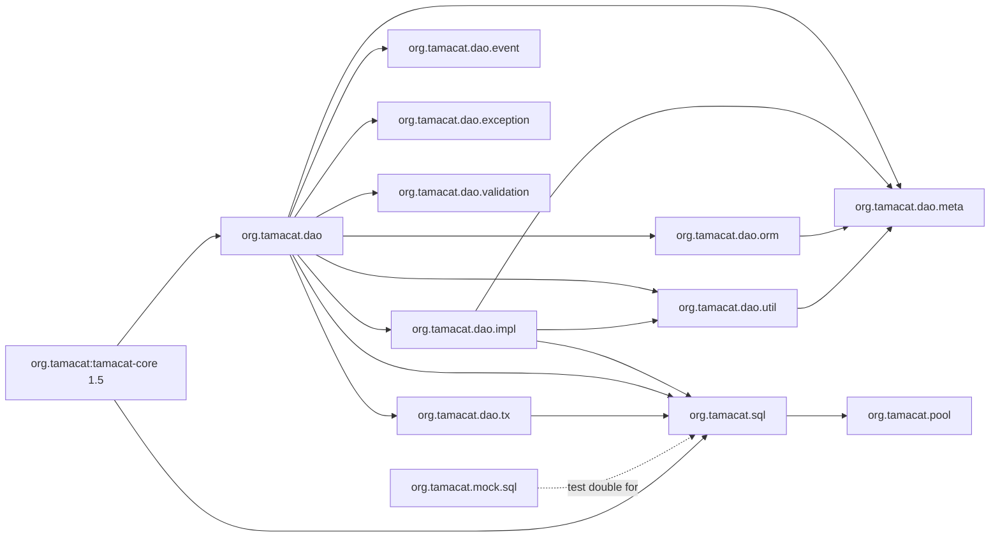

# Component Inventory — tamacat-dao

> Reverse-engineered from commit `e51c32739506565c572fed458c1fbba51bbab846`, branch
> `v2.0`. Every component the library ships, with its responsibility and its dependencies.

## Inventory Conventions

- **Depends on** lists intra-repository dependencies plus `java.sql` / `javax.sql` /
  `javax.naming` / `javax.json` / `tamacat-core` where they matter.
- Line references are from the scanned source and identify the load-bearing behaviour.
- "SQL-bearing" marks a component that either builds SQL text or hands SQL to a driver.

## Public Facade — `org.tamacat.dao`

| Component | Responsibility | Depends on | SQL-bearing |
|---|---|---|---|
| `DaoAdapter<T>` | Application-facing facade. Holds a `Dao` delegate (composition). Selects the dialect at `setDatabase` by substring match on the driver class name (`:86-92`). Forwards `create` / `update` / `delete` (`:164-174`), `createQuery` (`:124`), `createSearch` (`:128`), `param` (`:120-122`). Implements `AutoCloseable`. `getInsertSQL` / `getUpdateSQL` / `getDeleteSQL` throw `RuntimeException(NoSuchMethodException)` by default (`:152-162`) | `Dao`, `Query`, `Search`, `JdbcConfig` | indirectly |
| `Dao<T>` | Execute-and-map template. Holds `SQLParser` (`:50`), `DBAccessManager`, `ORMapper`. `search` (155-167), `searchList` with `rs.next()` offset loop (177-197), `param` (138-140), `createSearch` (142), `createQuery` (151-153), `executeQuery` (249-255), `executeUpdate` (257-264), `executeUpdate(String,int,InputStream)` (266-274). Default `getInsertSQL` / `getUpdateSQL` / `getDeleteSQL` throw (212-222) | `SQLParser`, `DBAccessManager`, `ORMapper`, `QueryImpl`, `Search` | yes |
| `DaoFactory` | Constructs `Dao` instances | `Dao` | no |
| `Query` (interface) | 30-method SQL builder contract; four SQL emitters plus `getBlobIndex`, `getTimestampString`, `autoPrimaryKeyUpdate` | `meta`, `Search`, `Sort` | contract |
| `Search` | WHERE-predicate accumulator into a `StringBuilder` (`:23`); `and`/`or(Column, Conditions, String...)` (40-52) delegate to `SQLParser.value` (43, 50); `getSearchString` (88-90); nested `Conditions` and `ValueConvertFilter`; `DefaultValueConvertFilter` (99-107) escapes `'` to `''`, null-safe | `SQLParser`, `Condition`, `meta/Column` | yes |
| `Sort` | ORDER BY accumulator. `sort(Object k, Object o)` (47-60) appends `k.toString() + " " + o.toString()` raw when `k` is not a `Column` (line 57) | `meta/Column` | yes |
| `Condition` (enum) | Operator strings and value templates (11-24), including `LIKE_HEAD` / `LIKE_PART` / `LIKE_TAIL` (11-13), `BETWEEN` (16), `IS_NULL` / `NOT_NULL` (21-22, null replaceHolder), `IN` (23) | — | yes |

## Dialect and Implementation — `org.tamacat.dao.impl`

| Component | Responsibility | Depends on | SQL-bearing |
|---|---|---|---|
| `QueryImpl` | The SQL builder. `getSelectSQL` (136-182), `getInsertSQL` (185-219), `getUpdateSQL` (236-274), `getDeleteSQL` (277-302), `getDeleteAllSQL` (305-309), `addWhere` (442-453, sets `useAutoPrimaryKeyUpdate=false` at 450), `addSearch` (455-461), `orderBy` (424-434), `groupBy` (409-421), `andIn` / `andNotIn` / `andExists` / `andNotExists` (389-406), `andOuterJoin` (351-356), `where`/`and`/`or(String)` (374-386), `getTimestampString` (463-466, returns the literal `current_timestamp`), `getBlobIndex` (469-471). Templates at `:36-37`. `where` `StringBuilder` at `:48` is never reset — instance is single-use | `SQLParser`, `meta`, `Search`, `Sort`, `util/MappingUtils` | yes |
| `MySQLDao` | MySQL dialect. `SQLParser` with `MySQLValueConvertFilter` (23-25), `createSearch` (28-30), `createQuery` injecting the filter (34-36), `SQL_CALC_FOUND_ROWS` rewrite (`:44`), LIMIT by int concatenation (`:46`), fresh `createStatement` (`:50`), `executeQuery` (`:54`), `SELECT FOUND_ROWS()` (64-70), statement close in `finally` (`:75`) | `Dao`, `MySQLSearch`, `DBAccessManager` | yes |
| `OracleDao` | Oracle dialect. Overrides `createSearch` to return `OracleSearch` (22-25). Does **not** override `createQuery`, so INSERT/UPDATE literals use the default filter. Carries `searchListForOracle` (30-73) — a rownum-pagination method that is **not** an override of `searchList`, is never called, has a `TODO: bugfix` Javadoc at 27-29, commented-out blocks at 54-56 and 64-68, and builds SQL with unbound `?` at lines 44 and 46 executed through `Dao.executeQuery` (`:51`) | `Dao`, `OracleSearch`, `DBAccessManager` | yes |
| `MySQLSearch` | MySQL `Search` subclass; nested `MySQLValueConvertFilter` (11-20) escapes `'` to `''` and `\` to `\\`, null-safe | `Search` | yes |
| `OracleSearch` | Oracle `Search` subclass; nested `OracleValueConvertFilter` (11-15) escapes `'` to `''`; `convertValue` (12-14) has **no null guard** | `Search` | yes |
| `MySQLCondition` (enum) | Adds `REGEXP(" regexp ")` and `RLIKE(" rlike ")` | `Search.Conditions` | yes |
| `PostgreSQLCondition` (enum) | Adds `REGEXP(" ~ ")`. There is **no** `PostgreSQLDao` or `PostgreSQLSearch` | `Search.Conditions` | yes |
| `DaoEventImpl` | Event payload implementation | `event/DaoEvent` | no |
| `LoggingDaoExecuterHandler` | Logs execution events; calls `e.printStackTrace()` at `:29` | `event/DaoExecuteHandler`, `tamacat-core` Log | no |
| `LoggingDaoTransactionHandler` | Logs transaction events | `event/DaoTransactionHandler` | no |
| `NoneDaoExecuteHandler`, `NoneDaoTransactionHandler` | No-op handlers (the defaults) | the event SPIs | no |

## Metadata Model — `org.tamacat.dao.meta`

| Component | Responsibility | Depends on |
|---|---|---|
| `Column` (interface) | ~30 methods: column name, `DataType`, primary-key / not-null / auto-generate-id / auto-timestamp flags, optional function name | `DataType` |
| `DefaultColumn` | Standard `Column` implementation | `Column`, `ColumnDefine` |
| `Table` (interface) | 11 methods: table name and column registry | `Column` |
| `DefaultTable` | Standard `Table` implementation. `registerColumn` (`:113-115`) catches `Exception` and calls `e.printStackTrace()` at `:114` | `Table`, `Column` |
| `Columns` | Static factory for `Column` instances | `DefaultColumn` |
| `Tables` | Static factory for `Table` instances | `DefaultTable` |
| `DataType` (enum) | STRING, BOOLEAN, NUMERIC, FLOAT, DATE, TIME, OBJECT, FUNCTION — drives `SQLParser.parseValue` branching | — |
| `ColumnDefine` | Package-private column definition helper | — |

## O/R Mapping — `org.tamacat.dao.orm`

| Component | Responsibility | Depends on |
|---|---|---|
| `ORMapper` | Walks a `ResultSet` and populates `ORMappingSupport` beans | `java.sql.ResultSet`, `meta`, `util/MappingUtils` |
| `ORMappingSupport` (interface) | 8-method contract a mappable bean implements | `meta/Column` |
| `MapBasedORMappingBean` | `LinkedHashMap`-backed generic bean with nested `GetFilter` / `SetFilter`. Uses the deprecated `BigDecimal.ROUND_HALF_UP` at `:181-185` | `ORMappingSupport`, `util/JSONUtils`, `javax.json` |

## Helpers — `org.tamacat.dao.util`

| Component | Responsibility | Depends on |
|---|---|---|
| `MappingUtils` | Type mapping and `getColumnName(Column)` — used by `SQLParser.value` (`:40`) and `QueryImpl`. `parse` (`:99-102`) is deprecated | `meta`, `tamacat-core` |
| `BlobUtils` | The only bind-parameter site. `executeUpdate(PreparedStatement, int, InputStream)` (15-23): `setBinaryStream` (`:18`), `executeUpdate` (`:19`) | `java.sql.PreparedStatement` |
| `JSONUtils` | JSON serialize/deserialize via JSON-P | `javax.json` |

## Event / Validation SPI

| Component | Responsibility |
|---|---|
| `event/DaoEvent` | Event payload contract |
| `event/DaoExecuteHandler` | 4-method execution observation SPI |
| `event/DaoTransactionHandler` | 8-method transaction observation SPI |
| `validation/Validator` | Single-method validation SPI |

## Exceptions — `org.tamacat.dao.exception`

| Component | Extends | Raised where |
|---|---|---|
| `DaoException` | `RuntimeException` | `Dao.handleException` funnel |
| `InvalidParameterException` | `IllegalArgumentException` | `SQLParser.java:45`, `:101`; `QueryImpl.java:289`, `:297` |
| `InvalidValueLengthException` | — | Value-length violations |

## Transactions

| Component | Responsibility | Depends on |
|---|---|---|
| `dao/tx/Transaction` | Multi-datasource `begin` / `commit` / `rollback` / `release` | `DBAccessManager` |
| `sql/TransactionStateManager` | Per-thread transaction state. `isNotCommited()` (`:68-71`) unboxes `this.state.get()` without a null check | `ThreadLocal` |
| `sql/IllegalTransactionStateException` | Transaction-state violation signal | — |

## JDBC Layer — `org.tamacat.sql`

| Component | Responsibility | Depends on | SQL-bearing |
|---|---|---|---|
| `SQLParser` | Value-to-SQL-literal rendering. `value` (39-73), `parseValue` (85-117), `parseLikeStringValue` (119-139), `parseMultiValue` (75-83), `isNumeric`. Tokens `#{value1}` / `#{value2}` / `#{values}` at 21-24; `ESCAPE = " escape '?'"` at `:27` | `meta`, `Search.Conditions`, `Search.ValueConvertFilter`, `util/MappingUtils` | yes |
| `DBAccessManager` | Per-name singleton JDBC session in a static `MANAGER` map. `executeQuery` (97-104), `executeUpdate` (106-113), `preparedStatement` (88-95), `getStatement` (65-78), `createStatement` (80-86), `commit` / `rollback` / `release` (`release` calls `MANAGER.remove(name)` at `:175`), `getExecutedQuery` (181-188). `executedQuery`, `running`, `con`, `stmt` are `ThreadLocal` fields on the shared instance | `ConnectionManager`, `java.sql` | yes |
| `ConnectionManager` | Pools JDBC connections over `StackObjectPool`. `closeAll()` (50-58) deregisters every driver in the JVM. `ConnectionFactory.destroy` (`:100-101`) has an empty catch | `pool`, `JdbcConfig`, `java.sql` | no |
| `JdbcConfig` (interface) | 6-method connection-source contract | — | no |
| `DriverManagerJdbcConfig` | `DriverManager`-based config; runs the activation probe at 54-55 | `JdbcConfig`, `java.sql.DriverManager` | probe SQL |
| `DataSourceJdbcConfig` | JNDI-datasource config; probe at 50-51. `getDriverClass()` returns `null` (92-94) | `JdbcConfig`, `javax.naming`, `javax.sql.DataSource` | probe SQL |
| `DriverManagerDataSource` | `DataSource` wrapper over `DriverManager` | `javax.sql.DataSource` | no |
| `DBUtils` | Close/cleanup helpers. Empty catch blocks at 22-23, 29-30, 35-36 | `java.sql` | no |
| `ResourceManager` | Resource lifecycle helper | — | no |
| `LifecycleSupport` (interface) | 3-method start/stop contract | — | no |

## Generic Pool — `org.tamacat.pool` / `.impl`

| Component | Responsibility |
|---|---|
| `ObjectPool` (interface) | Borrow / return / close contract |
| `PoolableObject` (interface) | Pooled-object marker contract |
| `PoolableObjectFactory` (interface) | 6-method object lifecycle: create, activate, passivate, validate, destroy |
| `impl/StackObjectPool` | LIFO pool implementation |
| `PoolLimitException` | Raised when `maxPools` is exceeded |
| `ObjectActivateException` | Raised when activation fails |

## Mock JDBC Stack — `org.tamacat.mock.sql` (in `src/main`, shipped in the jar)

| Component | Lines | Capability | Gap |
|---|---|---|---|
| `MockDriver` | 76 | Self-registers with `DriverManager` in a static block (21-27); `acceptsURL` returns `true` for everything (37-39); `connect` returns one shared `MockConnection` (41-43); `setConnection` allows injection (33-35); `e.printStackTrace()` at `:25` | none for the driver itself |
| `MockConnection` | 283 | `prepareStatement(String sql)` (168-170) returns `new MockPreparedStatement(this)` and **discards the `sql` argument**; five further overloads at 172-197 | prepared SQL text is not retrievable |
| `MockStatement` | 203 | `execute*` log SQL via `LOG.info` (40-80); `executeQuery` returns a `MockResultSet`; `executeUpdate` returns `1` (71-74) | SQL only logged, not recorded assertably |
| `MockPreparedStatement` | 323 | Extends `MockStatement`, implements `PreparedStatement`. **All `setXxx` are empty bodies**; `executeUpdate()` returns `0` (41-44); three `setBinaryStream` overloads (119, 274, 292) do nothing | **no parameter capture, no SQL capture; `executeUpdate()` returns 0 not 1** |
| `MockResultSet` | 816 | Full `ResultSet` stub | — |
| `MockDataSourceImpl` | 70 | `DataSource` stub | — |
| `MockDataSourceRegister` | 35 | Binds a `DataSource` into an RMI JNDI context; `e.printStackTrace()` at `:32` | requires a running RMI registry |

The de-facto SQL-assertion channel used by the existing end-to-end tests is **not** the
mock stack — it is `DBAccessManager.getExecutedQuery()` (`DBAccessManager.java:181-188`),
a `ThreadLocal<List<String>>` populated at `:90` (prepared), `:99` (query), and `:109`
(update). `UserDaoTest` asserts against `dao.getExecutedQuery().get(0)`. That list records
**only SQL text**; no companion structure records bound parameter values, and the prepared
entry at `:90` is added before any parameter is set.

## Test Fixtures — `src/test/java/org/tamacat/dao/test`

| Component | Role |
|---|---|
| `User` | Sample mapped bean |
| `UserDao` | Sample `DaoAdapter` subclass, exercised end-to-end through `MockDriver` |
| `TestDao` | Sample DAO — 88 lines of `// TODO Auto-generated method stub` |
| `User_test` | `main()` harness. Line 14 builds `search.and(User.AGE, Condition.EQUAL, "';select * from dual --'")` against a NUMERIC column — an existing manual injection probe, never run by the build. With current code that input is rejected by `SQLParser.isNumeric` and throws `InvalidParameterException` |

## Component Dependency Direction

<!-- Text fallback: org.tamacat.dao is the root package and depends on impl, meta, orm, util, event, exception, validation, tx, and directly on org.tamacat.sql. org.tamacat.dao.impl depends on meta, util, and org.tamacat.sql. tx depends on org.tamacat.sql. orm and util depend on meta. org.tamacat.sql depends on org.tamacat.pool. org.tamacat.mock.sql is a test double for the org.tamacat.sql layer but ships in src/main. The external tamacat-core 1.5 library is used by both org.tamacat.dao and org.tamacat.sql. No cycles: the dependency runs one way, dao to sql to pool. -->
