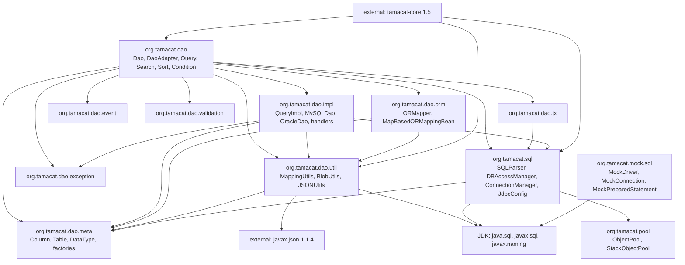

# Dependencies — tamacat-dao

> Reverse-engineered from commit `e51c32739506565c572fed458c1fbba51bbab846`, branch
> `v2.0`. The external tree is verified output from `mvn dependency:tree`; the internal
> graph is derived from import and call sites.

## External Dependencies

### Resolved tree (verified via `mvn dependency:tree`)

```
org.tamacat:tamacat-dao:jar:2.0
+- junit:junit:4.13.2:test
|  \- org.hamcrest:hamcrest-core:1.3:test
+- org.tamacat:tamacat-core:1.5:compile
|  +- jakarta.xml.bind:jakarta.xml.bind-api:2.3.3
|  |  \- jakarta.activation:jakarta.activation-api:1.2.2
|  \- com.sun.xml.bind:jaxb-impl:2.3.9 (runtime)
|     \- com.sun.activation:jakarta.activation:1.2.2
+- javax.json:javax.json-api:1.1.4:compile
+- org.glassfish:javax.json:1.1.4:compile
+- org.easymock:easymock:5.1.0:test
|  \- org.objenesis:objenesis:3.3:test
+- com.mysql:mysql-connector-j:9.6.0:test
|  \- com.google.protobuf:protobuf-java:4.31.1:test
+- org.slf4j:slf4j-api:2.0.18:test
+- ch.qos.logback:logback-core:1.3.16:test
\- ch.qos.logback:logback-classic:1.3.16:test
```

### Direct dependencies by scope

| Artifact | Version | Scope | Used where |
|---|---|---|---|
| `org.tamacat:tamacat-core` | 1.5 | compile | `DI` / `DIContainer` for `db.xml`, `Log` / `LogFactory`, `StringUtils` (in `SQLParser`), `DateUtils`, `ClassUtils`, `CollectionUtils`, `UniqueCodeGenerator` (in `QueryImpl.getInsertSQL`), `ResourceNotFoundException` |
| `javax.json:javax.json-api` | 1.1.4 | compile | `util/JSONUtils`, `orm/MapBasedORMappingBean` |
| `org.glassfish:javax.json` | 1.1.4 | compile | JSON-P implementation for the above |
| `junit:junit` | `[4.13.2,)` **open range** (`pom.xml:39`) | test | all tests |
| `org.easymock:easymock` | 5.1.0 | test | **nothing — declared but referenced nowhere in `src/`** |
| `com.mysql:mysql-connector-j` | 9.6.0 | test | test-scope driver; its absence is the only reason offline `mvn test` fails |
| `org.slf4j:slf4j-api` | 2.0.18 | test | backing for `tamacat-core`'s `Log`; **no direct import in `src/main`** |
| `ch.qos.logback:logback-core` | 1.3.16 | test | logging backend for tests |
| `ch.qos.logback:logback-classic` | 1.3.16 | test | logging backend for tests |

### Transitive dependencies

| Artifact | Version | Arrives via |
|---|---|---|
| `org.hamcrest:hamcrest-core` | 1.3 | `junit` |
| `jakarta.xml.bind:jakarta.xml.bind-api` | 2.3.3 | `tamacat-core` |
| `jakarta.activation:jakarta.activation-api` | 1.2.2 | `jakarta.xml.bind-api` |
| `com.sun.xml.bind:jaxb-impl` | 2.3.9 (runtime) | `tamacat-core` |
| `com.sun.activation:jakarta.activation` | 1.2.2 | `jaxb-impl` |
| `org.objenesis:objenesis` | 3.3 | `easymock` |
| `com.google.protobuf:protobuf-java` | 4.31.1 | `mysql-connector-j` |

### JDK-provided dependencies (no artifact)

| Package | Used by |
|---|---|
| `java.sql` | `DBAccessManager`, `Dao`, `BlobUtils`, `ConnectionManager`, `ORMapper`, the whole `org.tamacat.mock.sql` stack |
| `javax.sql` | `DataSourceJdbcConfig`, `DriverManagerDataSource`, `MockDataSourceImpl` |
| `javax.naming` | `DataSourceJdbcConfig` JNDI lookup, `MockDataSourceRegister` |

### Notable facts about the external surface

1. **No JDBC driver at compile scope.** The library codes against `java.sql` /
   `javax.sql` only. The consuming application supplies the driver, and the driver class
   name it configures is what selects the dialect.
2. **No ORM, DI, or web framework at compile scope.** Only `tamacat-core` and the two
   `javax.json` artifacts. There is no Spring, Hibernate, MyBatis, or jOOQ.
3. **`junit:junit` is declared as the open range `[4.13.2,)`** (`pom.xml:39`), so the
   build is not reproducible: the resolved JUnit version can change between builds
   without a source change.
4. **EasyMock is declared at test scope and used nowhere.** All mocking is done by the
   hand-rolled `org.tamacat.mock.sql` stack.
5. **SLF4J and Logback are test-scope only.** `src/main` logs exclusively through
   `tamacat-core`'s `Log` / `LogFactory` abstraction.
6. The repository resolves `tamacat-core` from a custom repository
   (`https://raw.github.com/tamacat/tamacat.github.io/mvn-repo/`), not Maven Central.

## Internal Dependency Graph

There is one Maven module, so all "internal dependencies" are Java-package dependencies
inside a single compilation unit.



<!-- Text fallback: One Maven module. org.tamacat.dao (the public facade) depends on impl, meta, orm, util, event, exception, validation, tx, and org.tamacat.sql. org.tamacat.dao.tx depends on org.tamacat.sql. org.tamacat.dao.impl depends on meta, util, org.tamacat.sql, and exception. orm depends on meta and util. util depends on meta, the external javax.json, and the JDK java.sql package. org.tamacat.sql depends on meta, org.tamacat.pool, and the JDK JDBC packages. org.tamacat.mock.sql depends only on the JDK JDBC packages. The external tamacat-core 1.5 is used by org.tamacat.dao, org.tamacat.sql, and org.tamacat.dao.util. The graph is acyclic and layered downward from dao to sql to pool. -->

### Cross-package coupling table

| From | To | Nature of the coupling |
|---|---|---|
| `dao` | `sql` | `Dao` holds an `SQLParser` (`Dao.java:50`) and a `DBAccessManager`; `Dao.executeQuery`/`executeUpdate` are thin forwards |
| `dao` | `dao.impl` | `Dao.createQuery` constructs a `QueryImpl` (`Dao.java:151-153`); `DaoAdapter.setDatabase` constructs `MySQLDao` / `OracleDao` (`:86-92`) |
| `dao.impl` | `sql` | `QueryImpl` constructs `SQLParser` per SQL emission (`QueryImpl.java:186`); `MySQLDao` / `OracleDao` call `DBAccessManager` directly |
| `dao` and `dao.impl` | `dao.meta` | every SQL-building path reads `Column.getType()`, `getColumnName()`, `isNotNull()`, `isAutoGenerateId()`, `isAutoTimestamp()` |
| `sql` | `dao.meta` | `SQLParser` branches on `DataType` and calls `MappingUtils.getColumnName` (`SQLParser.java:40`) |
| `sql` | `pool` | `ConnectionManager` is built on `StackObjectPool` |
| `dao.util` | `java.sql` | `BlobUtils` is the only `PreparedStatement.setXxx` call site (`BlobUtils.java:18`) |
| `dao.tx` | `sql` | `Transaction` drives `DBAccessManager` begin / commit / rollback / release |
| `mock.sql` | nothing internal | pure JDK JDBC stub, but ships in the main artifact |

### Coupling hotspots

- **`SQLParser` is the choke point for value rendering.** `Search`, `QueryImpl`, and
  `Dao` all hold or construct one. Every value that reaches the database passes through
  `SQLParser.parseValue` or `SQLParser.value`.
- **`DBAccessManager` is the choke point for execution.** Every non-mock JDBC call in
  `src/main` outside the two `JdbcConfig` activation probes goes through it or through
  `MySQLDao`'s directly acquired statement.
- **`meta.Column` and `meta.DataType` are the widest interfaces.** `Column` has ~30
  methods and is consumed by `dao`, `dao.impl`, `dao.orm`, `dao.util`, and
  `org.tamacat.sql`.
- **Dialect subclasses reach past their own layer**: `MySQLDao.java:50` calls
  `DBAccessManager.createStatement()` directly rather than going through `Dao`'s
  protected helpers.

## Dependency Hygiene Observations

| Observation | Evidence |
|---|---|
| Open version range breaks reproducibility | `junit:junit` `[4.13.2,)` at `pom.xml:39` |
| Declared-but-unused dependency | `org.easymock:easymock:5.1.0` referenced nowhere in `src/` |
| Manifest version drift against the pom | `MANIFEST.MF` says `1.6.1` / `1.6.1-20260324`; `pom.xml` says `2.0` |
| Uncommitted dependency bump in the working tree | `pom.xml` edit: version `1.6.1` to `2.0`, slf4j `2.0.17` to `2.0.18` |
| Update reporting is advisory only | `versions-maven-plugin` `display-dependency-updates` bound to `compile`; nothing fails the build |
| SBOM produced but not gated | CycloneDX `makeAggregateBom` at `package`; no policy check consumes it |
| Custom (non-Central) repository in the resolution path | `https://raw.github.com/tamacat/tamacat.github.io/mvn-repo/` |

## Stated Unknowns

- **`org.tamacat:tamacat-core:1.5` internals were not read from source.** The behaviour of
  `StringUtils.isEmpty` / `isNotEmpty` / `parse`, `UniqueCodeGenerator.generate()`,
  `DI.configure`, and `ClassUtils.newInstance` is taken from call context only. Because
  `SQLParser` relies on `StringUtils.isEmpty` for its empty-value branches, this is a real
  gap in the dependency picture.
- **Downstream consumers of this library are outside the repository.** No caller of
  `Query.getBlobIndex()` exists here, so the compatibility surface that external tamacat
  projects rely on was not determined.
