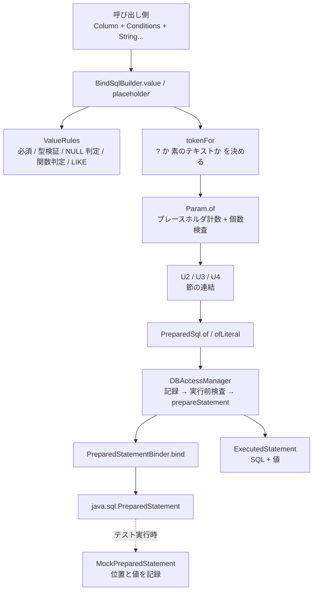
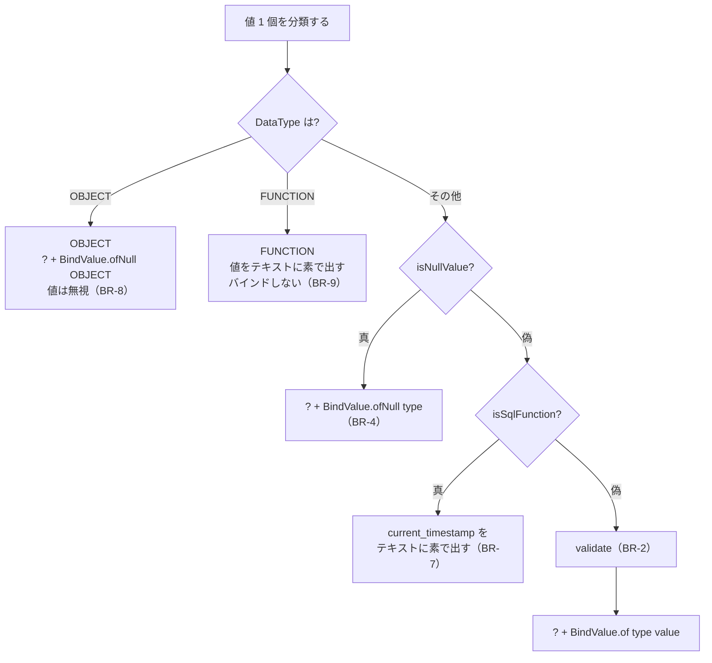

# Business Logic Model — U1 `bind-foundation`

## 上流成果物との関係

- **`unit-of-work.md`**（units-generation, 2.7）— U1 の責務、境界、実装上の制約、および「Unit 内の実装順序」1〜8。本文書のアルゴリズムはその 8 段に対応づける。
- **`unit-of-work-story-map.md`**（同上）— U1 が担う FR-2.1〜FR-2.4 / FR-4.1 / FR-4.2 / FR-8.1、判定する AC-5 / AC-6 / AC-8、および横断要件（NFR-3、NFR-4、CON-3、CON-6）。
- **`requirements.md`**（requirements-analysis, 2.3）— FR-2 群（現行挙動の維持が Must）、FR-4 群、FR-8.1、NFR-1（実行経路に値の文字列連結が 0 件）、NFR-3、NFR-4（Java 8）、NFR-7（性能目標なし）、CON-1、CON-6、CON-7。
- **`components.md`**（application-design, 2.6）— C-1〜C-8 と M-5 / M-6 の責務・境界、および「設計の骨子」の 2 経路並置構造。
- **`component-methods.md`**（同上）— 各コンポーネントのシグネチャ、C-4 の現行処理順序表、C-6 の setter 対応表、C-8 の mock 拡張一覧。
- **`services.md`**（同上）— R-1 SQL 組み立て、R-2 JDBC セッション管理（`ThreadLocal`）、R-5 実行の観測、および「実行フローの変化」シーケンス図。本文書はそのシーケンスのうち U1 が所有する区間を詳細化する。

規則の列挙は `business-rules.md`、型の定義は `domain-entities.md` にある。本文書は**アルゴリズムと処理順序**を扱う。規則番号 `BR-n` は `business-rules.md` を指す。

---

## この文書の範囲

U1 は「SQL テキスト + 値の並び」を対で運ぶ機構の一式である。**SQL 文の組み立て（節の連結）は行わない**（`unit-of-work.md` U1 の境界）。したがって本文書が扱うのは次の 5 つの処理である。

| # | 処理 | 担当コンポーネント | 節 |
|---|---|---|---|
| 1 | 値を分類し、検証し、LIKE を組み立てる | C-4 `ValueRules` | § 2 |
| 2 | 述語断片を `?` 付きテキストと値の対にする | C-5 `BindSqlBuilder` | § 4 |
| 3 | テキスト中のプレースホルダを数え、値との整合を検査する | C-1 `Param` / C-2 `PreparedSql` | § 5 |
| 4 | 値を JDBC に適用し、実行し、記録する | C-6 `PreparedStatementBinder` / M-5 `DBAccessManager` / C-7 `ExecutedStatement` | § 6, § 7 |
| 5 | 適用された位置と値をテストから取り出せるようにする | C-8 mock 拡張 | § 8 |

加えて、リテラス経路（M-6 `SQLParser`）を `ValueRules` に委譲させる（§ 3）。

---

## § 1. 全体のデータフロー



<!-- Text fallback: 呼び出し側が Column と Conditions と値の並びを BindSqlBuilder に渡す。BindSqlBuilder は ValueRules に必須チェック・型検証・NULL 判定・SQL 関数判定・LIKE の組み立てを依頼し、tokenFor が各値について「? を置くか素のテキストを置くか」を決める。結果は Param.of でプレースホルダ計数と個数検査を受けて Param になる。Param は U2/U3/U4 が節として連結し、PreparedSql.of（新経路）または PreparedSql.ofLiteral（旧経路の互換シム）で完成文になる。DBAccessManager は記録してから実行前検査を行い、prepareStatement して PreparedStatementBinder に値を適用させ、java.sql.PreparedStatement を実行する。記録は ExecutedStatement として保持される。テスト実行時は MockPreparedStatement が位置と値を記録する。 -->

**U1 の境界はこの図の `Param.of` までと `PreparedSql.of` 以降である。** 中央の「U2 / U3 / U4 が節を連結する」区間は U1 の担当ではない。

---

## § 2. `ValueRules` — 値の分類・検証・LIKE 組み立て

`SQLParser`（`SQLParser.java:85-150`）から規則を切り出す。**出力を 1 文字も変えない**ことが唯一の成功条件である（BR-31）。

### 2.1 `isNumeric(String value)` — 現行の丸写し

```java
static boolean isNumeric(String value) {
    if (StringUtils.isEmpty(value)) return false;
    Pattern p = Pattern.compile("^\\-?[0-9]*\\.?[0-9]+$");
    return p.matcher(value).find();
}
```

`SQLParser.java:145-150` をそのまま移す。`find()` を `matches()` に変えない（`^`/`$` により結果は同じだが、変える理由がない）。BR-3。

### 2.2 `validate(Column column, String value)` — FR-2.1

```java
static void validate(Column column, String value) {
    DataType t = column.getType();
    if (t != DataType.NUMERIC && t != DataType.FLOAT) return;
    if (StringUtils.isEmpty(value)) return;              // 空は NULL 扱い（isNullValue が拾う）
    if (isNumeric(value)) return;
    throw new InvalidParameterException("value is not numeric.");
}
```

例外メッセージは `SQLParser.java:101` と同一。BR-2。**AC-5 を満たすのはこのメソッドである。**

### 2.3 `isRequiredButEmpty(Column column, String value)` — 必須チェックの述語

```java
static boolean isRequiredButEmpty(Column column, String value) {
    return StringUtils.isEmpty(value) && column.isNotNull();
}
```

**投げるのは呼び出し側である。** メッセージがテーブル修飾付きのカラム名を必要とし（`"Column [" + MappingUtils.getColumnName(column) + "] is required."`）、その文字列は呼び出し側が既に組み立てているためである。`SQLParser.java:45-47` と同じ形を保つ。BR-1。

**適用は単一値のときだけである**（BR-1）。この述語自体は値の個数を知らないため、呼び出し側が単一値の分岐でだけ呼ぶ。

### 2.4 `isNullValue(Column column, String value)` — FR-2.4

```java
static boolean isNullValue(Column column, String value) {
    switch (column.getType()) {
        case NUMERIC:
        case FLOAT:
            return StringUtils.isEmpty(value);                                  // SQLParser.java:94
        case DATE:
        case TIME:
            return StringUtils.isEmpty(value)
                || "NULL".equalsIgnoreCase(value);                              // :105
        case OBJECT:
            return false;                                                       // :112（BR-8 が別に扱う）
        default:
            return value == null;                                               // STRING / BOOLEAN / FUNCTION
    }
}
```

BR-4。`SQLParser.NULL_VALUE` の定数 `"NULL"` をそのまま使う。

### 2.5 `isSqlFunction(Column column, String value)` — FR-2.4

```java
static boolean isSqlFunction(Column column, String value) {
    DataType t = column.getType();
    return (t == DataType.DATE || t == DataType.TIME)
        && value != null
        && value.equalsIgnoreCase("current_timestamp");
}
```

BR-7。`SQLParser.java:107` の判定を切り出したもの。**`isNullValue` より後に評価する**（現行 `parseValue` の分岐順）。

### 2.6 `escapeLike(Conditions condition, Column column, String value)` — FR-2.3

```java
static final char[] ESCAPE_CANDIDATES = { '$', '#', '~', '!', '^' };

static LikeEscape escapeLike(Conditions condition, Column column, String value) {
    String v = (value == null) ? "" : value;                                    // BR-11 / :120-123
    if (v.indexOf('%') >= 0 || v.indexOf('_') >= 0) {                           // :124
        for (char e : ESCAPE_CANDIDATES) {
            if (v.indexOf(e) == -1) {                                           // :127 生の値に対して走査
                String escaped = v.replace("%", e + "%").replace("_", e + "_"); // :128 手順 1
                String wrapped = condition.getReplaceHolder()
                                          .replace(SQLParser.VALUE1, escaped);  // :129 手順 2
                return LikeEscape.of(wrapped, e);
            }
        }
        // 5 候補すべてが値に含まれる場合はループを抜ける（BR-14 / :137）
    }
    String wrapped = condition.getReplaceHolder().replace(SQLParser.VALUE1, v); // :138
    return LikeEscape.noEscape(wrapped);
}
```

**バインドされる値は `wrapped`（手順 2 まで）である。** 手順 3（`ValueConvertFilter`）と手順 4（引用符で囲む）はバインド経路では行わない（BR-13、BR-18）。

`escapeLike` は `column` を受け取るが本体では使わない。**型ゲート（BR-10）は呼び出し側が持つ**ためである。引数に残すのは `component-methods.md` C-4 のシグネチャに従うためで、将来型ごとに規則が分かれた場合の余地でもある。

### 2.7 分岐の全体像



<!-- Text fallback: 値 1 個の分類は次の順で判定する。まず DataType が OBJECT なら値を無視して ? を置き BindValue.ofNull(OBJECT) を積む。FUNCTION なら値をテキストにそのまま出しバインドしない。それ以外は isNullValue を判定し、真なら ? を置き BindValue.ofNull(型) を積む。偽なら isSqlFunction を判定し、真なら current_timestamp をテキストにそのまま出す。偽なら validate で型検証を行い、通れば ? を置き BindValue.of(型, 値) を積む。 -->

**判定順序で `FUNCTION` を `isNullValue` より前に置く。** `isNullValue` は `FUNCTION` に対して `value == null` で真を返すが（BR-4）、BR-9 が「`FUNCTION` はバインドしない」と定めているため、`FUNCTION` の枝が先に確定する必要がある。値が null の `FUNCTION` はテキストに `null` という文字列が出る——現行 `parseValue` の else 分岐が `convertValue(null)` すなわち null を返し、`StringBuffer.append((String) null)` が `"null"` を書き込むのと同じ結果である（`SQLParser.java:114-116`、`:41` の `StringBuffer`）。

---

## § 3. `SQLParser` の委譲化（M-6）

`ValueRules` を先に作り、`SQLParser` を委譲に書き換える。**この段が終わった時点で `SQLParserTest` が 1 行も変更なしで緑であること**が、以降のすべての作業の土台になる（`unit-of-work.md` U1 実装順序 4）。

| 現行 | 委譲後 |
|---|---|
| `isNumeric(String)`（`:145-150`） | `return ValueRules.isNumeric(value);` |
| `parseValue` の NUMERIC / FLOAT 分岐の検証（`:97-102`） | `ValueRules.validate(column, value)` を呼び、真偽判定は `ValueRules.isNumeric` に委譲 |
| `parseValue` の空値・`NULL` 判定（`:94, :105`） | `ValueRules.isNullValue(column, value)` |
| `parseValue` の `current_timestamp` 判定（`:107`） | `ValueRules.isSqlFunction(column, value)` |
| `parseLikeStringValue`（`:119-139`） | `ValueRules.escapeLike(...)` の結果に `ValueConvertFilter` と引用符と `escape` 句を適用して組み立てる |
| `value` の必須チェック（`:45-47`） | `ValueRules.isRequiredButEmpty(column, value)` の結果で投げる |

**変えないもの**: シグネチャ、戻り値の中身、`ValueConvertFilter` の保持と適用位置、`parseMultiValue` の実装（BR-32）。

`parseLikeStringValue` の委譲後の形:

```java
protected String parseLikeStringValue(Conditions condition, Column column, String value) {
    LikeEscape le = ValueRules.escapeLike(condition, column, value);
    if (!le.hasEscape()) {
        return parseValue(column, le.getBoundValue());                  // 現行 :138 と同じ
    }
    String parsed = (valueConvertFilter == null)
        ? le.getBoundValue() : valueConvertFilter.convertValue(le.getBoundValue());   // :130
    if (column.getType() == DataType.STRING || column.getType() == DataType.BOOLEAN) {
        parsed = "'" + parsed + "'";                                    // :131-133
    }
    return parsed + ESCAPE.replace('?', le.getEscapeChar());            // :134
}
```

現行 `:138` は `parseValue(column, condition.getReplaceHolder().replace(VALUE1, value))` であり、`escapeLike` の `noEscape` 側が返す `boundValue` はまさにこの `replaceHolder` 適用後の文字列であるため、置き換えは等価である。

---

## § 4. `BindSqlBuilder` — `?` 付き述語の生成

`SQLParser.value(...)`（`:39-73`）の構造をそのまま写し、値を埋め込む代わりにトークンを置いて値を積む。

### 4.1 `tokenFor` — 1 値をトークンと `BindValue` に変換する

§ 2.7 の決定木を 1 メソッドにする。戻り値はテキストトークンと `BindValue`（不要なら null）の対である。

```java
private Token tokenFor(Column column, String value) {
    DataType t = column.getType();
    if (t == DataType.OBJECT) {
        return new Token("?", BindValue.ofNull(DataType.OBJECT));            // BR-8
    }
    if (t == DataType.FUNCTION) {
        return new Token(value == null ? "null" : value, null);              // BR-9
    }
    if (ValueRules.isNullValue(column, value)) {
        return new Token("?", BindValue.ofNull(t));                          // BR-4
    }
    if (ValueRules.isSqlFunction(column, value)) {
        return new Token(value, null);                                       // BR-7
    }
    ValueRules.validate(column, value);                                      // BR-2
    return new Token("?", BindValue.of(t, value));
}
```

`Token` は `BindSqlBuilder` 内部の private static クラスで足りる。公開しない。

### 4.2 `value(Column, Conditions, String... values)`

```java
public Param value(Column column, Conditions condition, String... values) {
    String colName = MappingUtils.getColumnName(column);
    StringBuilder text = new StringBuilder(colName).append(condition.getCondition());
    List<BindValue> binds = new ArrayList<>();
    if (values != null) {
        if (values.length == 1) {
            String value = values[0];
            if (ValueRules.isRequiredButEmpty(column, value)) {                       // BR-1
                throw new InvalidParameterException("Column [" + colName + "] is required.");
            }
            if ((column.getType() == DataType.STRING || column.getType() == DataType.BOOLEAN)
                    && condition.getCondition().indexOf(" like ") >= 0) {             // BR-10
                LikeEscape le = ValueRules.escapeLike(condition, column, value);
                text.append("?");
                if (le.hasEscape()) {
                    text.append(" escape '").append(le.getEscapeChar()).append("'");
                }
                binds.add(BindValue.of(column.getType(), le.getBoundValue()));        // BR-13
            } else if (condition.getCondition().equals(" in ")) {                     // :51
                append(text, binds, condition.getReplaceHolder(),
                       SQLParser.MULTI_VALUE, tokenFor(column, value));
            } else {
                append(text, binds, condition.getReplaceHolder(),
                       SQLParser.VALUE1, tokenFor(column, value == null ? "" : value));  // BR-5
            }
        } else if (values.length >= 2) {
            if (condition.getCondition().indexOf(" between ") >= 0) {                 // :62
                String t = condition.getReplaceHolder();
                for (int i = 0; i < values.length; i++) {
                    Token tk = tokenFor(column, values[i]);                           // BR-6（null 置換なし）
                    t = t.replace(SQLParser.VALUES[i], tk.text);
                    if (tk.bind != null) binds.add(tk.bind);
                }
                text.append(t);
            } else {                                                                  // IN
                StringBuilder tokens = new StringBuilder();
                for (String v : values) {
                    if (tokens.length() > 0) tokens.append(",");
                    Token tk = tokenFor(column, v);                                   // BR-6
                    tokens.append(tk.text);
                    if (tk.bind != null) binds.add(tk.bind);
                }
                text.append(condition.getReplaceHolder()
                                     .replace(SQLParser.MULTI_VALUE, tokens.toString()));
            }
        }
    }
    return Param.of(text.toString(), binds);
}
```

**LIKE の枝だけが `escapeLike` を経由し、`tokenFor` を通らない。** LIKE のバインド値は条件のラップとエスケープを適用済みの文字列であり、`isNullValue` / `isSqlFunction` の判定対象ではないためである（現行も `parseLikeStringValue` が独立した経路になっている）。LIKE の値は `escapeLike` により必ず非 null になる（BR-11）ので `BindValue.of` の BV-2 を満たす。

### 4.3 現行から引き継ぐ既知の欠陥

| # | 現行の挙動 | バインド版 | 扱い |
|---|---|---|---|
| 1 | `BETWEEN` に 3 値以上を渡すと `VALUES[i]`（要素数 2 の配列）で `ArrayIndexOutOfBoundsException`（`:63-65`） | 同じ | **維持する。** ガードを入れると現行と挙動が変わる |
| 2 | `BETWEEN` に 1 値だけ渡すと `#{value2}` が未置換のまま残る（`:57` が `replaceHolder` 全体を `parseValue` に通すため `'a and #{value2}'` になる） | `? and #{value2}` になり、値は 1 個。`Param.of` の個数検査は**通る**（`?` は 1 個） | **維持する。** どちらも DB で構文エラーになる壊れた SQL であり、本取り組みの回帰ではない |
| 3 | `IS_NULL` / `NOT_NULL` に値を 1 個渡すと `getReplaceHolder()` が null のため `NullPointerException`（`:55/:57`） | 同じ | **維持する** |

いずれも `requirements.md` FR-2 の「現行の挙動を維持する」に従う。1 と 3 は例外で落ちるため気づける。2 は静かに壊れた SQL を作るため、`memory.md` の Open questions に記録した。

### 4.4 `placeholder(Column column, String value)` — INSERT の VALUES 用

`SQLParser.parseValue(column, value)` のバインド版。**`value(...)` と違い null → 空文字の置換を行わない**（BR-5 は単一値経路にしかないため）。

```java
public Param placeholder(Column column, String value) {
    Token tk = tokenFor(column, value);
    return Param.of(tk.text, tk.bind == null
        ? Collections.<BindValue>emptyList() : Collections.singletonList(tk.bind));
}
```

`QueryImpl.getInsertSQL` は `parser.parseValue(col, ...)` を直接呼んでいる（`QueryImpl.java:199-208`）。そのバインド版がこれである。U3 の担当。

### 4.5 `sqlFunction(Column column, String function)`

```java
public Param sqlFunction(Column column, String function) {
    return Param.of(function == null ? "null" : function,
                    Collections.<BindValue>emptyList());
}
```

値ゼロ。**`function` に `?` を含めてはならない**——`Param.of` の個数検査（BR-24）が値ゼロに対して `?` を検出し `InvalidParameterException` になる。この制約を Javadoc に明示する。

`tokenFor` が `isSqlFunction` を内部で判定するため（§ 4.1）、通常の経路では `sqlFunction` を明示的に呼ぶ必要はない。呼び出し側がカラム値に由来しない関数を差し込みたい場合の入口として残す。

---

## § 5. プレースホルダ計数と個数検査

### 5.1 走査アルゴリズム（ADR-012 が 3.1 に委ねた点）

```java
/** 引用符の外にある ? の個数を返す。走査不能なら -1。 */
static int countPlaceholders(String sql) {
    int count = 0;
    boolean inQuote = false;
    for (int i = 0; i < sql.length(); i++) {
        char c = sql.charAt(i);
        if (c == '\'') {
            if (inQuote && i + 1 < sql.length() && sql.charAt(i + 1) == '\'') {
                i++;                    // '' はエスケープされた ' 。2 文字まとめて読み飛ばす
                continue;
            }
            inQuote = !inQuote;
        } else if (c == '?' && !inQuote) {
            count++;
        }
    }
    return inQuote ? -1 : count;        // 引用符が閉じていなければ走査不能
}
```

BR-21。単一引用符だけを扱い、行コメント（`--`）・ブロックコメント（`/* */`）・二重引用符やバッククォートによる識別子は扱わない。対象となる SQL はライブラリがメタデータとフィルタ済みの値から組み立てたものに限られ、コメントは現れない。

### 5.2 走査の検算

| 入力 | 期待 | 走査の結果 |
|---|---|---|
| `test1.name like ? escape '$'` | 1 | `?` を数え、`'$'` は引用符の内側。末尾の `'` で閉じる → **1** |
| `INSERT INTO users (...) VALUES ('admin','password',null,null,null)` | 0 | `?` なし → **0** |
| `UPDATE file SET file.data=? WHERE file.id='1'` | 1 | 旧 BLOB 経路。`?` 1 個、値 0 個 → 未束縛と判定される |
| `WHERE name='a?b'` | 0 | 引用符の内側の `?` は数えない → **0** |
| `WHERE name='a\\''b'`（MySQL フィルタ通過後） | 0 | `''` を読み飛ばして正しく閉じる → **0** |
| `WHERE name='a` | -1 | 引用符が閉じない → **走査不能** |

MySQL 版の検算が成立する根拠は BR-22 にある——`MySQLValueConvertFilter` は `'` → `''` を**先に**適用してから `\` → `\\` を適用するため、単独の `\'` を生成しない。

### 5.3 走査結果の使い分け

| 呼び出し元 | `-1`（走査不能）のとき | `count != values.size()` のとき |
|---|---|---|
| `Param.of(sql, values)` | `InvalidParameterException` | `InvalidParameterException` |
| `PreparedSql.of(sql, values)` | `InvalidParameterException` | `InvalidParameterException` |
| `PreparedSql.ofLiteral(sql)` | 検査しない（遅延評価。BR-24） | 検査しない |
| `PreparedSql.hasUnboundPlaceholders()` | **`true`（Q4 = B）** | `count > values.size()` なら `true` |

`of(...)` で走査不能が起きるのは組み立て側の欠陥である。新経路のテキストは値を含まないため引用符が閉じないことがありえない（唯一の引用符は LIKE の `escape 'X'` で、`X` は `$ # ~ ! ^` のいずれか——BR-21 の LE-3）。

`hasUnboundPlaceholders()` で走査不能を `true` に倒すのは Q4 = B の選択による。到達経路は `ofLiteral` 由来に限られ、現行 3 実装の `ValueConvertFilter` では再現しない（BR-22）。

---

## § 6. `PreparedStatementBinder` — 値の JDBC への適用

```java
static void bind(PreparedStatement stmt, List<BindValue> values) {
    try {
        for (int i = 0; i < values.size(); i++) {
            BindValue v = values.get(i);
            int pos = i + 1;                                     // 1 始まり（BR-15）
            if (v.isNull()) {
                stmt.setNull(pos, sqlTypeOf(v.getType()));       // BR-17
            } else if (v.getType() == DataType.OBJECT) {
                stmt.setBinaryStream(pos, v.getStream());        // BR-16
            } else {
                stmt.setString(pos, v.getValue());               // BR-16
            }
        }
    } catch (SQLException e) {
        throw new DaoException(e);                               // BR-20
    }
}

static int sqlTypeOf(DataType type) {
    switch (type) {
        case NUMERIC:
        case FLOAT:    return Types.NUMERIC;
        case DATE:     return Types.DATE;
        case TIME:     return Types.TIMESTAMP;
        case OBJECT:   return Types.BLOB;
        case FUNCTION: return Types.OTHER;      // 到達しない（BR-9）
        case STRING:
        case BOOLEAN:
        default:       return Types.VARCHAR;
    }
}
```

`setBinaryStream(int, InputStream)` は JDBC 4.0 の 2 引数形である。現行 `BlobUtils.executeUpdate`（`BlobUtils.java:18`）が同じ形を使っており、`MockPreparedStatement` も実装している（`MockPreparedStatement.java:291-295`）。

**`sqlTypeOf` は Q2 = A の決定である。** モックテストでは検証できない（`MockPreparedStatement.setNull` は空実装）。実 DB での確認は FR-8.3（Derby）が最初の機会になる（BR-17）。

---

## § 7. `DBAccessManager` — 実行と資源解放

### 7.1 実行と資源解放（Q1 = E の決定）

`ResultSet` をメソッド外に出さない。`PreparedStatement` と `ResultSet` の両方を try-with-resources で閉じる。

```java
public <R> R executeQuery(PreparedSql sql, ResultSetHandler<R> handler) {
    record(sql);                                                 // BR-27（実行前に記録）
    checkBindable(sql);                                          // BR-26
    try (PreparedStatement ps = getConnection().prepareStatement(sql.getSql())) {
        PreparedStatementBinder.bind(ps, sql.getValues());
        try (ResultSet rs = ps.executeQuery()) {
            return handler.handle(rs);
        }
    } catch (SQLException e) {
        throw new DaoException(e);
    }
}

public int executeUpdate(PreparedSql sql) {
    record(sql);
    checkBindable(sql);
    try (PreparedStatement ps = getConnection().prepareStatement(sql.getSql())) {
        PreparedStatementBinder.bind(ps, sql.getValues());
        return ps.executeUpdate();
    } catch (SQLException e) {
        throw new DaoException(e);
    }
}
```

**なぜ `ResultSet` を返す形にしないか。** `PreparedStatement` は生成時に 1 本の SQL テキストに束縛されるため、現行 `getStatement()`（`DBAccessManager.java:65-78`）のように `ThreadLocal` に 1 本キャッシュして使い回すことができない。SQL をキーにしたキャッシュを持てば再利用できるが、それは `requirements.md` OOS-2 / NFR-7 が明示的にスコープ外とした「`PreparedStatement` キャッシュ」である。したがって呼び出しごとに新規生成になる。

一方 `ResultSet` を返すと、`Statement` を閉じられる主体が存在しない——JDBC 仕様上 `Statement` を閉じるとその `ResultSet` も閉じられるため、メソッド内で try-with-resources を使うと呼び出し側が受け取る `ResultSet` が閉じ済みになる。呼び出し側（`Dao.search`、`Dao.java:157`）は `ResultSet` しか閉じておらず `Statement` の handle を持たない。コールバック形にすると、この対立が構造的に消える。

**記録は検査より前に行う。** 検査で弾かれた SQL も `getExecutedQuery()` に残り、何を実行しようとしたかが追える。

### 7.2 実行前検査

```java
private void checkBindable(PreparedSql sql) {
    if (!sql.hasUnboundPlaceholders()) return;
    if (sql.getPlaceholderCount() < 0) {
        throw new DaoException(
            "Cannot verify placeholders: unterminated quote in SQL text. sql=[" + sql.getSql() + "]");
    }
    throw new DaoException(
        "Unbound placeholder(s): " + sql.getPlaceholderCount() + " placeholder(s) but "
        + sql.getValues().size() + " value(s). For a BLOB update, use "
        + "Dao#executeUpdate(String,int,InputStream) or override getUpdatePreparedSql(T). "
        + "sql=[" + sql.getSql() + "]");
}
```

BR-23、BR-26、ADR-012。2 つのメッセージを分けるのが Q4 = B の要求である。前者は利用側が独自の `ValueConvertFilter` を実装している場合の唯一の手がかりになる。

### 7.3 記録

```java
protected ThreadLocal<List<ExecutedStatement>> executedStatements = new ThreadLocal<>();

public List<ExecutedStatement> getExecutedStatements() {
    List<ExecutedStatement> list = executedStatements.get();
    if (list == null) {
        list = new ArrayList<>();
        executedStatements.set(list);
    }
    return list;
}

private void record(PreparedSql sql) {
    getExecutedQuery().add(sql.getSql());                                  // BR-28（型も形も不変）
    getExecutedStatements().add(new ExecutedStatement(sql.getSql(), sql.getValues()));
}
```

`getExecutedStatements()` の遅延初期化は `getExecutedQuery()`（`DBAccessManager.java:181-188`）と同形である。`shutdown()`（`:206-215`）に `dba.executedStatements.remove();` を追加する。`release()` は現行の `executedQuery` と同じく削除しない（BR-30）。

これが **AC-8** を満たす経路である。

### 7.4 変えないもの

`executeQuery(String)` / `executeUpdate(String)` / `preparedStatement(String)` / `getStatement()` / `createStatement()` / `getExecutedQuery()` / `commit` / `rollback` / `release` / `getInstance` / `close` はシグネチャも挙動も不変（`component-methods.md` M-5）。旧 BLOB 経路（`Dao.executeUpdate(String, int, InputStream)` → `dbm.preparedStatement(sql)`）はそのまま残る。

---

## § 8. mock 拡張 — 適用された位置と値の取り出し

FR-8.1 の実現手段。`PreparedStatementBinder` の正しさを確認する唯一の直接的な手段である（`unit-of-work.md` U1「mock 拡張を含める理由」）。

### 8.1 記録するもの

| クラス | 変更 |
|---|---|
| `MockConnection.prepareStatement(String sql)`（`:168-170`） | `sql` を破棄せず `new MockPreparedStatement(this, sql)` に渡す。生成したインスタンスを内部リストに追記する（BR-33、BR-36） |
| `MockConnection` | `getPreparedStatements()` / `getLastPreparedStatement()` / `clearPreparedStatements()` を追加 |
| `MockPreparedStatement` の各 `setXxx(int, ...)` | 位置をキーに値を記録。同位置への 2 回目は後勝ち（BR-34） |
| `MockPreparedStatement` | `getPreparedSql()` / `getBoundValue(int)` / `getBoundValues()` を追加 |
| `MockPreparedStatement.executeUpdate()`（`:41-44`） | `0` を返す現行挙動を**変更しない**（BR-35） |
| `MockDriver` | 登録済みインスタンスを static フィールドに保持し `getInstance()` で公開（BR-36） |

`MockPreparedStatement` のコンストラクタは現行 `MockPreparedStatement(Connection con)` を残したまま `MockPreparedStatement(Connection con, String sql)` を追加する（追加のみ、NFR-3）。

### 8.2 テストからの使い方（FR-8.1 / Bolt 1 の Definition of Done）

```java
MockConnection con = (MockConnection) MockDriver.getInstance().connect(null, null);
con.clearPreparedStatements();

User user = new User();
user.val(User.USER_ID, "admin");
dao.search(user);

MockPreparedStatement ps = con.getLastPreparedStatement();
assertEquals("SELECT ... FROM users WHERE users.user_id=?", ps.getPreparedSql());
assertEquals("admin", ps.getBoundValue(1));
```

`MockDriver.getInstance()` を使う理由は BR-36 / BR-37 のとおり——`MockDriver.acceptsURL` が URL を問わず常に `true` を返すため（`MockDriver.java:37-39`）、`DriverManager` 経由では FR-8.3 / OQ-6 で Derby を classpath に加えたときに取得されるドライバが登録順に依存しうる。

`MockConnection` は全テストで共有されるため、複数本を数えるテストは `@Before` で `clearPreparedStatements()` を呼ぶ（BR-36）。

---

## § 9. 実装順序

`unit-of-work.md` の「U1 `bind-foundation`」8 段に本文書の節を対応づける。

| 段 | 内容 | 本文書 | 完了の確認 |
|---|---|---|---|
| 1 | `BindValue`（C-3） | `domain-entities.md` C-3 | 3 形のファクトリと BV-1〜BV-5 の単体テスト |
| 2 | `Param`（C-1）/ `PreparedSql`（C-2）と `?` 個数検査 | § 5、`domain-entities.md` C-1 / C-2 | § 5.2 の検算 6 件を単体テストにする |
| 3 | `ValueRules`（C-4） | § 2 | — （4 段目で検証する） |
| 4 | `SQLParser`（M-6）を `ValueRules` へ委譲化 | § 3 | **`SQLParserTest` が 1 行も変更なしで緑**（BR-31）。以降の作業はこの検証済みの土台の上で行う |
| 5 | `BindSqlBuilder`（C-5） | § 4 | § 2.7 の決定木の各枝と BR-13 の検算表 5 件 |
| 6 | mock スタック拡張（C-8） | § 8 | 位置と値が取り出せること |
| 7 | `PreparedStatementBinder`（C-6） | § 6 | **6 の完了後でなければ正しさを確認できない** |
| 8 | `ExecutedStatement`（C-7）と `DBAccessManager`（M-5） | § 7 | AC-8。実行前検査（§ 7.2）の 2 分岐 |

**4 段目が本 Unit の要である。** `SQLParserTest` はリポジトリで最も密なテストであり、`ValueRules` の切り出しが挙動を変えていないことをここで確定させる。これを後回しにすると、`ValueRules` が「バインド系からしか呼ばれていない」状態で確定してしまい、リテラル系との乖離が後から生じうる（`unit-of-work.md`）。

**6 を 7 より先に置く理由**（`unit-of-work.md` より）: `PreparedStatementBinder` の責務は「値を 1 始まりの位置に順に適用する」ことだけであり、その正しさを確認する手段は mock の記録機能しかない。逆順にすると 7 が検証されないまま完了する。

---

## § 10. 2.6 契約からの差分

`component-methods.md` に対する差分。**この節が差分の全量である。** `domain-entities.md` の同名節は型に関する差分だけを扱っており、本節を参照する。

**曖昧さを避けるため、件数を要約せず新規 public メンバを 1 個ずつ列挙する。** 下表の行数がそのまま差分の件数である。

### 追加（12 メンバ、うち 5 個は `org.tamacat.mock.sql`）

| # | 新規 public メンバ | パッケージ | 根拠 |
|---|---|---|---|
| A-1 | `PreparedSql.getPlaceholderCount()`（`int`。走査不能は `-1`） | `org.tamacat.dao` | Q4 = B が「走査不能」と「未束縛あり」を区別することを要求する。`DBAccessManager`（`org.tamacat.sql`）は `PreparedSql`（`org.tamacat.dao`）の package-private メンバに到達できない（`decisions.md` レビュー指摘 F-1 と同じ制約） |
| A-2 | `LikeEscape.getBoundValue()` | `org.tamacat.sql` | `component-methods.md` C-4 が `escapeLike` の戻り値型として `LikeEscape` を宣言済みだが、メンバは未定だった。本ステージが確定する |
| A-3 | `LikeEscape.getEscapeChar()` | `org.tamacat.sql` | 同上 |
| A-4 | `LikeEscape.hasEscape()` | `org.tamacat.sql` | 同上 |
| A-5 | `LikeEscape.of(String, char)` | `org.tamacat.sql` | 同上 |
| A-6 | `LikeEscape.noEscape(String)` | `org.tamacat.sql` | 同上 |
| A-7 | `ResultSetHandler<R>`（**新規 public 型**）と `handle(ResultSet) throws SQLException` | `org.tamacat.sql` | Q1 = E |
| A-8 | `MockDriver.getInstance()` | `org.tamacat.mock.sql` | Q3 = A |
| A-9 | `MockConnection.getPreparedStatements()` | `org.tamacat.mock.sql` | Q3 = A |
| A-10 | `MockConnection.getLastPreparedStatement()` | `org.tamacat.mock.sql` | Q3 = A |
| A-11 | `MockConnection.clearPreparedStatements()` | `org.tamacat.mock.sql` | Q3 = A |
| A-12 | `MockPreparedStatement(Connection, String)`（コンストラクタ。既存の 1 引数形は残す） | `org.tamacat.mock.sql` | Q3 = A |

**A-8〜A-12 は 2.6 に存在しない。** `component-methods.md` C-8 が規定していたのは `MockConnection.prepareStatement` が `sql` を保持すること、`MockPreparedStatement` に `getPreparedSql()` / `getBoundValue(int)` / `getBoundValues()` を追加すること、`executeUpdate()` の挙動を変えないことの 4 点だけである。**「テストがその記録に到達する経路」は規定されていなかった**（§ 8.2、Q3 = A）。

**A-8〜A-12 の可視性上の帰結を明示する。** `org.tamacat.mock.sql` は `src/main` にあり production jar に同梱される（`decisions.md` ADR-009 の Negative、`requirements.md` OOS-6）。したがってこの 5 メンバは**製品成果物の public 表面に載り、FR-3.1 の互換維持対象になる**。Build and Test（3.6）が NFR-3 / AC-11 を監査するときの対象に含める必要がある。

### 変更（1 点）

| # | 内容 | 根拠 |
|---|---|---|
| C-1 | `component-methods.md` M-5 の `public ResultSet executeQuery(PreparedSql sql)` を**追加しない**。代わりに `public <R> R executeQuery(PreparedSql sql, ResultSetHandler<R> handler)` を追加する | Q1 = E。§ 7.1 のとおり `ResultSet` を返す形では `PreparedStatement` を閉じる主体が存在しない。M-4 `Dao` にも波及するが、M-4 は U2 の所有のため § 11-1 で引き継ぐ |

### 削除・シグネチャ変更

**なし。** 上表の追加 12 メンバと変更 1 点はいずれも既存の public / protected シグネチャの削除・変更を伴わない。C-1 は「2.6 が追加すると宣言していたが、まだ存在しないメソッド」を別の形に差し替えるものであり、現行コードに対する破壊的変更ではない。したがって FR-3.1 / NFR-3 を満たす。

`decisions.md` の ADR はいずれも覆していない。ADR-007（値に一律 `setString`）に対する Q2 = A の関係は `business-rules.md` BR-17 に記した——ADR-007 の根拠は「現行の DB 側の型変換を維持する」ことであり、NULL には変換すべきテキストがないためこの根拠が `setNull` の SQL 型には及ばない。

---

## § 11. 後続 Unit への引き継ぎ事項

| # | 引き継ぎ先 | 内容 |
|---|---|---|
| 1 | **U2 `select-path`** | `component-methods.md` M-4 の `protected ResultSet executeQuery(PreparedSql sql)` はコールバック形（`protected <R> R executeQuery(PreparedSql, ResultSetHandler<R>)`）になる。`Dao.search` / `searchList` の内部をこの形に書き換える |
| 2 | **U2 `select-path`** | 現行 `Dao.search`（`Dao.java:155-167`）の `catch (SQLException e) { handleException(e); }` は、`dbm.executeQuery(String)` が既に `SQLException` を `DaoException` に包んでいるため、実際には `rs.next()` / `mapping()` の失敗だけを捕まえている。コールバック化するとこれらも `DBAccessManager` の内側で走る。この funnel を維持するか（維持すると実行失敗まで `handleException` を通り、現行より広がる）を U2 が決める |
| 3 | **U3 `write-path`** | OBJECT カラムは `BindValue.ofNull(DataType.OBJECT)` として 1 枠を占め、`setNull(pos, Types.BLOB)` が適用される。呼び出し側が `getBlobIndex()` の位置に `setBinaryStream` で上書きする（`domain-entities.md` C-3、BR-8、BR-34 の後勝ち規則）。AC-7 はこの機構の上で判定する |
| 4 | **U2 / U3 / U4** | `MockPreparedStatement.executeUpdate()` は `0` を返す（BR-35）。親クラス `MockStatement.executeUpdate(String)` は `1` を返す（`MockStatement.java:71-74`）。`UserDaoTest.testCreate` の `assertEquals(1, result)`（`UserDaoTest.java:39`）は、実行が `PreparedStatement` 経路に切り替わった時点で失敗する。FR-8.2 の対応表の対象 |
| 5 | **U2 / U3 / U4** | 値リストの順序がテキストの `?` の順序と一致することは U1 の外で決まる（ADR-011）。BR-24 の個数検査は順序のずれを検出しない。検出手段は § 8 の mock アサートだけである（BR-25） |
| 6 | **Build and Test（3.6）** | `sqlTypeOf`（§ 6）はモックでは検証できない。FR-8.3 の Derby 有効化が実 DB での最初の確認機会になる（OQ-6、ADR-007 の Negative） |
| 7 | **Build and Test（3.6）** | `MockDriver.acceptsURL` が URL を問わず `true` を返す（`MockDriver.java:37-39`）。Derby を classpath に加えたとき `DriverManager` の登録順に依存する挙動が生じうる（BR-37） |
| 8 | **U5 `identifier-safety`** | § 5.1 の走査規則は、カラム名・テーブル名に `'` や `?` が含まれないことを前提としている。識別子位置の検証（FR-1.7）はこの前提を強める方向に働く |

---

## Review

READY

### iteration 2 — 検証の方法と範囲

iteration 1 の blocking 指摘 F-1（「2.6 契約からの差分」の申告件数の自己矛盾と過少申告）に対する修正を検証した。`business-logic-model.md` § 10 の全面書き換えと `domain-entities.md` 同名節のスコープ限定を、実ソースではなく主に上流契約（`component-methods.md`、`components.md`、`unit-of-work.md`、`unit-of-work-story-map.md`、`requirements.md`、`services.md`、`functional-design-questions.md`）との突き合わせで検証した。とくに、§ 10 が新規 public メンバとして申告する A-1〜A-12 / C-1 が**実際に全量か**を、`component-methods.md` の C-1〜C-8・M-5・M-6 の公開メソッド一覧から独立に再導出して確かめた（過小申告・過大申告の両方向で反証を試みた）。あわせて、修正が触れた箇所（§ 10、`domain-entities.md` の差分節、§ 1 の Mermaid）の周辺が本文の他の主張（§ 7.1、§ 8、§ 11）と矛盾していないかを確認した。

### F-1 の解消状況

**実体として解消されている。体裁だけの修正ではない。**

- 本ファイル § 10 は「件数を要約せず新規 public メンバを 1 個ずつ列挙する」方針に転換し、A-1〜A-12（12 件）と C-1（変更 1 件）を個別に列挙する形になった。見出し「追加（12 メンバ、うち 5 個は `org.tamacat.mock.sql`）」を実際に数えると表の行数は 12、うち A-8〜A-12 の 5 行が `org.tamacat.mock.sql` であり、見出しと表が一致する（iteration 1 で指摘した「3 点」と実 4 行の不一致は再発していない）。
- `component-methods.md` の C-1（6 メソッド）/ C-2（5 メソッド）/ C-3（7 メソッド）/ C-4（6 メソッド）/ C-5（3 メソッド）/ C-6（1 メソッド、package-private）/ C-7（2 メソッド）/ C-8（`getPreparedSql()` / `getBoundValue(int)` / `getBoundValues()` の 3 新規メソッドのみ）/ M-5（3 新規メソッド）/ M-6（新規メソッドなし）を全数突き合わせた結果、A-1〜A-12 のいずれも 2.6 に既存の宣言がなく、逆に 2.6 が既に規定していたものを「追加」に誤って数えている行は見つからなかった（過大申告なし）。C-1 の変更（`executeQuery(PreparedSql)` → `executeQuery(PreparedSql, ResultSetHandler<R>)`）も、2.6 の M-5 が実際に前者を追加として宣言していたことと一致し、Q1=E の決定内容（`functional-design-questions.md` Q1）とも文字どおり一致する。
- `business-rules.md` BR-33〜BR-37 と本ファイル § 8.1 が述べる mock 拡張の全項目（`MockConnection.prepareStatement` の SQL 保持、`setXxx` の位置・値記録、`MockPreparedStatement.getPreparedSql()`/`getBoundValue(int)`/`getBoundValues()`、`executeUpdate()` 不変、`MockDriver.getInstance()`、`MockConnection` の 3 アクセサ、新コンストラクタ）を § 10 の A-8〜A-12 および「本節に含まれない差分」（2.6 既存の 4 点）に仕分けし直したが、抜け・重複は見つからなかった。A-8〜A-12 が 2.6（`component-methods.md` C-8、381〜392行）に存在しないという主張も再確認した——2.6 は `MockConnection.prepareStatement` の SQL 保持、`setXxx` の記録、`getPreparedSql()`/`getBoundValue(int)`/`getBoundValues()`、`executeUpdate()` 不変の 4 点のみを規定しており、`MockDriver` にも `MockConnection` のアクセサ 3 種にも新コンストラクタにも触れていない。
- `domain-entities.md` の同名節は「**型に関する差分のみ**」と明示的にスコープされ、冒頭の注記が「本節は差分の全量ではない。全量は `business-logic-model.md` § 10。食い違ったときは § 10 が正」と述べる。節内の各行に付された § 10 対応 ID（追加 1→A-1、追加 2→A-2〜A-6、追加 3→A-7、変更 1→C-1）は、§ 10 の実際の ID 割り当てと 1 対 1 で一致する。末尾の「本節に含まれない差分」が列挙する 5 メンバ（`MockDriver.getInstance()`、`MockConnection` の 3 メソッド、`MockPreparedStatement` の新コンストラクタ）も § 10 の A-8〜A-12 と完全に一致する。2 文書間に残る食い違いは見つからなかった。
- § 10 の書き換えは § 7.1（`executeQuery` のコールバック化）、§ 8（mock 拡張の実装）、§ 11（M-4 への波及を U2 に引き継ぐ旨）と矛盾していない。C-1 の記述は § 7.1 のシグネチャと一字一句一致し、A-8〜A-12 は § 8.1 の記述と一致する。

### 新たに見つかった所見（non-blocking）

- **`domain-entities.md` 冒頭 9 行目の要約記述が、本文と食い違っている。** 「`## 上流成果物との関係`」節の `component-methods.md` の行が「本文書は **2 点だけ追加する**（`PreparedSql.getPlaceholderCount()`、`ValueRules.escapeLike` が返す `LikeEscape` の形）」と述べているが、同じ文書の「2.6 契約からの差分」節（320〜330行）は「次の **3 群**である」として `ResultSetHandler<R>`（Q1 = E、303〜316行で本文が実際に型定義している）を追加の 3 番目として明記している。9 行目は `ResultSetHandler<R>` を数え落としており、F-1 が指摘したのと同じ「件数のプローズが本文の実際の記載件数と食い違う」種類の欠陥である。ただし F-1 とは異なり、`ResultSetHandler<R>` は文書の他の場所（「型の一覧」表の 23 行目、「2.6 契約からの差分」節、専用のセクション 303〜316行）で明確に定義されており、この文書を通読する実装者が情報を見落とす実害は小さい。9 行目を「本文書は 3 点だけ追加する（`PreparedSql.getPlaceholderCount()`、`ValueRules.escapeLike` が返す `LikeEscape` の形、`ResultSetHandler<R>`）」のように訂正することを推奨するが、blocking にはしない。
- Mermaid の点線エッジ修正（`JD -. テスト実行時 .-> MK`）を確認した。標準的な `-. label .->` の記法に修正されており、iteration 1 の non-blocking 所見は解消されている。

### 軽く再確認した既存の主張（iteration 1 で反証できなかったもの）

- § 2 の `ValueRules` 抽出の引用行番号・分岐順序、§ 5.2 / BR-13 の検算表、BR-22 の `ValueConvertFilter` 前提、Q1=E の実コード整合、mock 系の引用箇所、ADR-007 との整合、AC-5 / AC-6 / AC-8 の要件対応は、いずれも本文が未変更のため iteration 1 の検証結果を維持する。今回はこれらに加えて `unit-of-work.md`・`unit-of-work-story-map.md`・`requirements.md`・`services.md` を再読し、U1 の所有コンポーネント一覧（C-1〜C-8 / M-5 / M-6）、AC-5 / AC-6 / AC-8 が U1 に帰属すること、`org.tamacat.mock.sql` が production jar に同梱され FR-3.1 / NFR-3 / AC-11 の監査対象になること（`unit-of-work.md`「デプロイモデル」節、ADR-009）が、いずれも § 10 の記述と矛盾しないことを確認した。
- consumes 6 成果物への参照（`upstream-coverage`）と H2 見出し数（`required-sections`）は 3 ファイルとも満たしている。Mermaid 図はいずれも text fallback を伴っている。

以上により、blocking な欠陥は見つからなかった。READY と判定する。

---

**適用記録（オーケストレータ、2026-08-09）**: iteration 2 の non-blocking 所見のうち `domain-entities.md` 9 行目の件数の食い違いを、レビュアーが本文中で指定した訂正文言のとおりに適用した。「本文書は 2 点だけ追加する（…）」を「本文書は 3 点だけ追加する（`PreparedSql.getPlaceholderCount()`、`ValueRules.escapeLike` が返す `LikeEscape` の形、`ResultSetHandler<R>`）」に書き換え、あわせて「mock スタックへの追加を含む差分の全量は `business-logic-model.md` § 10 にある」の一文を追記した。**この訂正はレビュアーの再検証を受けていない**が、変更はレビュアー自身が示した文言の適用であり、型定義・規則・アルゴリズムのいずれにも影響しない。もう 1 件の所見（Mermaid の点線エッジ）は iteration 2 のレビュー前に適用済みで、レビュアーが解消を確認している。
