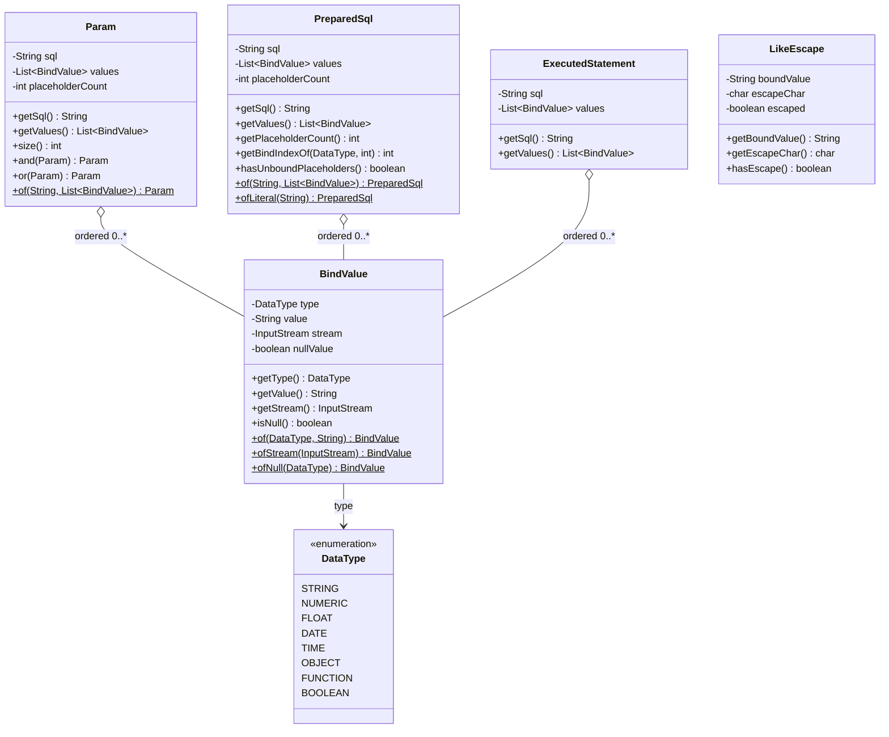

# Domain Entities — U1 `bind-foundation`

## 上流成果物との関係

- **`unit-of-work.md`**（units-generation, 2.7）— U1 `bind-foundation` の責務「『SQL テキスト + 値の並び』を対で運ぶ型と、それを検証・生成・JDBC に適用する機構の一式を新設する」と、所有コンポーネント C-1〜C-8 / M-5 / M-6。本文書はそのうち**状態を持つ型**を定義する。
- **`unit-of-work-story-map.md`**（同上）— U1 が担う FR-2.1〜FR-2.4 / FR-4.1 / FR-4.2 / FR-8.1 と AC-5 / AC-6 / AC-8。各型の不変条件はこれらの判定に対応する。
- **`requirements.md`**（requirements-analysis, 2.3）— FR-1.5（BLOB）、FR-2.4（DATE / TIME の空値・`NULL`・`current_timestamp`）、FR-3.2（`getBlobIndex()`）、FR-4.1 / FR-4.2（実行記録）、NFR-3（再コンパイル不要）、CON-1（Java 8）、CON-6（新規第三者依存なし）、CON-7（`QueryImpl` は単回使用）。
- **`components.md`**（application-design, 2.6）— C-1 `Param` / C-2 `PreparedSql` / C-3 `BindValue` / C-7 `ExecutedStatement` の責務と境界。本文書はその境界を変えず、属性・不変条件・ライフサイクルを与える。
- **`component-methods.md`**（同上）— 各型の公開メソッドシグネチャ。本文書は 3 点だけ追加する（`PreparedSql.getPlaceholderCount()`、`ValueRules.escapeLike` が返す `LikeEscape` の形、`ResultSetHandler<R>`）。追加の根拠は「2.6 契約からの差分」節に記す。**mock スタックへの追加を含む差分の全量は `business-logic-model.md` § 10 にある。**
- **`services.md`**（同上）— R-1 SQL 組み立て（呼び出し側スレッドに閉じる）、R-5 実行の観測（`ThreadLocal` に平文で保持）。本文書のライフサイクルはこの記述に従う。

---

## 型の一覧

| # | 型 | パッケージ | 可視性 | 可変性 | 由来 |
|---|---|---|---|---|---|
| C-1 | `Param` | `org.tamacat.dao` | public final class | **不変** | `components.md` C-1 |
| C-2 | `PreparedSql` | `org.tamacat.dao` | public final class | **不変** | `components.md` C-2 |
| C-3 | `BindValue` | `org.tamacat.dao` | public final class | **不変**（`InputStream` を除く。下記注記） | `components.md` C-3 |
| C-7 | `ExecutedStatement` | `org.tamacat.sql` | public final class | **不変** | `components.md` C-7 |
| — | `LikeEscape` | `org.tamacat.sql` | public final class | **不変** | `component-methods.md` C-4 が `escapeLike` の戻り値として言及。形は本ステージで確定 |
| — | `ResultSetHandler<R>` | `org.tamacat.sql` | public interface | 状態なし | 本ステージで新設（Q1 = E） |

`Param` / `PreparedSql` / `BindValue` を `org.tamacat.dao` に置く判断は `decisions.md` ADR-001 による（`Dao.prepare()` の戻り値と `Query.where(Param)` の引数、すなわち公開 API の一部であるため）。`ExecutedStatement` / `LikeEscape` / `ResultSetHandler` は `org.tamacat.sql` に閉じる。

---

## 関係



<!-- Text fallback: Param、PreparedSql、ExecutedStatement の 3 型がそれぞれ BindValue の順序付きリスト（0 個以上）を保持する。BindValue は DataType 列挙（STRING / NUMERIC / FLOAT / DATE / TIME / OBJECT / FUNCTION / BOOLEAN）を型情報として持つ。LikeEscape は他のどの型とも関連を持たない独立した値オブジェクトで、ValueRules.escapeLike の戻り値としてのみ使われる。Param は sql・values・placeholderCount を持ち and/or で連結できる。PreparedSql は同じ 3 フィールドに加え getBindIndexOf と hasUnboundPlaceholders を持ち、of と ofLiteral の 2 つのファクトリを持つ。BindValue は type・value・stream・nullValue を持ち of / ofStream / ofNull の 3 ファクトリを持つ。 -->

**`Param` と `PreparedSql` の間に継承も変換も置かない。** 両者は同じ形（テキスト + 値の並び）を持つが、`components.md` C-1 の境界「実行できない／実行できる」を型で表すことが分離の目的である（ADR-001）。共通の親型を導入すると `DBAccessManager.executeQuery(...)` に断片を渡せてしまい、分離の目的が失われる。冗長さは受け入れる。

---

## C-1. `Param` — 述語断片とその値

### 属性

| 属性 | 型 | 意味 |
|---|---|---|
| `sql` | `String` | `?` を含む述語断片テキスト。非 null |
| `values` | `List<BindValue>` | 断片中の `?` に対応する値。出現順。不変ラップ（`Collections.unmodifiableList`）。空リストあり |
| `placeholderCount` | `int` | 生成時に数えた `sql` 中のプレースホルダ数。`values.size()` と常に等しい |

`placeholderCount` を保持するのは、`and` / `or` による連結のたびに再走査しないためである。連結後の値は両者の和になる。

### 不変条件

| # | 不変条件 | 破れたときの挙動 |
|---|---|---|
| P-1 | `sql != null` | `of(...)` が `InvalidParameterException` |
| P-2 | `placeholderCount == values.size()` | `of(...)` が `InvalidParameterException`（ADR-001 の生成時検査） |
| P-3 | `getValues()` が返すリストは変更できない | `UnsupportedOperationException`（`Collections.unmodifiableList` の既定） |
| P-4 | 生成後に `sql` も `values` も変化しない | — （final フィールド、防御的コピー） |

P-2 の判定に使うプレースホルダ数の数え方は `business-logic-model.md`「プレースホルダ計数」節に定める。**P-2 は個数のずれだけを検出し、順序のずれは検出しない。** 順序の保証は `component-dependency.md`「順序の不変条件」と ADR-011 が担い、検出は FR-8.1（位置と値のアサート）が担う。

### ライフサイクル

状態遷移を持たない。生成後は不変であり、`and` / `or` は**新しい `Param` を返す**（自身を変更しない）。

```
BindSqlBuilder.value(...) ──> Param ──┬──> Param.and(other) ──> 新しい Param
Dao.prepare(...) ─────────────────────┤
                                      ├──> Search が蓄積（U2）
                                      └──> Query.where(Param) / and(Param) / or(Param)（U2）
```

`and(Param other)` / `or(Param other)` は `other == null` のとき**自身を返す**（`component-methods.md` C-1）。連結時のテキストは `this.sql + " and " + other.sql` / `" or "`、値は `this.values ++ other.values` である。括弧は付けない——付ける必要がある場面（`Search.and(Search)`）は U2 が呼び出し側で行う。

---

## C-2. `PreparedSql` — 実行できる完成文とその値

### 属性

| 属性 | 型 | 意味 |
|---|---|---|
| `sql` | `String` | `?` を含む完成した SQL 文。非 null |
| `values` | `List<BindValue>` | `?` に対応する値。出現順。不変ラップ。空リストあり |
| `placeholderCount` | `int` | `of(...)` 経由では生成時に数えた値。`ofLiteral(...)` 経由では **`UNCOUNTED`（`Integer.MIN_VALUE`）** を保持し、`getPlaceholderCount()` の初回呼び出しで遅延評価する |

### 由来（provenance）— この型で唯一の状態

`PreparedSql` は不変だが、**どちらのファクトリで作られたか**によって検査の扱いが変わる。これがこの型の唯一の「状態」である。

| 由来 | 生成元 | 生成時の個数検査 | `getPlaceholderCount()` | `hasUnboundPlaceholders()` |
|---|---|---|---|---|
| **checked**（`of(sql, values)`） | `QueryImpl.getSelectPreparedSql()` ほか新経路（U2 / U3 / U4） | **行う。** 不一致なら `InvalidParameterException` | 生成時の値をそのまま返す | **常に false** |
| **unchecked**（`ofLiteral(sql)`） | `Query` / `Dao` の `default` 実装・互換シム（ADR-004 / ADR-006）。`values` は空 | **行わない**（ADR-012） | 初回呼び出しで走査。走査不能なら `-1` | 走査結果によって決まる（下記） |

`ofLiteral` が生成時検査を行わない理由は ADR-012 のとおり——旧経路が生成する SQL は BLOB カラムを含む場合に未バインドの `?` を持つため、検査を強制すると既存サブクラスがすべて落ちる（NFR-3 違反）。

### 不変条件

| # | 不変条件 | 破れたときの挙動 |
|---|---|---|
| PS-1 | `sql != null` | `of` / `ofLiteral` が `InvalidParameterException` |
| PS-2 | **checked のとき** `placeholderCount == values.size()` | `of(...)` が `InvalidParameterException` |
| PS-3 | **checked のとき** `getPlaceholderCount() >= 0`（走査不能な SQL は checked では生成できない） | `of(...)` が `InvalidParameterException` |
| PS-4 | `unchecked` のとき `values.isEmpty()` | `ofLiteral` は `values` を受け取らないため構造的に成立 |
| PS-5 | `getValues()` が返すリストは変更できない | `UnsupportedOperationException` |

### `getBindIndexOf(DataType type, int occurrence)`

`values` を先頭から走査し、`type` に一致する `occurrence` 番目（1 始まり）の要素の**バインド位置**（1 始まり）を返す。該当なしは `-1`。

FR-3.2 の `getBlobIndex()` はこれを `getBindIndexOf(DataType.OBJECT, 1)` として使う（`component-methods.md` M-2、U3 の担当）。`values` が空の `ofLiteral` 由来の `PreparedSql` に対しては常に `-1` を返す。

### `hasUnboundPlaceholders()` — Q4 = B の帰結

```
checked   → 常に false（PS-2 により個数が一致している）
unchecked → getPlaceholderCount() < 0            … 走査不能   → true
            getPlaceholderCount() > values.size() … 未束縛あり → true
            それ以外                                            → false
```

**走査不能（`-1`）を `true` に倒すのは Q4 = B の選択による。** `DBAccessManager` はこの 2 つのケースを `getPlaceholderCount()` の値で区別し、異なるエラーメッセージを出す（`business-logic-model.md`「実行前検査」節）。

`getPlaceholderCount()` を public にする理由: `PreparedSql` は `org.tamacat.dao`、`DBAccessManager` は `org.tamacat.sql` にあり、Java の package-private はこの 2 パッケージ間に及ばない。`decisions.md`「レビュー後の修正記録」F-1 が `Search.getSearchParam()` について指摘したのと同じ制約である。

### ライフサイクル

```
QueryImpl.getSelectPreparedSql() 等 ──> PreparedSql (checked) ──┐
Query/Dao の default 実装 ──> ofLiteral ──> PreparedSql (unchecked) ─┤
                                                                     ├──> DBAccessManager が実行前検査
                                                                     └──> ExecutedStatement に記録され、
                                                                          PreparedStatementBinder が JDBC に適用
```

生成後は不変であり、実行によっても変化しない。同じ `PreparedSql` を 2 回実行してよい（値が消費されない）。ただし `QueryImpl` の単回使用制約（CON-7）により、同じ `Query` から 2 回 `getSelectPreparedSql()` を呼ぶと WHERE 句が二重に付いた**別の** `PreparedSql` が返る。これは現行 `getSelectSQL()` の挙動と一貫している。

---

## C-3. `BindValue` — 1 個のバインド値

### 属性

| 属性 | 型 | 意味 |
|---|---|---|
| `type` | `DataType` | 値の型。`PreparedStatementBinder` が setter と `setNull` の SQL 型を選ぶのに使う。非 null |
| `value` | `String` | 文字列表現の値。`OBJECT` および NULL 値では null |
| `stream` | `InputStream` | バイナリ値。`OBJECT` 以外では null |
| `nullValue` | `boolean` | SQL NULL としてバインドすべきか |

### 3 つの形

`BindValue` は次の 3 形のいずれかを取る。他の組み合わせは生成できない。

| 形 | ファクトリ | `type` | `value` | `stream` | `isNull()` |
|---|---|---|---|---|---|
| **テキスト値** | `of(DataType, String)` | 引数のまま | 非 null | null | `false` |
| **ストリーム値** | `ofStream(InputStream)` | `OBJECT` 固定 | null | 非 null | `false` |
| **NULL 値** | `ofNull(DataType)` | 引数のまま | null | null | `true` |

### 不変条件

| # | 不変条件 | 破れたときの挙動 |
|---|---|---|
| BV-1 | `type != null` | `of` / `ofNull` が `InvalidParameterException` |
| BV-2 | **`of(type, value)` の `value` は非 null**。SQL NULL は `ofNull(type)` を通す | `of(...)` が `InvalidParameterException` |
| BV-3 | `ofStream(in)` の `in` は非 null | `ofStream(...)` が `InvalidParameterException` |
| BV-4 | `isNull()` が真なら `value` も `stream` も null | 構造的に成立（ファクトリのみが生成する） |
| BV-5 | `getStream()` が非 null を返すのは `type == OBJECT` のときだけ | 構造的に成立 |

**BV-2 の根拠**: `components.md` C-3 が「値の解釈を決める責務は持たない。決めるのは（`PreparedStatementBinder`）」とし、`component-methods.md` C-3 が「この判定を `ValueRules` で行い、結果を `BindValue` に固定することで、バインド時に再判定しない」としている。`of(type, null)` を許すと「null は空文字か SQL NULL か」の判定がバインド時に再浮上する。生成時に閉じるため BV-2 を置く。

**`InputStream` に関する注記**: `BindValue` 自身は不変（フィールドは final、生成後に差し替わらない）だが、保持する `InputStream` は本質的に可変であり 1 回しか読めない。したがって**ストリーム値の `BindValue` を 2 回バインドしてはならない**。この制約は現行 `BlobUtils.executeUpdate(PreparedStatement, int, InputStream)`（`BlobUtils.java:15-23`）が持つ制約と同じであり、新しい論点ではない。`business-rules.md` BR-14 に規則として記す。

### `OBJECT` カラムの扱い（U3 への引き継ぎ事項）

`BindSqlBuilder` は `String... values` しか受け取らないため、**OBJECT カラムに対してストリーム値を作れない**。現行も同じで、`SQLParser.parseValue` は OBJECT に対し値を無視して `"?"` を返し（`SQLParser.java:112-113`）、実際のストリームは `Dao.executeUpdate(String, int, InputStream)` 経由で外から適用される。

本ステージは次の機構を定める。**どう使うかは U3 `write-path` が決める。**

- `BindSqlBuilder` が OBJECT カラムに遭遇したら、テキストに `?` を置き、値として **`BindValue.ofNull(DataType.OBJECT)`** を積む
- `PreparedStatementBinder` はこれを `setNull(pos, Types.BLOB)` として適用する
- 呼び出し側は `PreparedSql.getBindIndexOf(DataType.OBJECT, 1)`（＝ `getBlobIndex()`）で位置を得て `setBinaryStream(pos, in)` で上書きする

この形により、(1) `?` の個数と値の個数が一致するため PS-2 を満たし、(2) `hasUnboundPlaceholders()` が偽になり、(3) ストリームが供給されなかった場合は BLOB カラムに NULL が書かれる。現行の「未バインドの `?` が実行され DB がエラーを返す」より診断も結果も明確である。AC-7 の判定はこの機構の上で成立する。

---

## C-7. `ExecutedStatement` — 実行記録の 1 件

### 属性

| 属性 | 型 | 意味 |
|---|---|---|
| `sql` | `String` | 実行された SQL テキスト（`?` を含む） |
| `values` | `List<BindValue>` | その実行に渡された値。出現順。不変ラップ |

### 不変条件

| # | 不変条件 |
|---|---|
| ES-1 | 生成後に変化しない |
| ES-2 | 値のマスク・秘匿・省略を行わない（FR-4.2） |

FR-4.2 により機微データの扱いに追加条件を設けない。`services.md` R-5 が記録するとおり、**この記録は `ThreadLocal` のリストであり、利用側プロセスのメモリ内に平文で存在する。** 現行の `getExecutedQuery()` が既にリテラル埋め込みの SQL を平文で保持しているため露出面は増えない、というのが `requirements.md` FR-4.2 の判断である。

### ライフサイクル

`DBAccessManager` の `ThreadLocal<List<ExecutedStatement>>` に**追記のみ**で蓄積する。生存期間はスレッドであり、`DBAccessManager.shutdown()` が `remove()` する。`release()` は現行の `executedQuery` と同じく削除しない（現行挙動に揃える）。

---

## `LikeEscape` — `ValueRules.escapeLike` の戻り値

`component-methods.md` C-4 が「`LikeEscape`（バインドすべき値 + エスケープ文字、または『エスケープ不要』）」として言及した型。形を本ステージで確定する。

### 属性

| 属性 | 型 | 意味 |
|---|---|---|
| `boundValue` | `String` | バインドすべき値。条件の `%` ラッパー適用後、`%` / `_` のエスケープ適用後の文字列。**非 null**（空文字はありうる） |
| `escapeChar` | `char` | 選ばれたエスケープ文字。`escaped` が偽のときは意味を持たない |
| `escaped` | `boolean` | `escape 'X'` 句をテキストに付けるべきか |

### 不変条件

| # | 不変条件 |
|---|---|
| LE-1 | `boundValue != null`（`escapeLike` は null 値を空文字に置き換えてから処理する。`SQLParser.java:120-123` と同じ） |
| LE-2 | `escaped` が真のとき `escapeChar` は `$ # ~ ! ^` のいずれか |
| LE-3 | `escapeChar` は `?` になりえない（候補 5 文字に含まれないため）。これは `business-logic-model.md`「プレースホルダ計数」節の前提の 1 つである |

---

## `ResultSetHandler<R>` — 本ステージで新設（Q1 = E）

```java
package org.tamacat.sql;

@FunctionalInterface
public interface ResultSetHandler<R> {
    R handle(java.sql.ResultSet rs) throws java.sql.SQLException;
}
```

状態を持たない。`DBAccessManager.executeQuery(PreparedSql, ResultSetHandler<R>)` が `ResultSet` をメソッド外に出さずに閉じるための唯一の手段である。`throws SQLException` を宣言するのは、呼び出し側（`Dao.search` / `searchList`、U2）が `rs.next()` / `mapping()` をチェック例外のまま書けるようにするためである。

`@FunctionalInterface` は Java 8 の機能であり CON-1 / NFR-4 に適合する。

---

## 2.6 契約からの差分（**型に関する差分のみ**）

> **この節は差分の全量ではない。** 本文書が扱う範囲——`org.tamacat.dao` / `org.tamacat.sql` の**型**——に限った差分である。mock スタック（`org.tamacat.mock.sql`）への追加を含む差分の全量は **`business-logic-model.md` § 10** にある。本節と § 10 が食い違ったときは § 10 が正である。

本文書が定義する型のうち、`component-methods.md` に対して**追加**にあたるのは次の 3 群である。いずれも既存シグネチャの削除・変更を伴わない（FR-3.1 / NFR-3 を満たす）。

| # | 追加 | § 10 の対応 | 根拠 |
|---|---|---|---|
| 1 | `PreparedSql.getPlaceholderCount()`（public、`int`。走査不能は `-1`） | A-1 | Q4 = B が「走査不能」と「未束縛あり」を区別したエラーメッセージを要求する。`DBAccessManager`（`org.tamacat.sql`）は `PreparedSql`（`org.tamacat.dao`）の package-private メンバに到達できない（`decisions.md` F-1 と同じ制約） |
| 2 | `LikeEscape` のメンバ 5 つ（`getBoundValue()` / `getEscapeChar()` / `hasEscape()` / `of(String,char)` / `noEscape(String)`）の確定 | A-2〜A-6 | `component-methods.md` C-4 が戻り値型として型名を宣言していたが、メンバは未定だった |
| 3 | `ResultSetHandler<R>`（新規 public 型）と `handle(ResultSet)` | A-7 | Q1 = E |

**変更**は 1 点である。

| # | 変更 | § 10 の対応 | 根拠 |
|---|---|---|---|
| 1 | `component-methods.md` M-5 の `public ResultSet executeQuery(PreparedSql sql)` を**追加しない**。代わりに `public <R> R executeQuery(PreparedSql sql, ResultSetHandler<R> handler)` を追加する | C-1 | Q1 = E。`ResultSet` を返す形では `PreparedStatement` を閉じる主体が存在しない（詳細は `business-logic-model.md` § 7.1） |

この変更は M-4 `Dao` の `protected ResultSet executeQuery(PreparedSql sql)` にも波及する。**M-4 は U2 の所有であるため、本ステージは M-5 の契約のみを確定し、U2 に引き継ぐ。**

**本節に含まれない差分**: mock スタックへの 5 メンバの追加（`MockDriver.getInstance()`、`MockConnection.getPreparedStatements()` / `getLastPreparedStatement()` / `clearPreparedStatements()`、`MockPreparedStatement(Connection, String)`。§ 10 の A-8〜A-12）。`org.tamacat.mock.sql` は `src/main` にあり production jar に同梱されるため（`decisions.md` ADR-009）、この 5 メンバも FR-3.1 の互換維持対象になる。**NFR-3 / AC-11 の監査対象を数えるときは § 10 を見ること。**
