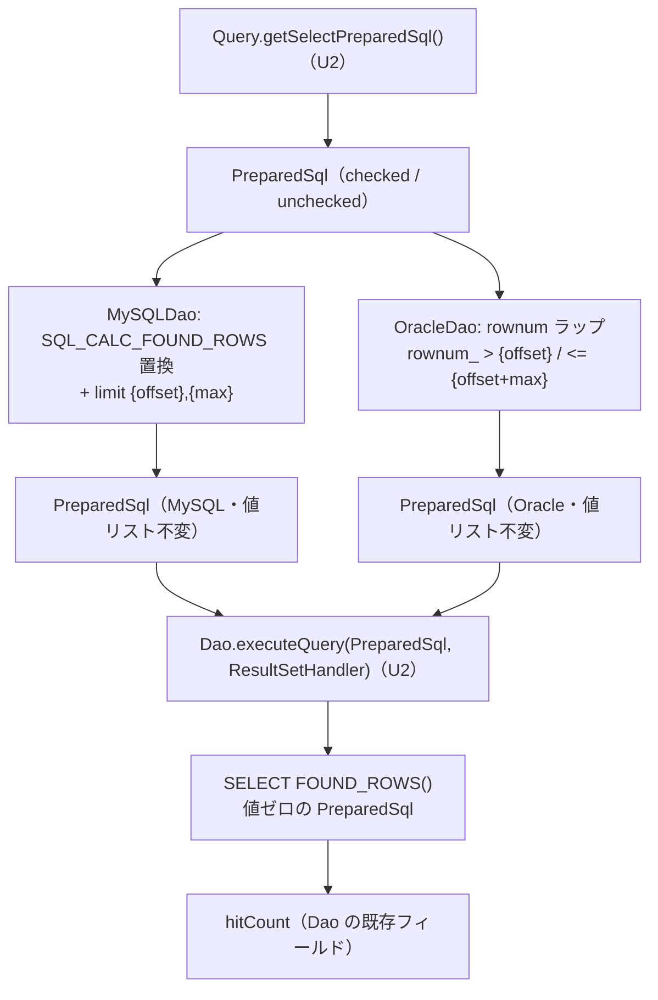

# Domain Entities — U4 `dialects`

## 上流成果物との関係

- **`unit-of-work.md`**（units-generation, 2.7）— U4 の責務「MySQL / Oracle の方言経路を新経路に載せ、その経路上に存在する既存欠陥を是正する」、境界（汎用経路 `Dao` / `Search` / `QueryImpl` に触れない、`MySQLSearch` / `MySQLCondition` / `PostgreSQLCondition` は変更なし、PostgreSQL 専用クラスを追加しない）、依存 U2、および実装上の制約（`SQL_CALC_FOUND_ROWS` の `replaceFirst` は `?` を増やさない、LIMIT / rownum の値は WHERE より後ろのテキストに現れる）。
- **`unit-of-work-story-map.md`**（同上）— U4 が担う FR-5.1 / 5.2 / 5.3 / 6.1 / 6.3 / 6.4 と FR-8.2 の該当行、判定する AC-9 / AC-10、Unit 内の実装順序 1〜4。
- **`requirements.md`**（requirements-analysis, 2.3）— FR-6.1（`searchListForOracle` の修正と有効化。`max` がページング範囲に使われていない点を含む）、FR-6.3（LIMIT の `int` 直接連結、**Should**）、FR-6.4（`OracleValueConvertFilter` の null ガード）、AC-9 / AC-10、NFR-1 / NFR-3 / NFR-7、CON-1。
- **`components.md`**（application-design, 2.6）— M-7 方言コンポーネントの責務と境界。
- **`component-methods.md`**（同上）— M-7 の変更内容表。本文書はそのうち 2 点を修正する（「2.6 / 2.7 契約からの差分」節。全量は `business-logic-model.md` § 8）。
- **`services.md`**（同上）— R-2 JDBC セッション管理、R-3 接続プーリング（`PreparedStatement` はプールされた `Connection` から都度生成される）、R-5 実行の観測。本文書のライフサイクルはこの記述に従う。

U1 `bind-foundation` が定義した `PreparedSql` / `BindValue` / `ResultSetHandler`、および U2 `select-path` が定義した `QueryImpl.getSelectPreparedSql()` / `Dao.executeQuery(PreparedSql, ResultSetHandler)` は**本 Unit の依存先**である。それらの契約は U1 / U2 の成果物にあり、本文書では再定義しない。

---

## この文書の範囲

**U4 は新しい型を 1 つも導入せず、既存クラスにフィールドを 1 つも追加しない。** `MySQLDao` / `OracleDao` / `OracleSearch` はいずれも状態を持たないか、状態は親クラス `Dao` / `Search` に属する。

したがって本文書が扱うのは次の 3 つである。

| # | 対象 | 種別 | 節 |
|---|---|---|---|
| 1 | **ページング窓** — `(start, max)` から導出される値の組 | 概念上の値（クラスにしない） | § 1 |
| 2 | **方言の `PreparedSql`** — 汎用経路の `PreparedSql` に方言接尾辞を足した派生値 | 既存型の合成規則 | § 2 |
| 3 | `hitCount` / `useHitCount` / `ValueConvertFilter` — U4 が意味に触れる既存の状態 | 既存 | § 3、§ 4 |

| 対象 | 新規フィールド | 新規 public 型 |
|---|---|---|
| `MySQLDao` | なし | なし |
| `OracleDao` | なし | なし |
| `OracleSearch` | なし | なし |

---

## § 1. ページング窓 — `(start, max)` から導出される値

### なぜ型にしないか

`(start, max)` は `searchList(Query, int, int)` の引数であり、メソッドの実行中しか生きない。**両方言で導出規則が同一であることが重要**なのであって、値を運ぶ器が必要なわけではない。型にすると public 表面が増え（FR-3.1 の互換維持対象が増え）、`unit-of-work.md` U4 の「汎用経路に触れない」という境界のもとでは置き場所（`org.tamacat.dao` か方言パッケージか）も決めなければならない。導出規則を規則として固定し、各方言のメソッド内でローカル計算する。

### 導出規則

汎用経路（`Dao.searchList`、`Dao.java:177-197`）と MySQL 経路（`MySQLDao.java:46`）が既に確立している意味に揃える。**`start` は 1 始まり**である。

| 導出値 | 定義 | 由来 |
|---|---|---|
| `offset` | `start - 1`（`start > 0` のとき）。`start <= 0` のとき窓なし | `Dao.java:181-184` の `for (int i=1; i<start; i++) rs.next();`、`MySQLDao.java:46` の `(start - 1)` |
| `limit` | `max`（`max > 0` のとき）。`max <= 0` のとき上限なし | `Dao.java:190-191` の `if (max > 0 && add >= max) break;` |
| `upperBound` | `offset + limit`（両方が有効なとき） | Q3 = A |

### 4 つの状態

**「窓」の導出式は両方言で共通だが、W-2 に限り方言によって適用されたりされなかったりする。** 下表は各方言が実際に返す**実効窓**を分けて示す。

| # | 条件 | MySQL の実効窓 | Oracle の実効窓 |
|---|---|---|---|
| W-1 | `start > 0 && max > 0` | `(offset, offset+limit]`。`limit {offset},{max}` を付ける。`useHitCount` なら `SQL_CALC_FOUND_ROWS` も付ける | `(offset, offset+limit]`。2 段ラップ（`rownum_ > {offset} and rownum_ <= {offset+max}`） |
| W-2 | `start > 0 && max <= 0` | **`[1, ∞)`。`offset` は適用されない。** 何も付けない（現行の `if (start > 0 && max > 0)` を維持）。`max<=0` のためコールバックの打ち切りも発火しない | `(offset, ∞)`。2 段ラップ（`rownum_ > {offset}` のみ） |
| W-3 | `start <= 0 && max > 0` | `[1, max]`。LIMIT 句は付かない（`paged = start>0 && max>0` が偽）が、コールバックの `if (max > 0 && add >= max) break;`（`MySQLDao.java:60-61`）は `paged` を参照せず `max > 0` だけで発火するため、結果的に先頭 `max` 件に切り詰まる | `[1, max]`。1 段ラップ（`where rownum <= {max}`） |
| W-4 | `start <= 0 && max <= 0` | 全件 | ラップしない |

**非対称は W-2 だけである。同じ `(start, max)` に対して 2 方言が異なる行集合を返すのは W-2 のみで、W-3 は行集合として一致する**（SQL 上の機構——LIMIT の有無・ラップの有無——は異なるが、結果の行集合は揃う）。

- **W-2**: MySQL は**現行の非対称をそのまま維持したもの**である——`MySQLDao.searchList` は `start > 0 && max > 0` のときしか LIMIT を付けず、`Dao.searchList`（`Dao.java:181-184`）が持つ行スキップに相当する処理も `MySQLDao.searchList` には存在しない。`max<=0` のためコールバックの打ち切りも発火しない。したがって `offset` はどこにも効かず実効窓は `[1, ∞)` になる。Oracle は W-2 でも `rownum_ > {offset}` を適用するため `offset` が効く。この条件を広げて `offset` を適用する行スキップを MySQL 側に追加すると、現行と異なる SQL が生成される（NFR-5 に対するリスク）。**FR-6.3 は LIMIT の連結方法の是正であって、LIMIT を付ける条件や行スキップの追加ではない。**
- **W-3**: MySQL は LIMIT 句こそ付けないが、コールバックの打ち切りが `max > 0` だけで独立に発火するため、`offset` を要しない `start<=0` の場合は Oracle の `where rownum <= {max}` と同じ行集合になる。Oracle 側は現行が `start > 0` だけでラップし `max` を使っていなかった（`business-logic-model.md` § 4.1「現行の 3 つの欠陥」の欠陥 2）ため、W-3 で `max` を使うことが FR-6.1 の要求そのものであり、これは MySQL の既存の打ち切り挙動と結果的に一致する。

**W-2 の非対称は意図的な決定であり、`business-rules.md`「残存リスク」R-6 に記録する。** 対称化（MySQL 側にも offset 適用の行スキップを足す）は本 Unit のスコープを超える判断のため、Functional Design ではこのまま実装し、必要なら後続の判断に委ねる。

### 不変条件

| # | 不変条件 | 守り方 |
|---|---|---|
| PW-1 | `offset >= 0` | `start <= 0` のときは窓を作らないため、`offset` は `start >= 1` からのみ導出される |
| PW-2 | `upperBound > offset`（両方が有効なとき） | `limit = max > 0` であるため構造的に成立 |
| PW-3 | 窓の値がテキストに現れる位置は WHERE 句より**後ろ**である | MySQL の `limit` は文末、Oracle の rownum 述語は最外側のラップ。`unit-of-work.md` U4「後続の連結」 |
| PW-4 | 窓の値は `?` を 1 つも作らない | Q2 = C。`int` を直接テキストに書く |

**PW-4 が値リストの順序に対して持つ意味**: 窓の値がバインドされないため、方言経路は汎用経路の値リスト（`getSelectPreparedSql()` が返す `PreparedSql.getValues()`）を**一切変更しない**。`component-dependency.md` が言う「後続の連結」で順序が壊れうる余地が、そもそも生じない。

---

## § 2. 方言の `PreparedSql` — 既存型の合成

方言経路が実行する `PreparedSql` は、U2 が作る汎用の `PreparedSql` に方言接尾辞（および MySQL では接頭辞の置換）を施した派生値である。

### 合成の入力と出力

| | 内容 |
|---|---|
| 入力 | `query.getSelectPreparedSql()` が返す `PreparedSql`（U2 が `QueryImpl` で override した checked 版、または外部 `Query` 実装の `default` 実装が返す `ofLiteral` 版） |
| 変換 | テキストに接尾辞を足す（MySQL は先頭の `SELECT ` の置換も行う）。**値リストは変更しない** |
| 出力 | 新しい `PreparedSql`（`PreparedSql` は不変であるため必ず新インスタンス） |

### 由来（provenance）を保つ規則

U1 の `PreparedSql` は **checked（`of`）/ unchecked（`ofLiteral`）の 2 つの由来**を持ち、`hasUnboundPlaceholders()` の挙動が異なる（U1 `domain-entities.md` C-2）。**方言による合成は、実際には `hasUnboundPlaceholders()` の値で分岐する**（下表）。unchecked かつプレースホルダ 0 個という稀な入力では合成後に checked 側の枝を通り由来のラベルが変わるが、値・個数とも 0 であるため実害はない（DS-3）。

| 入力の由来 | 合成に使うファクトリ | 理由 |
|---|---|---|
| checked（`hasUnboundPlaceholders()` が偽） | `PreparedSql.of(base.getSql() + suffix, base.getValues())` | 接尾辞は `?` を含まないため個数検査は入力と同じ結果になる |
| unchecked かつ未束縛あり（`hasUnboundPlaceholders()` が真） | `PreparedSql.ofLiteral(base.getSql() + suffix)` | `of` を使うと**生成時に `InvalidParameterException`（`IllegalArgumentException` の派生）**で落ち、U1 が `DBAccessManager.checkBindable` に用意した診断メッセージ付きの `DaoException` に到達しなくなる。失敗の型と場所を汎用経路と揃える |

**この分岐が必要になる具体例**: 外部の `Query` 実装が `getSelectPreparedSql()` を override せず（`default` 実装 = `PreparedSql.ofLiteral(getSelectSQL())`）、かつ `where(Param)` でリテラル側に `?` を持ち込んだ場合（U2 `business-logic-model.md` § 3.3 の帰結）。入力は「`?` を含むが値ゼロ」の unchecked な `PreparedSql` になる。汎用経路（`Dao.searchList`）ではこれが `DBAccessManager.checkBindable` で `DaoException` になる。**方言経路だけ別の例外型で、しかも実行前に落ちるのは避ける。**

### 不変条件

| # | 不変条件 | 守り方 |
|---|---|---|
| DS-1 | 合成後の値リストは入力と同一（同じ要素・同じ順序） | 接尾辞・置換のいずれも値を作らない（PW-4） |
| DS-2 | 合成後の `?` の個数は入力と同一 | 接尾辞に `?` を含めない。`SQL_CALC_FOUND_ROWS` の `replaceFirst("SELECT ", ...)` はテキスト置換であり `?` を増やさない（`unit-of-work.md` U4） |
| DS-3 | 合成は `base.hasUnboundPlaceholders()` の値を変えない——checked な入力は常に偽、`?` を持つ unchecked な入力は真のまま保たれる。**`?` を持たない unchecked な入力（実務上ほぼ生じない）だけは、合成後 `PreparedSql.of(...)` を通るため、由来（checked/unchecked のラベルそのもの）が結果的に checked 側へ切り替わる**——ただし値・個数とも 0 であり実害はない | 上表の分岐。**両方言で同一の private ヘルパを持つ**（`business-logic-model.md` § 2.2） |
| DS-4 | 入力の `PreparedSql` は変更されない | `PreparedSql` は不変（U1 P-4 / PS-1〜PS-5） |

**DS-3 のヘルパを 2 クラスに重複させる。** `MySQLDao` と `OracleDao` にそれぞれ private static メソッドとして置く。共通化するには `Dao` に protected メソッドを足すことになるが、それは `unit-of-work.md` U4 の境界「汎用経路（`Dao` / `Search` / `QueryImpl`）には触れない」を破り、かつ新規 protected メンバとして AC-11 の判定対象を増やす。**3 行の重複を受け入れる**（`business-logic-model.md` § 2.3 に判断を記録）。

---

## § 3. `hitCount` / `useHitCount` — 既存の状態、意味は不変

| 状態 | 所在 | 型 | U4 での扱い |
|---|---|---|---|
| `hitCount` | `Dao`（`Dao.java:55`） | `long` | **MySQL**: 現行どおり。まず `list.size()`、`useHitCount` かつ W-1 のとき `FOUND_ROWS()` の結果で上書きする。**Oracle**: 現行どおり設定しない |
| `useHitCount` | `Dao`（`Dao.java:56`） | `boolean`（既定 `true`） | 不変。`useHitCount(boolean)` / `getHitCount()` / `setHitCount(long)` はシグネチャも挙動も変えない |

**Oracle が `hitCount` を設定しないことを決定として記録する。** MySQL の `SQL_CALC_FOUND_ROWS` / `FOUND_ROWS()` に相当する機構が Oracle にはなく、総件数を得るには別途 `count(*)` を実行する必要がある。これは FR-6.1（未バインド `?` の解消と rownum ページングの動作）の範囲外であり、追加すると実行回数が増えて NFR-7 の「最適化を持ち込まない」姿勢とも食い違う。**現行も設定していないため、挙動の変化ではない。**

### ライフサイクル（MySQL、W-1 のとき）

```
searchList(query, start, max)
  ├─ 1 本目: 本体 SQL を実行 ──> list
  ├─ setHitCount(list.size())                      … 現行と同じ中間状態
  └─ useHitCount なら 2 本目: SELECT FOUND_ROWS()
       └─ setHitCount(hit)                          … 上書き
```

`hitCount` は `Dao` インスタンスのフィールドであり `searchList` の呼び出しごとに上書きされる。この単回上書きのライフサイクルは現行（`MySQLDao.java:63-70`）と同一である。

---

## § 4. `ValueConvertFilter` — 3 実装の null 契約（FR-6.4）

`Search.ValueConvertFilter` は状態を持たない SPI である（`Search.java:95-97`）。U4 が触るのは `OracleValueConvertFilter` 1 つだけで、**変更はフィールドではなく契約の穴埋め**である。

| 実装 | 所在 | `value == null` のときの現行の挙動 |
|---|---|---|
| `Search.DefaultValueConvertFilter` | `Search.java:99-107` | `return value;`（null を返す） |
| `MySQLSearch.MySQLValueConvertFilter` | `MySQLSearch.java:11-20` | `return value;`（null を返す） |
| `OracleSearch.OracleValueConvertFilter` | `OracleSearch.java:11-15` | **`NullPointerException`**（`value.replace(...)` をガードなしで呼ぶ） |

### 修正後の契約

| # | 不変条件 |
|---|---|
| VF-1 | 3 実装すべてが `value == null` に対して `null` を返す。例外を投げない |
| VF-2 | `value != null` のときの変換結果は現行と 1 文字も変わらない（Oracle は `'` → `''`、MySQL は `'` → `''` かつ `\` → `\\`、既定は `'` → `''`） |

**VF-1 が AC-10 の判定条件そのものである**——「NullPointerException がスローされない」かつ「汎用実装および MySQL 実装と同じ結果が返る」。

**バインド経路ではこのフィルタは適用されない**（FR-2.2、U1 BR-18）。修正が必要なのは、旧リテラル経路（`SQLParser` 経由の `getSearchString()` / `getSelectSQL()`）が FR-7.1 により残り続けるためである（`components.md` M-7）。

**`OracleSearch` に他の変更はない。** コンストラクタも `Search` の継承関係も不変であり、`org.tamacat.dao.impl` パッケージのままである。`OracleValueConvertFilter` は package-private の static クラスであり public 表面に載らない（NFR-3 の判定対象外）。

---

## 状態と派生の関係



<!-- Text fallback: U2 の Query.getSelectPreparedSql() が返す PreparedSql（checked または unchecked）を入力として、MySQLDao は SQL_CALC_FOUND_ROWS の置換と limit のリテラル連結を、OracleDao は rownum のラップを施し、それぞれ新しい PreparedSql を作る。どちらも値リストは入力と同一のまま変更しない。合成後の PreparedSql は U2 が追加した Dao.executeQuery(PreparedSql, ResultSetHandler) で実行される。MySQL の useHitCount 経路ではさらに値ゼロの PreparedSql として SELECT FOUND_ROWS() を実行し、その結果で Dao の既存フィールド hitCount を上書きする。 -->

---

## 2.6 / 2.7 契約からの差分（**型・状態に関する差分のみ**）

> **この節は差分の全量ではない。** 本文書が扱う範囲——型と状態——に限った差分である。差分の全量は **`business-logic-model.md` § 8** にある。本節と § 8 が食い違ったときは § 8 が正である。

| # | 上流の記述 | 修正後 | 由来 |
|---|---|---|---|
| 1 | `component-methods.md` M-7「`MySQLDao.searchList` は LIMIT を `" limit ?,?"` にしてオフセットと件数をバインドする」 | バインドしない。`int` のリテラル連結を維持する。窓の値は `?` を作らない（PW-4） | Q2 = C |
| 2 | `component-methods.md` M-7「`OracleDao.searchListForOracle` は rownum の `?` をバインドする」 | rownum の境界値もリテラルで埋める。`max` をページング範囲の決定に使う点は採る | Q2 = C ＋ Q3 = A |

**新規 public / protected メンバ**: **なし。** `OracleDao.searchList(Query,int,int)` は `Dao` の既存 public メソッドの override であり、新規メンバではない。`MySQLDao.searchList` も同様である。合成ヘルパは private static である。

**削除・シグネチャ変更**: **なし。** `OracleDao.searchListForOracle(Query,int,int)` は public のまま残す（NFR-3）。
