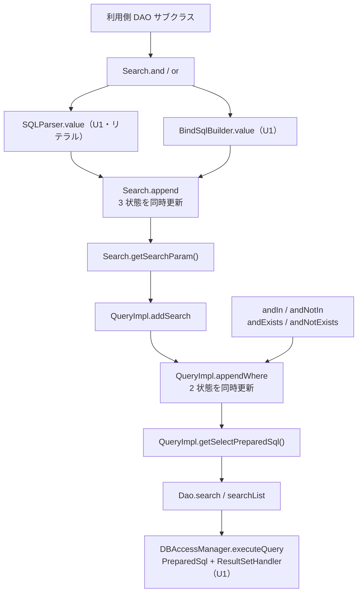

# Business Logic Model — U2 `select-path`

## 上流成果物との関係

- **`unit-of-work.md`**（units-generation, 2.7）— U2 の責務・境界・所有コンポーネント、「最大の設計リスク」＝ `Search` の 3 状態同期、`Query` インターフェースの変更を U2 に置く理由、移行作業（Q7 = B）、実装上の制約（CON-7、サブクエリの差し込み、旧戻り値の不変）。
- **`unit-of-work-story-map.md`**（同上）— U2 が担う FR-1.1 / 1.2 / 1.3 / 1.6 / 3.1 / 3.3 / 7.1 / 7.2 / 7.3、判定する AC-1 / AC-2 / AC-3 / AC-4、および「Unit 内の実装順序」1〜8。本文書の § 9 はその 8 段に対応づける。
- **`requirements.md`**（requirements-analysis, 2.3）— FR-1、FR-3.1 / 3.3、FR-7.1〜7.3、NFR-1、NFR-3、NFR-4、CON-7。
- **`components.md`**（application-design, 2.6）— M-1 / M-2 / M-3 / M-4 の責務と境界、「設計の骨子」の 2 経路並置構造。
- **`component-methods.md`**（同上）— M-1 の `default` 一覧と既定実装、M-2 の値アキュムレータ表と `addWhere(String, Param)`、M-3 の同期規則、M-4 の追加メソッド。本文書はこれらのうち 4 点を修正する（§ 10）。
- **`services.md`**（同上）— 「実行フローの変化」シーケンス図。本文書はそのうち `Search` → `QueryImpl` → `Dao` の区間を詳細化する。

U1 `bind-foundation` が定義した `Param` / `PreparedSql` / `BindValue` / `ResultSetHandler` の契約は U1 の成果物にある。規則の列挙は本 Unit の `business-rules.md`、状態の定義は `domain-entities.md` にある。本文書は**アルゴリズムと処理順序**を扱う。`BR-n` は本 Unit の規則、`U1 BR-n` は U1 の規則を指す。

---

## この文書の範囲

U2 は「WHERE 述語の組み立てから SELECT の実行まで」をバインド経路に切り替える。U1 が作った型と生成器の**上に経路を通す**のが仕事であり、値の分類規則や JDBC への適用は U1 の担当である。

| # | 処理 | 担当 | 節 |
|---|---|---|---|
| 1 | 述語を 3 状態（リテラル / バインドテキスト / 値）に同時蓄積する | M-3 `Search` | § 2 |
| 2 | WHERE 句を 2 状態（リテラル / 断片リスト）に同時蓄積する | M-2 `QueryImpl` | § 3 |
| 3 | SELECT 文を組み立て、値をテキストの出力順に結合する | M-2 `QueryImpl` | § 4 |
| 4 | サブクエリの子の文と値を親の一点に差し込む | M-2 `QueryImpl` | § 5 |
| 5 | `Query` に `default` 9 個を追加し旧 6 個を非推奨にする | M-1 `Query` | § 6 |
| 6 | FROM / JOIN 句の値を扱う | M-2 `QueryImpl` | § 7 |
| 7 | `prepare()` を提供し、実行をコールバック形に切り替える | M-4 `Dao` / `DaoAdapter` | § 8 |

**U2 が触らないもの**: INSERT / UPDATE / DELETE の経路（U3）、方言クラス（U4）、`Sort`（U5）、`ValueRules` / `BindSqlBuilder` / `PreparedStatementBinder` の内部（U1）。

---

## § 1. 全体のデータフロー



<!-- Text fallback: 利用側 DAO サブクラスが Search.and / or を呼ぶと、Search は U1 の SQLParser（リテラル面）と BindSqlBuilder（バインド面）の両方を呼び、その結果を単一の private append メソッドに渡して 3 状態を同時に更新する。getSearchParam() がバインド面を Param として返し、QueryImpl.addSearch がそれを appendWhere に渡して WHERE の 2 状態を同時に更新する。サブクエリ系メソッドも appendWhere を経由する。getSelectPreparedSql() が PreparedSql を組み立て、Dao.search / searchList が U1 の DBAccessManager にコールバックとともに渡して実行する。 -->

**同期を守る private メソッドは 3 つ**（`Search.append`、`QueryImpl.appendWhere`、`QueryImpl` の outer join 用）。この 3 つを迂回する経路を作らないことが U2 の正しさの中核である（BR-1、BR-3、BR-5）。

---

## § 2. `Search` — 3 状態の同時更新

### 2.1 追加するフィールド

```java
protected StringBuilder search = new StringBuilder();        // 既存（Search.java:23）
protected StringBuilder bindSearch = new StringBuilder();    // 追加
protected List<BindValue> bindValues = new ArrayList<>();    // 追加

SQLParser parser;                    // 既存（:30）。リテラル面
BindSqlBuilder builder;              // 追加。バインド面
```

コンストラクタ 2 種（`Search()` / `Search(ValueConvertFilter)`）で `builder` も生成する。`builder` は `ValueConvertFilter` を受け取らない（BR-18 相当、U1 BR-18）。

### 2.2 唯一の同期メソッド

```java
private void append(String connector, String literalSql, Param bindParam) {
    if (search.length() > 0) {
        search.append(" ").append(connector).append(" ");
        bindSearch.append(" ").append(connector).append(" ");
    }
    search.append(literalSql);
    bindSearch.append(bindParam.getSql());
    bindValues.addAll(bindParam.getValues());
}
```

先頭の断片に連結子を付けない条件（`search.length() > 0`）は現行 `Search.java:41-42` と同一である。**判定に使うのはリテラル側の長さだけ**——両者は常に同時に伸びるため（BR-1）、どちらで判定しても同じである。リテラル側を基準にするのは現行コードとの差分を最小にするためである。

### 2.3 4 つの入口

```java
public Search and(Column column, Conditions condition, String... values) {
    append("and", parser.value(column, condition, values),
                  builder.value(column, condition, values));
    return this;
}
public Search or(Column column, Conditions condition, String... values) {
    append("or", parser.value(column, condition, values),
                 builder.value(column, condition, values));
    return this;
}
public Search and(Search other) {
    Param p = other.getSearchParam();
    append("and", "(" + other.getSearchString() + ")",
                  Param.of("(" + p.getSql() + ")", p.getValues()));
    return this;
}
public Search or(Search other) {
    Param p = other.getSearchParam();
    append("or", "(" + other.getSearchString() + ")",
                 Param.of("(" + p.getSql() + ")", p.getValues()));
    return this;
}
```

**例外時の原子性**: `parser.value(...)` と `builder.value(...)` はどちらも `ValueRules` の必須チェック（U1 BR-1）と型検証（U1 BR-2）で `InvalidParameterException` を投げうる。**両者は `append(...)` の引数として評価されるため、どちらかが投げた時点で 3 状態のいずれも変更されていない。** これは BR-1 の不変条件を例外経路でも保つための構造である。

**両者の例外は一致する**——同じ `ValueRules` を呼ぶため（U1 § 3、§ 4.1）。したがって「リテラル側だけ成功してバインド側が失敗する」状態は生じない。

### 2.4 アクセサ

```java
public Param getSearchParam() {                       // 追加（public。decisions.md F-1）
    return Param.of(bindSearch.toString(), bindValues);
}

@Deprecated
public String getSearchString() {                     // 既存。戻り値不変
    return search.toString();
}
```

`Param.of(...)` が S-1（`?` の個数 = 値の個数）を検査する。空の `Search` に対しては `Param.of("", [])` となり 0 = 0 で通る。

`getSearchParam()` を **public** にするのは `decisions.md` のレビュー指摘 F-1 による——`Search` は `org.tamacat.dao`、`QueryImpl` は `org.tamacat.dao.impl` であり、Java の package-private は別パッケージに及ばない。

---

## § 3. `QueryImpl` — WHERE の 2 状態（Q1 = C）

### 3.1 追加するフィールドと内部型

```java
protected StringBuilder where = new StringBuilder();              // 既存（:48）。protected のまま
protected List<WhereFragment> bindFragments = new ArrayList<>();  // 追加

private static final class WhereFragment {   // public にしない
    final String connector;    // "and" / "or"。先頭断片では無視される
    final Param param;
}
```

### 3.2 唯一の同期メソッド

```java
private void appendWhere(String connector, String literalSql, Param bindParam) {
    if (where.length() == 0) {
        where.append(" ").append(WHERE).append(" ");
    } else {
        where.append(" ").append(connector).append(" ");
    }
    where.append(literalSql);
    bindFragments.add(new WhereFragment(connector, bindParam));
}
```

**` WHERE ` 接頭辞はリテラル側にだけ書く。** バインド側は断片のリストであり、接頭辞は `getSelectPreparedSql()` が描画時に付ける（§ 4.2）。断片に接頭辞を持たせないことで、断片が「述語そのもの」だけを表す形に保たれる。

### 3.3 `addWhere` の 2 つの形

```java
// 既存シグネチャ。リテラル専用経路（where(String) / and(String) / or(String) / getUpdateSQL の主キー述語）
protected Query<T> addWhere(String condition, String sql) {
    if (sql != null && sql.trim().length() > 0) {
        appendWhere(condition, sql, Param.of(sql, Collections.<BindValue>emptyList()));  // BR-19
        useAutoPrimaryKeyUpdate = false;
    }
    return this;
}

// component-methods.md M-2 が宣言した形。リテラル側は Param のテキストをそのまま使う
protected Query<T> addWhere(String condition, Param param) {
    return addWhere(condition, param == null ? null : param.getSql(), param);
}

// 内部の 3 引数形。リテラル面とバインド面が別物である経路が使う
private Query<T> addWhere(String condition, String literalSql, Param bindParam) {
    if (bindParam != null && literalSql != null && literalSql.trim().length() > 0) {
        appendWhere(condition, literalSql, bindParam);
        useAutoPrimaryKeyUpdate = false;
    }
    return this;
}
```

**2.6 の `addWhere(String, Param)` は 2 引数では足りない。** ADR-003 によりリテラル側の `where` も維持する必要があるが、`Param` はバインド面のテキストしか運ばない。3 引数の内部形を設け、2.6 が宣言した 2 引数形はその薄いラッパにする（§ 10 の差分 2）。

**`addWhere(String, Param)`（2 引数）の帰結**: リテラル側に `?` を含むテキストが入る。すなわち **`where(Param)` で組み立てた `Query` の `getSelectSQL()` は未束縛の `?` を含む SQL を返す**。`where(Param)` は FR-7.3 で新設するメソッドであり保存すべき旧挙動を持たないため、これは互換性の破壊ではない。この SQL を `ofLiteral` 経由で実行すると U1 の `hasUnboundPlaceholders()` が `DaoException` で拒否する（ADR-012）——診断可能な失敗であり、`business-rules.md` R-3 の系として記録する。

### 3.4 `join` も同期メソッドを経由する

```java
@Override
public Query<T> join(Column col1, Column col2) {
    tables.add(col1.getTable());
    tables.add(col2.getTable());
    String sql = getColumnName(col1) + "=" + getColumnName(col2);
    appendWhere("and", sql, Param.of(sql, Collections.<BindValue>emptyList()));
    // useAutoPrimaryKeyUpdate は設定しない（現行の非対称を維持。BR-4）
    return this;
}
```

現行は `where` に直接書いていた（`:312-322`）。**バインド側を取りこぼすと `getSelectPreparedSql()` から JOIN 条件が消える**ため、必ず `appendWhere` を経由させる。カラム名同士の比較であり値を持たないため `Param` は値ゼロである。

### 3.5 `addSearch` — 3 つの副作用を維持する

```java
protected Query<T> addSearch(String condition, Search search, Sort sort) {
    if (distinct == false) { distinct(search.isUnique()); }            // ① 現行のまま
    addWhere(condition, search.getSearchString(), search.getSearchParam());  // ② F4 の解消
    return orderBy(sort);                                              // ③ 現行のまま
}
```

② が変更点である。リテラル面は `getSearchString()`、バインド面は `getSearchParam()` から取り、3 引数形に渡す。①（DISTINCT の伝播。`if (distinct == false)` という条件を含む）と ③（ORDER BY の付与）は 1 文字も変えない（BR-17）。

---

## § 4. `getSelectPreparedSql()` の組み立て

### 4.1 SELECT 句と FROM 句を旧新で共有する

`getSelectSQL()`（`:135-181`）の SELECT 句・FROM 句の組み立ては、バインド版でもまったく同じ結果になる（値を含まないため）。**同じロジックを 2 か所に書くと乖離する**ので、private ヘルパに切り出して両者が呼ぶ。

```java
private String buildSelectClause() { /* :138-157 をそのまま */ }
private String buildFromClause(boolean bind, List<BindValue> collected) { /* :158-180 + 値の収集 */ }
```

`buildFromClause` は `bind` が真のとき `bindOuterJoinTables` のテキストを使い、同じループの中で値を `collected` に積む（BR-8）。偽のときは `outerJoinTables` を使い `collected` に触れない。

**`blobIndex` の扱い**: `getSelectSQL()` は先頭で `blobIndex = 0` にし（`:137`）、SELECT カラムに `DataType.OBJECT` が現れるたびに `blobIndex++` する（`:148-150`。増分は `:149`）。**`getSelectPreparedSql()` も同じ計数を行う。** SELECT 経路の `blobIndex` は従来「SELECT リストの OBJECT カラム数」を意味しており、この経路にバインド値としての OBJECT は現れないためである。INSERT / UPDATE 経路での `blobIndex` の意味の変更（`getBindIndexOf(OBJECT, 1)`）は U3 の担当であり、U2 は SELECT 経路の意味を変えない。

### 4.2 組み立て

```java
@Override
public PreparedSql getSelectPreparedSql() {
    List<BindValue> values = new ArrayList<>();
    String select = buildSelectClause();                    // 値なし
    String from = buildFromClause(true, values);            // FROM 句の値をここで収集（BR-6 の先頭）
    StringBuilder w = new StringBuilder();
    for (int i = 0; i < bindFragments.size(); i++) {
        WhereFragment f = bindFragments.get(i);
        w.append(i == 0 ? " " + WHERE + " " : " " + f.connector + " ");
        w.append(f.param.getSql());
        values.addAll(f.param.getValues());                 // BR-6 の後段
    }
    return PreparedSql.of(select + from + w + groupBy + orderBy, values);
}
```

**値の結合順は `FROM 句の値 ++ 各断片の値（断片の並び順）`** である。テキストの出力順（`select + from + where + groupBy + orderBy`、`:181`）と一致する。`groupBy` / `orderBy` は値を持たない（BR-7）。

`PreparedSql.of(...)` が最終の個数検査を行う（U1 BR-24）。ここで落ちるのは、断片単位の `Param` はすべて整合しているのに全体で不整合になった場合——すなわち FROM 句の値の収集漏れか二重計上である。**この検査が § 4 の実装ミスを捕まえる最後の砦である。**

---

## § 5. サブクエリ（FR-1.6）

現行（`:388-406`）は子の `getSelectSQL()`（リテラル）を親の WHERE に連結する。バインド版は子の `getSelectPreparedSql()` を使う。

```java
@Override
public Query<T> andIn(Column column, Query<T> query) {
    PreparedSql child = query.getSelectPreparedSql();
    String literal = getColumnName(column) + " IN (" + query.getSelectSQL() + ")";
    Param bind = Param.of(getColumnName(column) + " IN (" + child.getSql() + ")", child.getValues());
    return addWhere("and", literal, bind);
}
```

`andNotIn`（`" NOT IN ("`）、`andExists`（`"EXISTS ("`）、`andNotExists`（`"NOT EXISTS ("`）も同形である。

**子の値が連続ブロックとして 1 つの `WhereFragment` に入るため、差し込み位置の一致が構造的に成立する**（BR-9）。断片リスト構造（Q1 = C）の直接の利点である——値リストが 1 本の設計なら「子の値を親のどの位置に挿入するか」を明示的に管理する必要があった。

**子と親の両方を呼ぶことの帰結**: `query.getSelectSQL()` と `query.getSelectPreparedSql()` を両方呼ぶため、子の `blobIndex` が 2 回設定される（どちらも同じ値になるため実害はない）。子の `tables` / `uniqTableNames` への追加は `Set` であり冪等である。

---

## § 6. `Query` インターフェース（M-1）

### 6.1 追加する `default` メソッド 9 個

| メソッド | 既定実装 |
|---|---|
| `default PreparedSql getSelectPreparedSql()` | `PreparedSql.ofLiteral(getSelectSQL())` |
| `default PreparedSql getInsertPreparedSql(T data)` | `PreparedSql.ofLiteral(getInsertSQL(data))` |
| `default PreparedSql getUpdatePreparedSql(T data)` | `PreparedSql.ofLiteral(getUpdateSQL(data))` |
| `default PreparedSql getDeletePreparedSql(T data)` | `PreparedSql.ofLiteral(getDeleteSQL(data))` |
| `default PreparedSql getDeleteAllPreparedSql(Table table)` | `PreparedSql.ofLiteral(getDeleteAllSQL(table))` |
| `default Query<T> where(Param param)` | `where(param.getSql())`（値は失われる） |
| `default Query<T> and(Param param)` | `and(param.getSql())` |
| `default Query<T> or(Param param)` | `or(param.getSql())` |
| **`default Query<T> andOuterJoin(Table table, Param param)`** | **`return this;`（何もしない）** |

**`andOuterJoin(Table, Param)` の既定実装だけが委譲しない理由**: 他の `default` は対応する旧メソッドに委譲できるが、旧 `andOuterJoin(Table, Search)` は `Search` を要求し、`Param` から `Search` を作る手段がない（`Search` は蓄積器であり、テキストから復元できない）。例外を投げると外部の `Query` 実装が新しい経路で必ず失敗する（ADR-006 が排した挙動）。**何もしないことで、外部実装は現行の `andOuterJoin` がキー不在時に示すのと同じ挙動になる**（BR-13）。

### 6.2 `@Deprecated` を付ける旧メソッド 6 個

`getSelectSQL()` / `getInsertSQL(T)` / `getUpdateSQL(T)` / `getDeleteSQL(T)` / `getDeleteAllSQL(Table)` / **`andOuterJoin(Table, Search)`**。いずれもシグネチャも戻り値の中身も変えない。

### 6.3 不変のメソッド 29 個

**`Query.java` の実メソッド宣言数は 35 である**（`Query.java:25-180` を実測）。29 + 6 = 35 で整合する。

**`component-methods.md` M-1 の「上記以外の 25 メソッド」は誤りである。** 同節が列挙する名前は 27 個だが、そのうち `select` は 2 オーバーロード、`addUpdateColumn(s)` は 3 メソッド（`addUpdateColumn` ＋ `addUpdateColumns` 2 形）を 1 つの名前にまとめている。展開すると 30 個であり、2.6 が非推奨にする 5 個を引いた 35 − 5 = 30 と一致する。**列挙そのものは網羅している——数え上げだけが誤っている。** 本ステージが Q2 = C で `andOuterJoin(Table, Search)` を非推奨に移すため、不変は 29 個になる。

**`where(String)` / `and(String)` / `or(String)` / `param()` は非推奨にしない。** FR-7.1 がこれらの正当な用途（開発者が書いた SQL 断片）を認めており、非推奨にするとその用途まで否定することになる（ADR-002 代替 2 の却下理由）。

### 6.4 `QueryImpl` は 9 個すべてを override する

U2 が override するのは `getSelectPreparedSql()` / `where(Param)` / `and(Param)` / `or(Param)` / `andOuterJoin(Table, Param)` の 5 個である。残り 4 個（insert / update / delete / deleteAll）は **U3 が override する**。**インターフェース側の宣言は U2 で一括して行う**——2 つの Unit に分けると U2 完了時点で `Query` が「半分だけ新メソッドを持つ」状態になり、`QueryImpl` のコンパイルが片方の Unit に引きずられる（`unit-of-work.md`「`Query` インターフェースの変更をここに置く理由」）。

---

## § 7. FROM / JOIN 句（Q2 = C）

### 7.1 追加するフィールド

```java
protected Map<Table, String> outerJoinTables = new LinkedHashMap<>();      // 既存（:44）
protected Map<Table, Param> bindOuterJoinTables = new LinkedHashMap<>();   // 追加
```

### 7.2 唯一の同期メソッド

```java
private void putOuterJoin(Table key, String literalExpr, Param bindExpr) {
    outerJoinTables.put(key, literalExpr);
    bindOuterJoinTables.put(key, bindExpr);
}
```

`outerJoin(Column, Column)` / `andOuterJoin(Table, Search)` / `andOuterJoin(Table, Param)` はすべてこれを経由する（BR-5）。

### 7.3 3 つの入口

```java
@Override
public Query<T> outerJoin(Column col1, Column col2) {
    // :325-340 のロジックはそのまま。ただし put の呼び出し箇所は 2 つある
    //   (a) outerJoinTables.containsKey(col2.getTable()) が真の枝（既存式に " and ..." を連結）
    //   (b) 偽の枝（"... left join ... on ..." を新規に作る）
    // 両方を putOuterJoin に置き換える。片方だけ置き換えると bindOuterJoinTables が
    // 欠落し、getSelectPreparedSql() の FROM 句から outer join が消える。
    // 生成される式はカラム名同士の比較のみで値を持たないため、
    // bindExpr は Param.of(同じテキスト, emptyList()) になる。
}

@Deprecated
@Override
public Query<T> andOuterJoin(Table tab1, Search search) {
    if (outerJoinTables.containsKey(tab1)) {                    // BR-13。現行の条件をそのまま
        String literal = outerJoinTables.get(tab1) + " and " + search.getSearchString();
        Param prev = bindOuterJoinTables.get(tab1);
        // 旧メソッドはリテラルのまま。バインド面にもリテラルテキストを値ゼロで積む（BR-12）
        putOuterJoin(tab1, literal,
            Param.of(prev.getSql() + " and " + search.getSearchString(), prev.getValues()));
    }
    return this;
}

@Override
public Query<T> andOuterJoin(Table tab1, Param param) {         // 新規
    if (outerJoinTables.containsKey(tab1)) {                    // BR-13。同じ条件で同じく何もしない
        Param prev = bindOuterJoinTables.get(tab1);
        List<BindValue> merged = new ArrayList<>(prev.getValues());
        merged.addAll(param.getValues());
        putOuterJoin(tab1,
            outerJoinTables.get(tab1) + " and " + param.getSql(),   // リテラル面にも ? が入る（§ 3.3 と同じ帰結）
            Param.of(prev.getSql() + " and " + param.getSql(), merged));
    }
    return this;
}
```

**非推奨版のバインド面にリテラルテキストを積むことの帰結**: `getSelectPreparedSql()` の FROM 句に値がリテラルとして残る。**この経路は SM-1 の対象外である**（BR-12、`business-rules.md` R-1）。`Query` の他の 5 つの非推奨メソッドと同じ扱いであり、FR-7.2 の文書化対象に加える。

### 7.4 値の収集順

FROM 句の値は `buildFromClause` の `for (Table tab : tables)` ループ（`:157-179` に対応）で、テキストを組み立てるのと**同一の反復**の中で収集する（BR-8）。独立した蓄積リストを持たないため、テキストの出力順と値の順序がずれる余地がない。

---

## § 8. `Dao` / `DaoAdapter`（M-4）

### 8.1 `prepare(...)` — `param()` のバインド版

```java
public Param prepare(Column column, Conditions condition, String... values) {
    return bindSqlBuilder.value(column, condition, values);
}
```

`param(...)`（`Dao.java:138-140`）は**無変更**で残る（BR-14、FR-7.3）。`Dao` はリテラル用の `SQLParser` とバインド用の `BindSqlBuilder` の 2 つを保持する。

`prepare` という別名にする理由は ADR-002 のとおり——Java は戻り値の型だけが異なるオーバーロードを許さない。

### 8.2 実行（Q3 = A、U1 の Q1 = E を受ける）

```java
protected <R> R executeQuery(PreparedSql sql, ResultSetHandler<R> handler) throws DaoException {
    DaoEvent event = createDaoEvent(sql.getSql());
    getExecuteHandler().handleBeforeExecuteQuery(event);
    R result = dbm.executeQuery(sql, handler);
    getExecuteHandler().handleAfterExecuteQuery(event);
    return result;
}

public T search(Query<T> query) {
    try {
        return executeQuery(query.getSelectPreparedSql(), rs -> {
            if (rs.next()) return mapping(query.getSelectColumns(), rs);
            else return orm.getMappedObject();
        });
    } catch (DaoException e) {
        handleException(e.getCause() != null ? e.getCause() : e);   // BR-16。必ず throw する
        return null;                                                 // 到達しない
    }
}

public Collection<T> searchList(Query<T> query, int start, int max) {
    Collection<Column> columns = query.getSelectColumns();
    try {
        return executeQuery(query.getSelectPreparedSql(), rs -> {
            ArrayList<T> list = new ArrayList<>();
            if (start > 0) { for (int i = 1; i < start; i++) rs.next(); }   // :182-185 のまま
            int add = 0;
            while (rs.next()) {
                list.add(mapping(columns, rs));
                add++;
                if (max > 0 && add >= max) break;                          // :186-193 のまま
            }
            return list;
        });
    } catch (DaoException e) {
        handleException(e.getCause() != null ? e.getCause() : e);
        return null;
    }
}
```

**`ResultSet` の close は `DBAccessManager` が行う**（U1 § 7.1 の try-with-resources）。`Dao` 側の `try (ResultSet rs = ...)` は消える。

**`handleException` の funnel が広がる**（BR-16）。現行は `rs.next()` / `mapping()` の失敗だけが `handleException` を通っていた——`dbm.executeQuery(String)` が既に `SQLException` を `DaoException` に包んでいたためである。コールバック化により実行そのものの失敗も通るようになる。**通知を失う方向の変化はない。**

**Java 8 適合**: ラムダが捕捉する `query` / `columns` / `start` / `max` はいずれも実質的 final である（メソッド引数、およびメソッド内で再代入しないローカル）。`ResultSetHandler.handle` が `throws SQLException` を宣言しているため、`rs.next()` をそのまま書ける（U1 の設計）。

### 8.3 `DaoAdapter`

`DaoAdapter` に次を追加し、いずれも `delegate` に転送する。

| メソッド | 可視性 | 転送先 |
|---|---|---|
| `prepare(Column, Conditions, String...)` | public | `delegate.prepare(...)` |
| `<R> R executeQuery(PreparedSql, ResultSetHandler<R>)` | protected | `delegate.executeQuery(sql, handler)` |

`search(Query)` / `searchList(Query,int,int)` / `searchList(Query)` は既に転送されている（`DaoAdapter.java:136-146`）ため追加は不要である。

**`executeQuery` の転送を追加する理由**（レビュー指摘 F-1 による訂正）: `DaoAdapter` は現行で `protected ResultSet executeQuery(String sql)` を `delegate` に転送している（`DaoAdapter.java:176-178`）。`executeUpdate(String)`（`:180-182`）と `executeUpdate(String,int,InputStream)`（`:184-186`）も同様である。したがって「現行は `executeQuery` を転送していない」という前提は誤りであり、バインド版だけ転送しない理由はない。

さらに `unit-of-work-story-map.md`（AC-11 の項）は、U2 が **`DaoAdapter.java` 自身に直接追加する**メンバとして `prepare(...)` / `executeQuery(PreparedSql)` / `search` / `searchList` を明示的に挙げており、それが AC-11（変更前にコンパイルされた `DaoAdapter` サブクラスが再コンパイルなしでロードできる）の判定根拠になっている。**転送を省くと AC-11 の判定前提が崩れる。**

旧 `executeQuery(String)` / `executeUpdate(String)` / `executeUpdate(String,int,InputStream)` の転送は**そのまま残す**（BR-10、FR-3.1）。

---

## § 9. 実装順序

`unit-of-work-story-map.md`「U2 `select-path`」の 8 段に本文書の節を対応づける。

| 段 | 内容 | 本文書 | 完了の確認 |
|---|---|---|---|
| 1 | `Query`（M-1）に `default` 9 個を宣言し、旧 6 個に `@Deprecated` | § 6 | コンパイルが通る。**U3 が override を足せる土台を先に作る** |
| 2 | `Search`（M-3）の 3 状態と private `append(...)` | § 2.1、§ 2.2 | `SearchTest` が**無変更で緑**（BR-10） |
| 3 | `Search.getSearchParam()`（public）の追加 | § 2.4 | 空の `Search` と 1 述語・2 述語で `Param.of` が通る |
| 4 | `QueryImpl`（M-2）の `bindFragments` と `appendWhere` / `addWhere` 3 形 / `join` / `addSearch` | § 3 | `QueryImplTest` が**無変更で緑**。`getSelectSQL()` と `getSelectPreparedSql()` の述語数が一致する |
| 5 | `QueryImpl.getSelectPreparedSql()` | § 4 | **AC-1**（STRING の EQUAL）、**AC-2**（LIKE）、**AC-3**（IN の `(?,?,?)` と順序） |
| 6 | `andIn` / `andNotIn` / `andExists` / `andNotExists`（FR-1.6） | § 5 | **AC-4**（サブクエリの差し込み位置）。**5 の完成後**でなければ子の `getSelectPreparedSql()` が使えない |
| 6b | `andOuterJoin` の非推奨化とバインド版の追加（Q2 = C） | § 7 | FROM 句に値が出る場合の結合順が正しい |
| 7 | `Dao` / `DaoAdapter`（M-4）の `prepare(...)` / `executeQuery(PreparedSql, ResultSetHandler)` / `search` / `searchList` | § 8 | 実行経路が新経路に切り替わる |
| 8 | 移行（Q7 = B） | BR-20 | `UserDao` / `FileDataDao` / `MySQLDaoTest` の `param()` → `prepare()`、`UserDaoTest` の SELECT 経路アサート書き換え、FR-8.2 対応表の該当行 |

**段 2 を段 3 より先に置く理由**（`unit-of-work-story-map.md`）: `getSearchParam()` が返す `Param` は `bindSearch` と `bindValues` の対である。同期規則が構造として先に立っていなければ、アクセサが不整合な状態を露出しうる。

**段 1 を最初に置く理由**: `Query` の宣言を U2 で一括して行う（§ 6.4）。

---

## § 10. 2.6 / 2.7 契約からの差分

**この節が差分の全量である。** 件数を要約せず 1 件ずつ列挙する。

| # | 上流の記述 | 修正後 | 由来 |
|---|---|---|---|
| **D-1** | `component-methods.md` M-2「値アキュムレータ」表が `whereValues`（`List<BindValue>`）を `where` と対にし、`getSelectPreparedSql()` のテキストを「SELECT 句 + FROM/JOIN + **`where`**」とする | `where` はリテラルを保持し続ける（ADR-003）ため `?` の個数が値と一致せず、`PreparedSql.of` が必ず落ちる。バインド側は `List<WhereFragment>`（connector + `Param`）で持ち、`getSelectPreparedSql()` はそこから描画する（§ 3、§ 4.2） | Q1 = C |
| **D-2** | `component-methods.md` M-2 が `protected Query<T> addWhere(String condition, Param param)` を宣言する | 2 引数では足りない——`Param` はバインド面のテキストしか運ばず、リテラル側の `where` も維持する必要がある。3 引数の private 形 `addWhere(String, String, Param)` を設け、2.6 が宣言した 2 引数形はその薄いラッパにする（§ 3.3）。**宣言されたシグネチャは残る** | Q1 = C の帰結 |
| **D-3** | `unit-of-work.md` の U2 所有コンポーネント一覧に `andOuterJoin` が含まれない | `andOuterJoin` を U2 に取り込む（§ 7）。担当 FR は変わらない | Q2 = C |
| **D-4** | `component-methods.md` M-1 が追加する `default` を 8 個、非推奨にする旧メソッドを 5 個、不変を **25 個**とする | **9 個 / 6 個 / 29 個**（§ 6）。`default` と非推奨の増加は Q2 = C による。**不変の数え直しは 2.6 の誤りの訂正である**——`Query.java` の実メソッド宣言数は 35 であり（実測）、2.6 の列挙は網羅しているが数え上げが誤っている（§ 6.3） | Q2 = C ＋ 2.6 の計数誤りの訂正 |
| **D-5** | `component-dependency.md`「順序が作られる場所」表に FROM 句が現れない | FROM 句の値はテキスト上 `where` より前に出るため、結合順は **FROM 句の値 ++ 各 `WhereFragment` の値**（§ 4.2、BR-6） | Q2 = C |
| **D-6** | `component-methods.md` M-4 が `protected ResultSet executeQuery(PreparedSql sql)` を宣言する | 追加しない。代わりに `protected <R> R executeQuery(PreparedSql, ResultSetHandler<R>)` を追加する。**`Dao` と `DaoAdapter` の両方に追加する**（§ 8.2、§ 8.3） | U1 の Q1 = E の引き継ぎ |

**新規 public メンバ**（FR-3.1 の互換維持対象に加わるもの）:

| # | メンバ | 所在 |
|---|---|---|
| P-1 | `Search.getSearchParam()` | `org.tamacat.dao.Search` |
| P-2〜P-10 | `Query` の `default` メソッド 9 個（§ 6.1） | `org.tamacat.dao.Query` |
| P-11 | `Dao.prepare(Column, Conditions, String...)` | `org.tamacat.dao.Dao` |
| P-12 | `DaoAdapter.prepare(Column, Conditions, String...)` | `org.tamacat.dao.DaoAdapter` |

**新規 protected メンバ**（`protected` も public クラスの互換維持対象である。AC-11 の判定対象）:

| # | メンバ | 所在 |
|---|---|---|
| Pr-1 | `Dao.executeQuery(PreparedSql, ResultSetHandler<R>)` | `org.tamacat.dao.Dao` |
| Pr-2 | `DaoAdapter.executeQuery(PreparedSql, ResultSetHandler<R>)` | `org.tamacat.dao.DaoAdapter` |
| Pr-3 | `QueryImpl.addWhere(String, Param)` | `org.tamacat.dao.impl.QueryImpl` |
| Pr-4 | `QueryImpl.bindFragments`（フィールド） | 同上 |
| Pr-5 | `QueryImpl.bindOuterJoinTables`（フィールド） | 同上 |
| Pr-6 | `Search.bindSearch` / `Search.bindValues`（フィールド） | `org.tamacat.dao.Search` |
| Pr-7 | `Dao.bindSqlBuilder`（フィールド） | `org.tamacat.dao.Dao` |

`Dao` に `bindSqlBuilder` フィールドを置くのは、既存の `protected SQLParser parser = new SQLParser();`（`Dao.java:50`）と対称にするためである（`domain-entities.md` § 5）。`BindSqlBuilder` は状態を持たないため毎回 `new` する実装も可能だが、そうすると BR-14 が述べる「`Dao` は 2 つの生成器を持つ」という構造がコード上に現れない。`Search` も同じ判断で `parser` と `builder` を並べて持つ（§ 2.1）。

`WhereFragment` は private static であり公開しない。`QueryImpl` の `bindFragments` / `bindOuterJoinTables` は `protected` だが、**既存フィールドの削除・改名を伴わない追加のみ**であるため NFR-3 を満たす。

**削除・シグネチャ変更**: なし。

---

## § 11. 後続 Unit への引き継ぎ事項

| # | 引き継ぎ先 | 内容 |
|---|---|---|
| 1 | **U3 `write-path`** | `Query` の `default` 宣言は U2 が一括して行った。U3 は `QueryImpl` に `getInsertPreparedSql` / `getUpdatePreparedSql` / `getDeletePreparedSql` / `getDeleteAllPreparedSql` の override を足すだけでよい |
| 2 | **U3 `write-path`** | `addWhere(String, String)` は主キー述語の経路（`:246`、`:285`）でも使われる。U2 が値ゼロの `Param` を積む形にしたため、**U3 は `getUpdatePreparedSql` で主キー述語をバインド版に切り替える必要がある**——さもないと UPDATE の WHERE がリテラルのまま残る。3 引数形 `addWhere(String, String, Param)` を使う |
| 3 | **U3 `write-path`** | `blobIndex` は SELECT 経路では「SELECT リストの OBJECT カラム数」を意味し続ける（§ 4.1）。INSERT / UPDATE 経路での意味の変更（`getBindIndexOf(OBJECT, 1)`）は U3 の担当である |
| 4 | **U3 `write-path`** | `join()` が `useAutoPrimaryKeyUpdate = false` を設定しないという現行の非対称を U2 は維持した（BR-4）。`getUpdateSQL` の主キー述語の付き方に影響するため、U3 はこの前提の上で設計する |
| 5 | **U4 `dialects`** | **`MySQLDao.searchList` は `Dao.executeQuery` を経由していない**——`dbm.createStatement()` で生の `Statement` を取り、`stmt.executeQuery(sql)` を直接呼び、`DaoEvent` の発火も自前で行っている（`MySQLDao.java:39-62`）。したがって U2 が `Dao.executeQuery` をコールバック形にしても `MySQLDao` は自動的には切り替わらない。U4 はこのメソッドを `PreparedSql` 経路に載せ替える際、実行の呼び方そのものを書き直す必要がある（FR-5.1 / FR-6.3）。`OracleDao.searchListForOracle` も同様に自前で実行しており、FR-6.1 が修正対象としている |
| 6 | **U5 `identifier-safety`** | `orderBy(Sort)` と SELECT 句の `col.getFunctionName()`（`:152`）は識別子位置であり、呼び出し側の文字列が構文として入る。U2 は `Sort` に触れていない（`business-rules.md` R-4） |
| 7 | **Build and Test（3.6）** | BR-1 / BR-3 の同期が破れた場合、個数検査では捕まらず「述語が欠落した SQL が正常に実行される」形で現れる。`getSearchString()` と `getSearchParam().getSql()`、`getSelectSQL()` と `getSelectPreparedSql()` の述語数を突き合わせるテストが必要である（`business-rules.md` の失敗様式 1 / 2） |
| 8 | **Build and Test（3.6）** | `UserDaoTest.testSearchUser` / `testSearchListSearchSort` のアサート文字列は `?` 入りに変わる。FR-8.2 の対応表の対象 |

---

## Review

NOT-READY

### iteration 2 — 検証の方法と範囲

iteration 1 の blocking 指摘 2 件（F-1: `DaoAdapter.executeQuery` 転送省略の事実誤認と AC-11 前提との齟齬、F-2: `Query.java` のメソッド数の誤り）に対する修正を検証した。実ソース（`Query.java`、`QueryImpl.java`、`Search.java`、`Dao.java`、`DaoAdapter.java`）を再度読み、修正後の § 8.3・§ 6.3・§ 10・`domain-entities.md` § 4 の記述と突き合わせた。加えて non-blocking 4 件の訂正後の行番号を実ソースで再実測し、§ 10 の新設「新規 protected メンバ」表（Pr-1〜Pr-6）を `Query`/`QueryImpl`/`Search`/`Dao`/`DaoAdapter` の全フィールド・全メソッドから独立に数え直して過小・過大申告を確認した。

**F-1・F-2 とも実体として解消されている。** 詳細は以下のとおり。

- **F-1**: § 8.3 は `DaoAdapter.java:176-178`（`executeQuery(String)`）/ `:180-182`（`executeUpdate(String)`）/ `:184-186`（`executeUpdate(String,int,InputStream)`）が現行で `delegate` に転送されていることを正しく引用し（実ソースと一致を確認）、`unit-of-work-story-map.md:96` の AC-11 判定根拠（「U2: `prepare(...)` / `executeQuery(PreparedSql)` / `search` / `searchList`」）を正確に引用したうえで、`Dao` と `DaoAdapter` の双方に `executeQuery(PreparedSql, ResultSetHandler<R>)` を追加する結論に改めている。§ 10 D-6 に差分として明記され、Pr-1（`Dao.executeQuery`）/ Pr-2（`DaoAdapter.executeQuery`）として新規 protected メンバ表にも計上されている。`search` / `searchList` / `searchList(Query)` を追加不要とする判断（`DaoAdapter.java:136-146` で既に転送済み、シグネチャ不変）も実ソースと一致する。
- **F-2**: `Query.java:25-180` のメソッド宣言を独立に数え直したところ **35 個**（select 2 / addUpdateColumn 1 / addUpdateColumns 2 / 他 30 個がそれぞれ 1）で、修正後の主張と一致した。非推奨化 6 個（`getSelectSQL` / `getInsertSQL` / `getUpdateSQL` / `getDeleteSQL` / `getDeleteAllSQL` / `andOuterJoin(Table,Search)`）を引くと不変は **29 個**、35 − 6 = 29 も 29 + 6 = 35 も整合する。`component-methods.md` M-1（197 行目）の「上記以外の 25 メソッド」という列挙（27 個の名前、うち `select` が 2 オーバーロード、`addUpdateColumn(s)` が 3 メソッドの圧縮表記）を展開すると 27 − 2 + (2+3) = 30 になり、これは Q2 = C 前の「不変 30 個」の主張とも一致する。§ 6.3 の新しい自己検算・`domain-entities.md` § 4 の記述はいずれも独立検証と一致した。

non-blocking 4 件の訂正（`outerJoin` 引用 `:325-340`、`Dao.param()` 引用 `:138-140`、`Dao.search` の catch 引用 `:163-165`、§ 7.3 の `put` 呼び出し 2 か所の明記）もすべて実ソースと一致することを確認した。`QueryImpl.java:326-328`（if 分岐）と `:330-332`（else 分岐）に確かに独立した `outerJoinTables.put(...)` 呼び出しが 1 回ずつあり、§ 7.3 の追記はこれを正しく捉えている。

しかし、この再検証の過程で iteration 1 では指摘されていなかった **新規の blocking な欠陥を 1 件** 確認した。

### 指摘 1（blocking・新規）— `Dao.prepare()` が使う `BindSqlBuilder` の保持方法について、成果物間で直接矛盾しており、新規 protected メンバ表の完全性が保証できない

`business-rules.md` **BR-14** は次のように述べる。

> `Dao` は `param(...)` 用の `SQLParser` を保持し続け、`prepare(...)` は別途 `BindSqlBuilder` を使う。**2 つの生成器を持つ冗長を受け入れる。**
>
> `Search` がリテラル系とバインド系の 2 つのテキストを持つのと同じ性質の代償であり、FR-3.1 を厳密に守るためである（ADR-003）。

`business-logic-model.md` **§ 8.1** の疑似コードも同じ前提で書かれている。

```java
public Param prepare(Column column, Conditions condition, String... values) {
    return bindSqlBuilder.value(column, condition, values);
}
```

`bindSqlBuilder` はここで**宣言なしに参照される裸の識別子**であり、直前の行「`param(...)`（`Dao.java:138-140`）は無変更で残る。`Dao` はリテラル用の `SQLParser` とバインド用の `BindSqlBuilder` の 2 つを保持する。」という説明と合わせて読むと、`Search.builder`（§ 2.1 で新規フィールドとして明示的に宣言されている）と対称な、`Dao` の新規フィールドとしての参照であるとしか読めない。実際 `param(...)` の実装（`Dao.java:138-140`、`return parser.value(...)`）は既存フィールド `protected SQLParser parser`（`Dao.java:50`）への参照であり、`prepare(...)` の疑似コードはこれと文法的に対称な形で書かれている。

ところが `domain-entities.md` **§ 5** は正反対のことを明記している。

> **U2 は `Dao` に新しいフィールドを追加しない。** 追加するのはメソッドだけである。

同じ節の下で「`prepare(...)` は `BindSqlBuilder` を使うため、`Dao` は 2 つの生成器を持つことになる」ともあり、BR-14 と同じ「2 つの生成器」という表現を使いながら、フィールドの追加は否定するという自己矛盾を含んでいる。

`BindSqlBuilder` は `component-methods.md` C-5 のとおり `ValueConvertFilter` を保持しない状態なしの型であり（U1 `business-logic-model.md` § 4 の `value(...)` 実装にも保持フィールドは現れない）、`prepare(...)` の呼び出しごとに `new BindSqlBuilder()` を生成しても挙動は同一である。したがって「フィールドを追加しない」実装は技術的に可能だが、**それを裏づけるコードは § 8.1 に一切現れていない**——現に示されている疑似コードは逆に「既存フィールドを参照する」形そのものである。

この矛盾は Pr-table の完全性に直接影響する。**もし `Dao` が実際に `bindSqlBuilder` を保持するフィールドを持つなら**（BR-14 の文言、および § 8.1 の疑似コードが自然に示唆する形）、それは `parser` と同じく `protected` になるはずであり、§ 10 の「新規 protected メンバ」表（Pr-1〜Pr-6）に **Pr-7 として計上されていなければならない**。しかし表には現れていない。今回の iteration で Pr-1〜Pr-6 を独立に数え直すよう指示された観点そのものにおいて、この表が過小申告になっている可能性がある。

**実装者はこの記述だけでは判断できない**——`Dao` に `protected BindSqlBuilder bindSqlBuilder` フィールドを足すべきか、`prepare(...)` の中で毎回 `new BindSqlBuilder()` するべきかは、`domain-entities.md` §5 と `business-rules.md` BR-14 ／ `business-logic-model.md` §8.1 とで文字どおり逆の指示になっている。どちらを選んでも AC-11 の判定対象（新規 protected メンバの総数）が変わるため、この不整合は§ 10 の Pr-table が「全量」であるという前提そのものを揺るがす。

### non-blocking な新規所見

- `business-logic-model.md` § 4.1 の `buildSelectClause() { /* :136-156 をそのまま */ }` / `buildFromClause(...) { /* :157-179 + 値の収集 */ }` という行番号引用は、実ソースの SELECT 句組み立てループが `:138-157`、FROM 句組み立てループが `:158-180` であり、いずれも 1〜2 行ずれている（`QueryImpl.java:136` はメソッド宣言行、`:137` は `blobIndex = 0`）。実装上の支障はない（「そのまま」移すことが明示されているため）が、指摘 1・2 で問われた引用精度の基準に照らすと訂正の余地がある。
- § 11 の後続 Unit への引き継ぎ事項 5 は「`MySQLDao.searchList` / `OracleDao.searchListForOracle` は `Dao.executeQuery` を使う」と述べるが、実ソースを確認すると `OracleDao.searchListForOracle`（`OracleDao.java:51`）は継承した `Dao.executeQuery(String)` を実際に呼ぶ一方、`MySQLDao.searchList`（`MySQLDao.java:39-78`）は `dbm.createStatement()` と生の `Statement.executeQuery(String)`（`:54`, `:65`）を直接使っており、**`Dao.executeQuery` を経由していない**。U4 `dialects` への引き継ぎ情報としては `MySQLDao` について誤りであり、U4 の実装者が「同じ形で書けばよい」と誤解する可能性がある。U2 自身の正しさには影響しないため non-blocking とするが、§ 11 の記述を修正することが望ましい。

指摘 1 は、iteration 1 の F-1 と同じ性質——「新規 protected メンバの総数（AC-11 の監査対象）が成果物間で食い違う」——を持つため、単独で NOT-READY の根拠とする。non-blocking な所見はいずれも指摘 1 とは独立に実装者が気づいて直せる粒度である。

---

**適用記録（オーケストレータ、2026-08-09。レビュアーの iteration 上限到達後）**

`reviewer_max_iterations: 2` に達したため、iteration 2 の指摘は**レビュアーの再検証を受けずに**適用した。3 件とも修正内容が一意に定まり、実ソースで裏を取れるものである。

| 指摘 | 適用した修正 | 実ソースでの検証 |
|---|---|---|
| **blocking** — `Dao.prepare()` が使う `BindSqlBuilder` の保持方法が成果物間で矛盾（`business-rules.md` BR-14 と § 8.1 はフィールドを前提、`domain-entities.md` § 5 は「フィールドを追加しない」と明記）。フィールドが必要なら「新規 protected メンバ」表に計上されねばならない | `domain-entities.md` § 5 を「`protected BindSqlBuilder bindSqlBuilder` を 1 つ追加する」に書き換え、フィールドにする理由（既存の `parser` と対称にする）と `protected` ゆえに AC-11 の判定対象になることを明記。§ 10 の表に **Pr-7** を追加 | `Dao.java:50` が `protected SQLParser parser = new SQLParser();` であることを確認。U1 `components.md` C-5 が `BindSqlBuilder` を「所有する状態: なし」としていることも確認 |
| non-blocking — § 4.1 の `buildSelectClause` / `buildFromClause` の引用行番号のずれ | `:136-156` → `:138-157`、`:157-179` → `:158-180`。`blobIndex++` の位置を `:149` と明記。`business-rules.md` BR-8 の FROM ループを `:159-180` に訂正 | `QueryImpl.java` の `getSelectSQL()` が `:136-182`、`StringBuilder select` が `:138`、`StringBuilder from` が `:158`、`blobIndex++` が `:149`、`return` が `:181` であることを確認 |
| non-blocking — § 11 引き継ぎ 5 の「`MySQLDao.searchList` は `Dao.executeQuery` を使う」が事実誤り | 「`Dao.executeQuery` を経由せず `dbm.createStatement()` で生の `Statement` を取り `stmt.executeQuery(sql)` を直接呼んでいる（`MySQLDao.java:39-62`）」に訂正し、U4 が実行の呼び方そのものを書き直す必要があることを明記 | `MySQLDao.java` の `searchList` が `dbm.createStatement()` と `stmt.executeQuery(sql)` を使い `DaoEvent` を自前で発火していることを確認 |

**未解消の指摘はない。** ただし上表の 3 件はいずれもレビュアーの再検証を経ていない。
