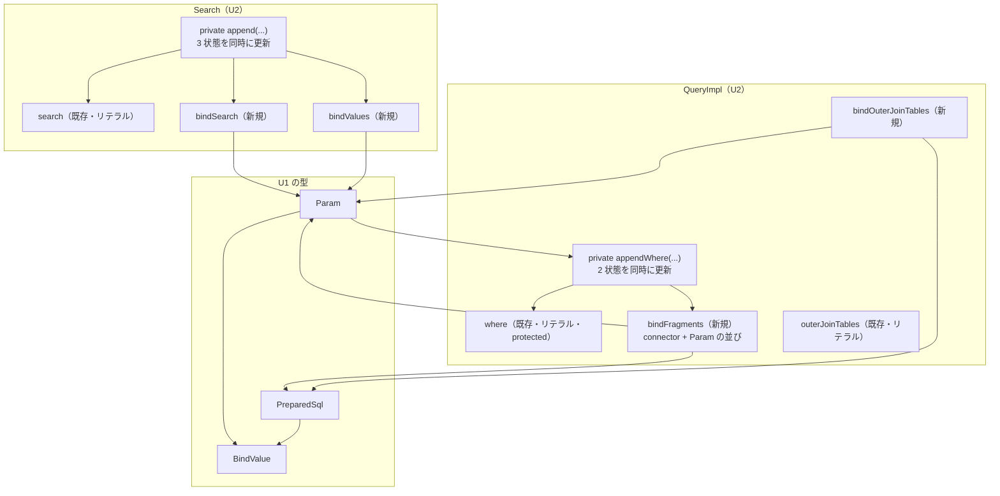

# Domain Entities — U2 `select-path`

## 上流成果物との関係

- **`unit-of-work.md`**（units-generation, 2.7）— U2 の責務「WHERE 述語の組み立てから SELECT の実行までを、U1 の土台の上でバインド経路に切り替える。旧 API の戻り値は変えない」、境界（INSERT / UPDATE / DELETE・方言・`Sort` に触れない）、および「この Unit が抱える最大の設計リスク」＝ `Search` の 3 状態同期。
- **`unit-of-work-story-map.md`**（同上）— U2 が担う FR-1.1 / 1.2 / 1.3 / 1.6 / 3.1 / 3.3 / 7.1 / 7.2 / 7.3 と AC-1 / AC-2 / AC-3 / AC-4、および Unit 内の実装順序 1〜8。
- **`requirements.md`**（requirements-analysis, 2.3）— FR-3.1（public API の後方互換）、FR-3.3（旧 `getSelectSQL()` 等の戻り値契約）、NFR-1、NFR-3、**CON-7（`QueryImpl` は単回使用。`where` の `StringBuilder` がリセットされない）**。
- **`components.md`**（application-design, 2.6）— M-1 `Query` / M-2 `QueryImpl` / M-3 `Search` / M-4 `Dao`・`DaoAdapter` の責務と境界。
- **`component-methods.md`**（同上）— M-3 の「`Search` が保持する 3 つの状態と、その同期規則」、M-2 の「値アキュムレータ」表。本文書は前者をそのまま採り、後者を修正する（Q1 = C）。
- **`services.md`**（同上）— R-1 SQL 組み立て（呼び出し側スレッドに閉じ、`QueryImpl` は単回使用）。本文書のライフサイクルはこの記述に従う。

U1 `bind-foundation` が定義した `Param` / `PreparedSql` / `BindValue` は**本 Unit の依存先**である。それらの契約は U1 の `domain-entities.md` にあり、本文書では再定義しない。

---

## この文書の範囲

**U2 は新しい public 型を 1 つも導入しない。** U2 が扱うのは「既存クラスが保持する状態」——`Search` と `QueryImpl` のアキュムレータ群である。本取り組みの正しさは、これらの状態が互いに整合し続けるかどうかにほぼ全面的に依存する（ADR-011、`component-dependency.md`「順序の不変条件」）。したがって本文書はそれらを**状態を持つエンティティ**として扱い、属性・不変条件・ライフサイクルを与える。

| # | 状態の集合 | 保持者 | 新規 / 既存 |
|---|---|---|---|
| 1 | 述語テキストと値（3 状態） | `Search`（`org.tamacat.dao`） | `search` は既存、他 2 つは新規 |
| 2 | WHERE 句のテキストと値（2 状態） | `QueryImpl`（`org.tamacat.dao.impl`） | `where` は既存、`bindFragments` は新規 |
| 3 | FROM / JOIN 句のテキストと値（3 状態） | `QueryImpl` | `outerJoinTables` は既存、他 2 つは新規 |
| — | `WhereFragment` | `QueryImpl` の private static クラス | 新規（**public にしない**） |

---

## 1. `Search` が保持する 3 状態

`component-methods.md` M-3 が定めた構造をそのまま採る。

| 状態 | 型 | 内容 | 参照元 | 新規 |
|---|---|---|---|---|
| `search` | `StringBuilder` | リテラル埋め込みの述語テキスト | `getSearchString()`（非推奨） | 既存（`Search.java:23`） |
| `bindSearch` | `StringBuilder` | `?` を含む述語テキスト | `getSearchParam()`（public） | **新規** |
| `bindValues` | `List<BindValue>` | `bindSearch` 中の `?` に対応する値 | `getSearchParam()` | **新規** |

### 不変条件

| # | 不変条件 | 守り方 |
|---|---|---|
| S-1 | `bindSearch` 中の `?` の個数 = `bindValues` の要素数 | `getSearchParam()` が `Param.of(...)` を通すため、破れていれば `InvalidParameterException` で落ちる |
| S-2 | `search` を変更するすべての操作が、同じ呼び出しの中で `bindSearch` と `bindValues` も変更する | **構造で守る。** 3 つを直接触るのは単一の private メソッド `append(...)` だけとし、`and` / `or` / `and(Search)` / `or(Search)` はすべてそれを経由する |
| S-3 | `search` と `bindSearch` の連結子（` and ` / ` or `）と括弧の位置が一致する | 同上。`append(...)` が両方に同じ連結子を書く |
| S-4 | 生成後に `valueConvertFilter` は変わらない | 既存（コンストラクタでのみ設定） |

**S-2 が破れたときの症状**: `Param.of(...)` の個数検査（S-1）は**個数のずれだけを検出する**。「リテラル側とバインド側の両方に append し忘れた」場合は個数が一致したまま述語が丸ごと欠落し、**WHERE 条件が緩い SQL が正常に実行される**。`unit-of-work.md` が U2 の「最大の設計リスク」と呼んだのがこれである。検査ではなく構造で守る理由がここにある。

### ライフサイクル

```
new Search() ──> and/or(Column, Conditions, values...)  ─┐
                 and/or(Search)                          ├──> append(...) が 3 状態を同時に更新
                                                         ─┘
              ──> getSearchString()  → search（リテラル、非推奨）
              ──> getSearchParam()   → Param(bindSearch, bindValues)
```

`Search` インスタンスは蓄積のみで、リセット手段を持たない（現行と同じ）。`start` / `max` / `unique` は述語と無関係であり本文書の対象外。

---

## 2. `QueryImpl` が保持する WHERE 句の 2 状態（Q1 = C）

| 状態 | 型 | 内容 | 参照元 | 新規 |
|---|---|---|---|---|
| `where` | `StringBuilder` | リテラル埋め込みの WHERE 句（連結子と ` WHERE ` 接頭辞を含む） | `getSelectSQL()` ほか旧メソッド（非推奨） | 既存（`QueryImpl.java:48`、**`protected`**） |
| `bindFragments` | `List<WhereFragment>` | 連結子と `Param` の対の並び | `getSelectPreparedSql()` ほかバインド版 | **新規** |

### なぜテキストではなく断片のリストなのか

**バインド側を `StringBuilder` ＋ `List<BindValue>` の 2 本で持つと、`Search` と同じ 3 状態同期の問題が `QueryImpl` にも生じる。** 断片のリストにすると、各断片が `Param` であるため U1 の不変条件 **P-2（`?` の個数 = 値の個数）が断片単位で成立**し、テキストと値のずれが構造的に起きなくなる。

**`where` を残す理由**: `protected StringBuilder where` は public クラス `QueryImpl` の `protected` フィールドであり、**互換維持対象である**（NFR-3）。`QueryImpl` を継承する外部クラスがこれを読んでいる可能性を否定できない（OQ-5 と同じ立場）。削除・改名しない。

### `WhereFragment`（`QueryImpl` の private static クラス）

| 属性 | 型 | 意味 |
|---|---|---|
| `connector` | `String` | この断片を直前の断片に繋ぐ語（`"and"` / `"or"`）。先頭の断片では無視される |
| `param` | `Param` | `?` を含む述語テキストとその値 |

**public にしない。** 公開すると FR-3.1 の互換維持対象が増える。`QueryImpl` の内部表現であり、外に出るのは `getSelectPreparedSql()` が返す `PreparedSql` だけである。

### 不変条件

| # | 不変条件 | 守り方 |
|---|---|---|
| Q-1 | `where` に断片が 1 つ書かれるたびに、`bindFragments` にも対応する断片が 1 つ追加される | **構造で守る。** 両方を触るのは単一の private メソッド `appendWhere(...)` だけとし、`addWhere(String, String)` / `addWhere(String, Param)` / `join(...)` はすべてそれを経由する |
| Q-2 | `where` の連結子の並びと `bindFragments` の `connector` の並びが一致する | 同上 |
| Q-3 | 各 `WhereFragment.param` が `Param` の不変条件 P-2 を満たす | `Param.of(...)` が生成時に保証する |
| Q-4 | `bindFragments` は `where` と同じライフサイクル（インスタンス生存、リセットされない） | CON-7 の単回使用制約に従う |

**Q-1 が破れたときの症状**: リテラル側とバインド側で述語の数が食い違う。`getSelectSQL()` と `getSelectPreparedSql()` が**異なる条件の SQL** を返す。`Param` の個数検査では捕まらない（各断片は個別には整合している）。検出はテスト——`getSelectSQL()` と `getSelectPreparedSql()` の述語数を突き合わせるアサート——に依存する。

### `where` に書き込む経路（実ソースで全数確認）

| # | 経路 | 値 | `useAutoPrimaryKeyUpdate = false` |
|---|---|---|---|
| 1 | `addWhere(String condition, String sql)`（`:442-453`） | 経路による | **設定する** |
| 2 | `join(Column col1, Column col2)`（`:315-320`） | **なし**（カラム名同士の比較） | **設定しない**（`addWhere` を経由しないため） |

経路 2 は `addWhere` を迂回する。**バインド側がこれを取りこぼすと JOIN 条件のない SQL になる**ため、`appendWhere(...)` を必ず経由させる。`useAutoPrimaryKeyUpdate` の非対称は現行の挙動であり維持する。

### ライフサイクル

```
new QueryImpl() ──> join / where / and / or / andIn / andNotIn / andExists / andNotExists / where(Search,Sort)
                    ──> appendWhere(...) が where と bindFragments を同時に更新
                 ──> getSelectSQL()          → select + from + where + groupBy + orderBy（リテラル、非推奨）
                 ──> getSelectPreparedSql()  → PreparedSql(select + from + <bindFragments> + groupBy + orderBy,
                                                            outerJoinValues ++ <bindFragments の値>)
```

**CON-7（単回使用）の帰結は現行と一貫する。** 同じ `QueryImpl` から `getSelectPreparedSql()` を 2 回呼んでも `where` / `bindFragments` はリセットされないため、2 回目も同じ内容を返す（`getSelectSQL()` と同じ挙動）。ただし `getUpdatePreparedSql`（U3）のように呼び出しが `addWhere` を発火させるメソッドでは、現行の「2 回呼ぶと主キー述語が 2 回付く」という誤用時の挙動がバインド側にも一貫して現れる。

---

## 3. `QueryImpl` が保持する FROM / JOIN 句の 3 状態（Q2 = C）

**Q2 = C により U2 の境界が `unit-of-work.md` の所有コンポーネント一覧を超える。** `andOuterJoin` を明示的に取り込む。

| 状態 | 型 | 内容 | 新規 |
|---|---|---|---|
| `outerJoinTables` | `Map<Table, String>` | リテラル埋め込みの outer join 式 | 既存（`QueryImpl.java:44`） |
| `bindOuterJoinTables` | `Map<Table, Param>` | `?` を含む outer join 式とその値 | **新規** |
| `outerJoinValues` | （導出） | `bindOuterJoinTables` の値を FROM 句の出力順に連結したもの | **導出値**（フィールドとして持たない） |

`outerJoinValues` を**フィールドにしない**理由: FROM 句の出力順は `getSelectSQL()` の `for (Table tab : tables)` ループが決めるため、値の順序も同じループで組み立てるのが自然である。独立したリストを持つと、テキストの出力順と値の蓄積順がずれる余地を作る。

### 不変条件

| # | 不変条件 |
|---|---|
| J-1 | `outerJoinTables` にエントリが作られる・更新されるたびに、`bindOuterJoinTables` にも対応する更新が起きる。**両方を触るのは単一の private メソッドだけ** |
| J-2 | `bindOuterJoinTables` の各 `Param` が P-2 を満たす |
| J-3 | FROM 句のテキスト組み立てと値の収集が**同一のループ**で行われる（順序の一致を構造で守る） |

### 書き込む経路

| # | 経路 | バインド側の扱い |
|---|---|---|
| 1 | `outerJoin(Column col1, Column col2)`（`:325-340`） | 値ゼロの `Param`。テキストはリテラル版と同一（カラム名同士の比較のみ） |
| 2 | `andOuterJoin(Table, Search)`（`:350-356`、**非推奨化**） | **リテラルのまま。** 値ゼロの `Param` にリテラルテキストを包む。旧 API の挙動を変えない（ADR-003 / ADR-006 と同じ立場） |
| 3 | `andOuterJoin(Table, Param)`（**新規**） | `Param` のテキストと値をそのまま取り込む |

**経路 2 が SM-1 の対象外になることを明示する。** 非推奨の旧メソッドを使い続ける限り、FROM 句に値がリテラルとして残る。これは `Query` の他の 5 つの非推奨メソッドと同じ扱いであり、`business-rules.md` に残存リスクとして記録する。

---

## 4. `Query` インターフェースの状態変化（M-1）

`Query` は状態を持たないが、**実装クラスに対する契約**が変わる。

| 区分 | 変更前（2.6 の想定） | 変更後（Q2 = C） |
|---|---|---|
| 追加する `default` メソッド | 8 個 | **9 個**（`andOuterJoin(Table, Param)` を追加） |
| `@Deprecated` を付ける旧メソッド | 5 個 | **6 個**（`andOuterJoin(Table, Search)` を追加） |
| 不変のメソッド | 25 個（**2.6 の計数誤り**。実際は 30 個） | **29 個**（`andOuterJoin(Table, Search)` が非推奨に移るため） |

**`Query.java` の実メソッド宣言数は 35 である**（`Query.java:25-180` を実測）。29 + 6 = 35 で整合する。

`component-methods.md` M-1 の「上記以外の 25 メソッド」は 2.6 の計数誤りである——列挙されている 27 個の名前のうち `select` は 2 オーバーロード、`addUpdateColumn(s)` は 3 メソッドを 1 名にまとめており、展開すると 30 個（= 35 − 2.6 が非推奨にする 5 個）になる。**列挙そのものは網羅している。** 詳細は `business-logic-model.md` § 6.3。

**`default` メソッドの既定実装は ADR-006 に従う**——例外を投げず、対応する旧メソッドの結果にフォールバックする。`andOuterJoin(Table, Param)` の既定実装は `andOuterJoin(table, /* param のテキストを Search に包めない */)` とはできないため、**`return this;`（何もしない）** とする。理由は `business-logic-model.md` § 5 に記す。

---

## 5. `Dao` / `DaoAdapter` が保持する状態（M-4）

**U2 は `Dao` にフィールドを 1 つ追加する。**

| 追加フィールド | 可視性 | 内容 |
|---|---|---|
| `bindSqlBuilder` | `protected` | `prepare(...)` が使う `BindSqlBuilder`。既存の `protected SQLParser parser = new SQLParser();`（`Dao.java:50`）と対称に置く |

`BindSqlBuilder` は状態を持たない（U1 `components.md` C-5「所有する状態: なし」）ため、毎回 `new` する実装も技術的には可能である。**フィールドにするのは既存の `parser` と形を揃えるためである**——`Dao` のサブクラスから見て「リテラル用の生成器」と「バインド用の生成器」が同じ形で並ぶほうが、BR-14 が述べる「2 つの生成器を持つ」構造が読み取りやすい。

| 追加メソッド | 可視性 | 状態への影響 |
|---|---|---|
| `Param prepare(Column, Conditions, String...)` | public | なし（`bindSqlBuilder` に委譲するだけ） |
| `<R> R executeQuery(PreparedSql, ResultSetHandler<R>)` | protected | なし |

`bindSqlBuilder` は `protected` であり **public クラスの互換維持対象になる**（AC-11 の判定対象）。`business-logic-model.md` § 10 の「新規 protected メンバ」表に Pr-7 として計上する。

`DaoAdapter` は同名メソッドを持ち `delegate` に転送する（`DaoAdapter.java:120-146` の既存メソッドと同じ形）。

**`Dao.parser` フィールドは不変。** `param(...)` が使う `SQLParser` はそのまま残る（FR-7.1）。`prepare(...)` は `BindSqlBuilder` を使うため、`Dao` は 2 つの生成器を持つことになる。これは `Search` がリテラル系とバインド系の 2 つのテキストを持つのと同じ性質の冗長であり、FR-3.1 を厳密に守るための代償である（ADR-003）。

---

## 状態間の関係



<!-- Text fallback: Search は search（既存のリテラルテキスト）、bindSearch（新規の ? 入りテキスト）、bindValues（新規の値リスト）の 3 状態を持ち、単一の private append メソッドだけがこれらを同時に更新する。bindSearch と bindValues は getSearchParam() を通じて U1 の Param になる。QueryImpl は where（既存のリテラルテキスト、protected）と bindFragments（新規の connector + Param の並び）の 2 状態を持ち、単一の private appendWhere メソッドだけがこれらを同時に更新する。Param は QueryImpl の appendWhere に入力される。QueryImpl は FROM 句についても outerJoinTables（既存・リテラル）と bindOuterJoinTables（新規・Param）の 2 状態を持つ。bindFragments と bindOuterJoinTables から getSelectPreparedSql() が PreparedSql を組み立てる。Param と PreparedSql はいずれも BindValue を保持する。 -->

**同期を守る private メソッドは 3 つである**——`Search.append(...)`、`QueryImpl.appendWhere(...)`、`QueryImpl` の outer join 用。いずれも「複数の状態を同時に更新する唯一の入口」という同じ役割を持つ。**この 3 つを迂回する経路を作らないことが U2 の正しさの中核である。**

---

## 2.6 / 2.7 契約からの差分

本 Unit が上流の記述を変更する箇所。**上流成果物は編集しない**——`business-logic-model.md`「2.6 / 2.7 契約からの差分」節が差分の全量であり、本節はそのうち型・状態に関わるものを再掲する。

| # | 上流の記述 | 修正後 | 由来 |
|---|---|---|---|
| 1 | `component-methods.md` M-2「値アキュムレータ」表が `whereValues` を `where` と対にし、`getSelectPreparedSql()` のテキストを「SELECT 句 + FROM/JOIN + `where`」とする | `where` はリテラルを保持し続ける（ADR-003）ため `?` の個数が値と一致しない。バインド側は `List<WhereFragment>`（connector + `Param`）で持ち、`getSelectPreparedSql()` はそこから組み立てる | Q1 = C |
| 2 | `unit-of-work.md` の U2 所有コンポーネント一覧に `andOuterJoin` がない | `andOuterJoin` を U2 に取り込む | Q2 = C |
| 3 | `component-methods.md` M-1 が追加 `default` を 8 個、非推奨を 5 個とする | 9 個 / 6 個 | Q2 = C |
| 4 | `component-dependency.md`「順序が作られる場所」表に FROM 句がない | FROM 句の値は `where` より前に出るため、結合順は FROM 句の値 ++ `bindFragments` の値 | Q2 = C |
