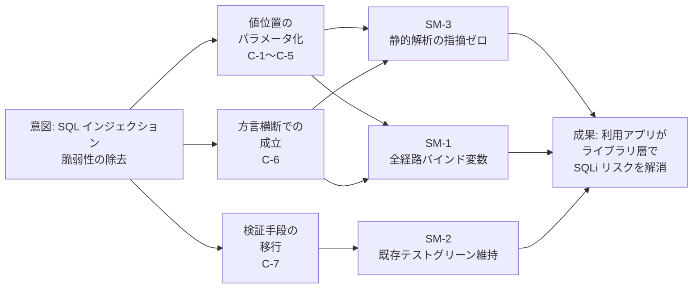

# Scope Document — SQL パラメータ化（PreparedStatement 化）

## 上流成果物との関係

本スコープ文書は `intent-statement.md`（intent-capture, 1.1）を起点とする。同文書が確定したプロダクト境界「tamacat-dao ライブラリ内の SQL 生成／実行経路のみを対象とする」、成功指標 SM-1〜SM-3、および `## Initial Scope Signal` の各制約（Java 8 維持、ローカルのみ・git push なし、public API の後方互換性維持）を、本ステージは変更せずに引き継ぐ。

`feasibility-assessment.md` と `constraint-register.md` は、本ワークフローのスコープ（`sql-parameterization`）で feasibility ステージが SKIP されているため存在しない。制約は上記のとおり `intent-statement.md` から引き継いだ。

## Minimum Viable Scope

SQL の値が入る位置すべて — WHERE の比較値、LIKE、IN、INSERT / UPDATE の値 — がバインド変数になった時点で、最小限の価値を届けたとみなす。 [Q1]

バインド変数で表現できない位置（テーブル名・カラム名・ORDER BY 句）の検証は、この最小限には含まれない。 [Q1] [Q3]

## In Scope

| # | 能力 | 優先度 | Source |
|---|------|--------|--------|
| C-1 | 単一値の比較条件（`=`, `<`, `>` など）のパラメータ化 | Must Have | [Q2] |
| C-2 | LIKE 条件のパラメータ化（前方一致・部分一致、およびワイルドカードのエスケープを含む） | Must Have | [Q2] |
| C-3 | IN 句・複数値条件のパラメータ化 | Must Have | [Q2] |
| C-4 | INSERT / UPDATE の値のパラメータ化 | Must Have | [Q2] |
| C-5 | BLOB / バイナリ値の取り扱い | Must Have | [Q3] |
| C-6 | DB 方言ごとの差異への対応（MySQL / Oracle / PostgreSQL） | Must Have | [Q3] |
| C-7 | 既存テストの移行（生成 SQL 文字列のアサーション → バインド値のアサーション） | Must Have | [Q3] |
| C-8 | 静的解析（CodeQL）での SQL インジェクション指摘ゼロの達成 | Must Have | [Q3] |
| C-9 | バインドできない位置（テーブル名・カラム名・ORDER BY 句）の注入不能化 | Should Have（暫定 — `## Assumptions & Open Questions` 参照） | [Q3] |

8 能力中 7 件が Must Have である。これは MoSCoW の一般則（Must Have は計画容量の 60% 以下）からの意図的な逸脱であり、部分的にしかパラメータ化されていない SQL 層は誤った安心を生むという理由で、明示的に選択された配分である。 [Q9]

## Out of Scope（Won't Have this time）

| # | 対象外 | 理由 | Source |
|---|--------|------|--------|
| O-1 | 利用側アプリケーションの修正 | tamacat-dao の外はプロダクト境界の外 | [Q7] |
| O-2 | パフォーマンス最適化（PreparedStatement キャッシュなど） | 安全性が先、最適化は後 | [Q7] |
| O-3 | 新規 DB 方言のサポート追加 | 既存方言の対応が対象であり、対応範囲の拡大はしない | [Q7] |

SQL インジェクション以外のセキュリティ課題は、明示的な Won't Have としては選択されなかった。境界を閉じず、発見時に都度判断するという扱いになっている（`## Assumptions & Open Questions` 参照）。 [Q7] [Q8] [Q10]

## Value Stream Map

<!-- Text fallback: 意図（SQL インジェクション脆弱性の除去）から3つの流れが伸びる。(1) 値位置のパラメータ化（C-1〜C-5）、(2) 方言横断での成立（C-6）、(3) 検証手段の移行（C-7）。(1) と (2) は成功指標 SM-1（全経路バインド変数）と SM-3（静的解析の指摘ゼロ）に合流し、(3) は SM-2（既存テストグリーン維持）に至る。SM-1・SM-2・SM-3 のすべてが、最終的な成果「利用アプリケーションがライブラリ層で SQLi リスクを解消できる状態」に合流する。C-8 は SM-3 の達成そのものであり、C-9 は本最小スコープの外にあるため図には現れない。 -->

## Sequencing Approach

Walking-skeleton-first を採る。1 経路（単純な WHERE の比較条件）を SQL 組み立てから実行まで端から端まで通し、動作を確認してから他の条件種別へ横展開する。 [Q5]

この方針は、`aidlc/spaces/default/memory/org.md` の `## Walking Skeleton` が定める「active scope が `skeleton: on` を宣言している場合は walking-skeleton Bolt を最初に走らせる」という運用と整合する。実際の Bolt 順序の確定は Delivery Planning（2.8）が行う。

期限（ハードデッドライン）は設定されていない。 [Q6]

## Assumptions & Open Questions

- [assumption] C-9（バインドできない位置の注入不能化）は Must Have ではないと選択されたが、Should / Could / Won't のいずれに属するかは明示的に選択されていない。Q7 の Won't Have 一覧に挙げられておらず、Q1 が最小スコープから除外していることから、暫定的に Should Have として記録している。この配置は次の承認ゲートで訂正できる。 [Q3] [Q1] [Q7]
- [assumption] 能力間の依存関係は本ステージでは確定していない。共通のバインド基盤が先に必要か、各条件種別が独立に扱えるかは Application Design（2.6）で明らかにする。このため本文書の能力一覧は依存順ではなく分類順で並んでいる。 [Q4]
- [assumption] SQL インジェクション以外のセキュリティ課題の扱いは、本ステージでは範囲を確定しない。明示的な Won't Have にはせず、発見時に都度判断する。プロダクト境界（SQL 生成／実行経路のみ）は変更しない。 [Q8] [Q10]
