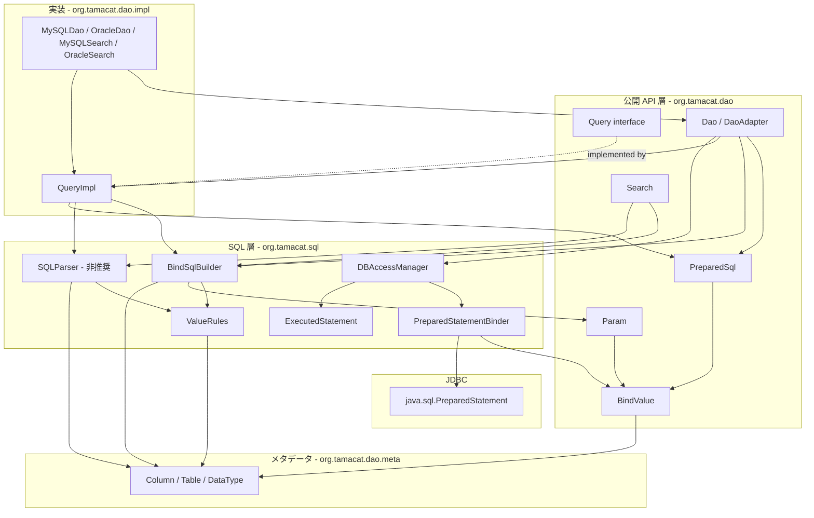

# Component Dependency — SQL パラメータ化（PreparedStatement 化）

## 上流成果物との関係

- **`requirements.md`**（requirements-analysis, 2.3）— CON-7（`QueryImpl` は単回使用）、OQ-2（バインド値の保持場所と順序）。本文書は値の流れと順序保証を定める。
- **`architecture.md`**（codekb）— 現行の依存方向「dao → sql → pool」と、これに循環がないという事実。本設計はこの方向を保つ。
- **`component-inventory.md`**（codekb）— 既存コンポーネントの依存一覧。「Component Dependency Direction」の図が現行の基準線である。
- **`stories.md`**（user-stories, 2.4）/ **`team-practices`**（practices-discovery, 2.2）— 本スコープで **SKIP** のため存在しない。

コンポーネント記号は `components.md` の C-1〜C-8 / M-1〜M-8 に対応する。

---

## 依存マトリクス

行が「依存する側」、列が「依存される側」。`X` は直接依存を示す。

| ↓依存元 / 依存先→ | Param | PreparedSql | BindValue | ValueRules | BindSqlBuilder | Binder | ExecutedStmt | SQLParser | Search | QueryImpl | Dao | DBAccessMgr | meta |
|---|---|---|---|---|---|---|---|---|---|---|---|---|---|
| **C-1 `Param`** | — | | X | | | | | | | | | | X |
| **C-2 `PreparedSql`** | | — | X | | | | | | | | | | X |
| **C-3 `BindValue`** | | | — | | | | | | | | | | X |
| **C-4 `ValueRules`** | | | | — | | | | | | | | | X |
| **C-5 `BindSqlBuilder`** | X | | X | X | — | | | | | | | | X |
| **C-6 `PreparedStatementBinder`** | | | X | | | — | | | | | | | X |
| **C-7 `ExecutedStatement`** | | | X | | | | — | | | | | | |
| **M-6 `SQLParser`** | | | | X | | | | — | | | | | X |
| **M-3 `Search`** | X | | | | X | | | X | — | | | | X |
| **M-2 `QueryImpl`** | X | X | X | | X | | | X | X | — | | | X |
| **M-4 `Dao` / `DaoAdapter`** | X | X | | | X | | | X | X | X | — | X | X |
| **M-5 `DBAccessManager`** | | X | X | | | X | X | | | | | — | |
| **M-7 方言** | | X | | | | | | X | X | X | X | X | X |
| **C-8 mock** | | | | | | | | | | | | | |

`meta` は `org.tamacat.dao.meta`（`Column` / `Table` / `DataType`）を指す。

**依存方向の確認**: 新規コンポーネント C-1〜C-7 のうち、`org.tamacat.dao` にあるのは C-1 / C-2 / C-3、`org.tamacat.sql` にあるのは C-4 / C-5 / C-6 / C-7 である。

- `org.tamacat.sql` の C-4 / C-5 / C-6 / C-7 は `org.tamacat.dao.meta`（`DataType`）と `org.tamacat.dao`（`Param` / `PreparedSql` / `BindValue`、および `Search.Conditions`）に依存する。
- これは現行の `SQLParser` が `org.tamacat.dao.Search.Conditions` と `meta` に依存しているのと同じ形であり（`SQLParser.java:10-16`）、**新しい依存方向を導入しない**。
- `org.tamacat.pool` への依存は増えない。

循環は生じない。`architecture.md` が記録する「dao → sql → pool の一方向」は保たれる。

---

## 新旧 2 経路の依存関係



<!-- Text fallback: 公開 API 層に Query インターフェース、Search、Dao/DaoAdapter、および新規の Param、PreparedSql、BindValue が置かれる。実装層に QueryImpl と方言クラスがある。SQL 層に新規の ValueRules、BindSqlBuilder、PreparedStatementBinder、ExecutedStatement と、既存の SQLParser（非推奨）、DBAccessManager がある。Search と QueryImpl は新経路では BindSqlBuilder を、旧経路では SQLParser を使う。BindSqlBuilder と SQLParser はどちらも ValueRules を使う。BindSqlBuilder は Param を作り、QueryImpl は PreparedSql を作る。Dao は PreparedSql を DBAccessManager に渡し、DBAccessManager は PreparedStatementBinder で値を java.sql.PreparedStatement に適用し、ExecutedStatement に記録する。すべてのコンポーネントが meta パッケージの Column/Table/DataType に依存する。循環はない。 -->

**新旧が合流する点は 2 つだけである。**

1. `ValueRules` — リテラル系（`SQLParser`）とバインド系（`BindSqlBuilder`）が共有する。FR-2.1 / FR-2.3 / FR-2.4 の挙動が 1 か所で決まる（Q4 = C）。
2. `PreparedSql` — 旧経路の結果も `ofLiteral(...)` で包まれてここに合流し、同じ実行メソッドを通る（F2 の互換シム）。

---

## 値の流れと順序保証

FR-1 の正しさは「SQL テキスト中の `?` の出現順と、`BindValue` の並び順が一致すること」に尽きる。この順序がどこで作られ、どこで検査されるかを示す。

### 順序の不変条件（設計の中核）

**値リストは、対になるテキストアキュムレータと 1 : 1 で持つ。複数のテキストアキュムレータを連結して最終 SQL を組む場合、値リストも同じ連結順で結合する。**

これが本設計で唯一の順序保証の規則である。「値リストを 1 本だけ持ち、生成された順に append する」という素朴な実装は**誤りである**。理由を次に示す。

#### 単一の値リストが破綻する具体例（`getUpdateSQL`）

`QueryImpl.getUpdateSQL`（`:236-274`）は SET 句と WHERE 句を**単一のループ**で組み立てる。

```java
for (Column col : updateColumns.toArray(...)) {
    if (col.isPrimaryKey()) {
        if (useAutoPrimaryKeyUpdate) {
            addWhere("and", parser.value(col, Condition.EQUAL, data.getValue(col)));  // WHERE の値
        }
        continue;
    }
    ...
    values.append(parser.value(col, Condition.EQUAL, data.getValue(col)));            // SET の値
}
String query = UPDATE.replace("${TABLE}", tableName).replace("${VALUES}", values.toString());
return query + where.toString();   // テキストは SET → WHERE の順で連結される
```

ここで **`updateColumns` の反復順は主キーが先とは限らず、実際にはライブラリ自身の主要な使い方で主キーが先である**。

| 根拠 | 内容 |
|---|---|
| `User.java:17` | `USER_ID = Columns.create("user_id").primaryKey(true)` — 主キー |
| `User.java:23-24` | `Tables.create("users").registerColumn(USER_ID, PASSWORD, DEPT_ID, UPDATE_DATE, AGE)` — 主キーが**登録順の 1 番目** |
| `DefaultTable.java:16` | `LinkedHashSet<Column> columns` — 反復順は登録順を保つ |
| `UserDao.java:41-45` | `addUpdateColumns(User.TABLE.columns())` — この順序がそのまま `updateColumns` になる |

したがってループ 1 回目で主キーの `addWhere` が発火し、**WHERE の値が SET の値より先に生成される**。一方テキストは `query + where.toString()` により SET が先である。値リストを 1 本でループ順に append すると、次のずれが生じる。

```
最終テキスト:  UPDATE users SET password=?,dept_id=?,update_date=?,age=? WHERE users.user_id=?
? の順序:      [password, dept_id, update_date, age, user_id]
単一リストの順: [user_id, password, dept_id, update_date, age]   ← 全ての値が 1 つずつずれる
```

**このずれは例外を起こさない。** `?` の個数（5）と値の個数（5）が一致するため生成時の検査（後述の検査 1）を通り、JDBC のパラメータ数検査も通る。誤った値が誤ったカラムに書き込まれた UPDATE が正常終了する。本設計で最も危険な失敗様式である。

#### 順序が作られる場所と、対になるアキュムレータ

| # | 場所 | テキストアキュムレータ | 対になる値リスト |
|---|---|---|---|
| 1 | `Search.and` / `or`（`Search.java:40-52`） | `search`（`:23`）のバインド版 | `Search` の値リスト 1 本 |
| 2 | `Search.and(Search)` / `or(Search)`（`:54-66`） | 同上（相手のテキストを `(...)` で包んで append） | 同上（相手の値リストを同時に末尾へ連結） |
| 3 | `QueryImpl.addSearch`（`:455-461`）/ `addWhere`（`:442-453`） | `where`（`QueryImpl.java:48`）のバインド版 | `whereValues` |
| 4 | `QueryImpl.getInsertPreparedSql` | `values`（VALUES 句） | `insertValues` |
| 5 | `QueryImpl.getUpdatePreparedSql` | `values`（SET 句） | `setValues` |

**`QueryImpl` は値リストを 2 本以上持つ。** `whereValues`（WHERE 句用）と、`setValues` / `insertValues`（SET / VALUES 句用）である。`getUpdatePreparedSql` は最終的に次のように結合する。

```
テキスト:  UPDATE ... SET <values>   +   <where>
値リスト:  setValues                 ++  whereValues
```

`getDeletePreparedSql` / `getDeleteAllPreparedSql` は SET 句を持たないため `whereValues` のみを使う。`getSelectPreparedSql` も同様に `whereValues` のみである（SELECT 句に値は現れない）。

この規則により、ループの実行順がどうであれ、値の並びは常にテキストの `?` の並びと一致する。

### サブクエリの差し込み（FR-1.6）

`andIn` / `andNotIn` / `andExists` / `andNotExists`（`QueryImpl.java:389-406`）は、子 `Query` の `getSelectPreparedSql()` を呼び、そのテキストを親の WHERE の**一点に**差し込む。子の値は連続したブロックであるため、親の値リストの**その位置に**そのまま挿入すれば順序が一致する。並び替えは発生しない。

```
親 WHERE テキスト:  ... and col IN ( <子の SELECT テキスト> ) and other=?
親 値リスト:        [親の先行値...] [子の値ブロック...] [親の後続値...]
```

### 後続の連結（LIMIT / SQL_CALC_FOUND_ROWS）

`MySQLDao.searchList` は WHERE より**後ろ**に LIMIT を付ける。LIMIT の値（オフセットと件数、FR-6.3）は値リストの末尾に追加すればテキスト順と一致する。`SQL_CALC_FOUND_ROWS` の `replaceFirst("SELECT ", ...)`（`MySQLDao.java:44`）は先頭のテキスト置換であり `?` を増やさないため、順序に影響しない。

`OracleDao.searchListForOracle`（FR-6.1）は内側の SELECT を外側の rownum クエリで包む。rownum の `?` は内側 SELECT より**後ろ**のテキストに現れるため、値も末尾に追加する。

### 順序の検査が行われる 3 か所

| # | 場所 | 検査内容 |
|---|---|---|
| 1 | `Param.of(...)` / `PreparedSql.of(...)` | テキスト中の `?` の個数と `BindValue` の要素数が一致することを検査し、不一致なら `InvalidParameterException` |
| 2 | `PreparedStatementBinder.bind(...)` | 値の個数ぶんだけ 1 始まりの位置に適用する。JDBC ドライバがパラメータ数の不一致を検出する |
| 3 | テスト（FR-8.1） | 拡張した `MockPreparedStatement` から位置と値を取り出してアサートする |

**検査 1 が最も重要である。** テキストと値のずれは実装ミスとして最も起きやすく、かつ本番では「値がずれた SQL が正常に実行される」という最悪の形で現れうる（例: `WHERE a=? AND b=?` に値を逆順で渡す）。生成時に個数を検査することで、少なくとも個数のずれは即座に落ちる。

**個数が一致していても順序が違う場合**は検査 1 では捕まらない。これは検査 3（テストによる位置と値のアサート）が担う。FR-8.1 を Must にした理由がここにある。

### `?` 個数の数え方に関する注意

テキスト中の `?` を数える際、`escape '?'` のような**リテラル中の疑問符**を誤ってパラメータと数えてはならない。現行の `SQLParser.ESCAPE = " escape '?'"`（`:27`）は `?` を含むが、これは常に実際のエスケープ文字に置換されてから出力される（`:134`）ため、生成後のテキストには残らない。とはいえ、値の中身に `?` が含まれる可能性（リテラル文字列としての `?`）はバインド化により**消える**——値はテキストに入らないため。したがって生成後のテキスト中の `?` は常にプレースホルダである。この性質は検査 1 の前提であり、`decisions.md` ADR-007 に記録する。

---

## 共有される可変状態

| 状態 | 保持者 | 生存期間 | 並行アクセス |
|---|---|---|---|
| WHERE のテキスト（`StringBuilder`） | `QueryImpl`（`:48`） | `QueryImpl` インスタンス。リセットされないため単回使用（CON-7） | なし前提（現行と同じ） |
| `whereValues`（**新規**） | `QueryImpl` | 同上。WHERE テキストと同一ライフサイクル | 同上 |
| `setValues` / `insertValues`（**新規**） | `QueryImpl` | `getUpdatePreparedSql` / `getInsertPreparedSql` の呼び出しごとにクリアされる（現行の `values` `StringBuilder` がメソッドローカルであるのと同じ） | 同上 |
| 述語テキスト（`StringBuilder`） | `Search`（`:23`） | `Search` インスタンス | なし前提 |
| 述語の値リスト（**新規**） | `Search` | 同上 | 同上 |
| 実行済み SQL（`List<String>`） | `DBAccessManager`（`ThreadLocal`） | スレッド | `ThreadLocal` により分離 |
| 実行済み文と値（**新規** `List<ExecutedStatement>`） | `DBAccessManager`（`ThreadLocal`） | スレッド | 同上 |
| `Connection` / `Statement` | `DBAccessManager`（`ThreadLocal`） | スレッド | 同上 |

**新規の可変状態はすべて既存の可変状態と同じライフサイクル・同じ並行性前提に載る。** 新しい並行性の論点は増えない。`QueryImpl` の単回使用制約（CON-7）が値リストにも適用されるため、「`getUpdateSQL` を 2 回呼ぶと主キー述語が 2 回付く」という現行の挙動は、バインド版でも「値も 2 回付く」という形で一貫する（挙動の一貫性は保たれるが、どちらも誤用である）。

---

## 変更の影響範囲（ブラストレーダス）

`brownfield.md` の Blast Radius Analysis に従い、変更されるファイルとその依存元を分類する。

| 変更ファイル | 依存元（このファイルを使う側） | 影響度 |
|---|---|---|
| `Query.java`（interface） | `QueryImpl`、`Dao`、`DaoAdapter`、利用側 DAO サブクラス、テスト 6 ファイル | **高**（公開インターフェース。ただし `default` 追加のみで非破壊） |
| `QueryImpl.java` | `Dao.createQuery`、`MySQLDao.createQuery`、テスト 4 ファイル | **高**（最も変更量が多い） |
| `Search.java` | `QueryImpl.addSearch`、`MySQLSearch`、`OracleSearch`、`Dao.createSearch`、テスト 3 ファイル | **高** |
| `Dao.java` | `DaoAdapter`、`MySQLDao`、`OracleDao`、利用側 DAO サブクラス、テスト | **高** |
| `DaoAdapter.java` | 利用側 DAO サブクラス、テスト | 中 |
| `DBAccessManager.java` | `Dao`、`MySQLDao`、`Transaction`、テスト 1 ファイル | **高** |
| `SQLParser.java` | `Search`、`QueryImpl`、`Dao`、テスト 1 ファイル | 中（委譲のみ、挙動不変） |
| `MySQLDao.java` / `OracleDao.java` / `OracleSearch.java` | `DaoAdapter.setDatabase`、テスト | 中 |
| `MockConnection.java` / `MockPreparedStatement.java` | すべての e2e テスト | 中（テストのみ） |
| **新規 7 ファイル**（C-1〜C-7） | 上記 | 低（新規のため依存元なし） |

**テストへの影響**（FR-8.2 の対応表の対象）:

| テストファイル | 影響 |
|---|---|
| `SQLParserTest.java` | リテラル経路のテスト。`SQLParser` の挙動が不変のため**変更不要** |
| `SearchTest.java` | `getSearchString()` に対するアサート 12 件。戻り値不変のため**変更不要**。バインド版のアサートを追加する |
| `QueryImplTest.java` | 旧 `getSelectSQL()` 等に対するアサート。戻り値不変のため**変更不要**。バインド版を追加する |
| `MySQLDaoTest.java` | `param()` と旧 `getInsertSQL()` に対するアサート。戻り値不変のため**変更不要**。`prepare()` 版を追加する |
| `UserDaoTest.java` | `getExecutedQuery().get(0)` に対するアサート。実行経路が新経路に切り替わるため **SQL テキストが `?` 入りに変わる → 変更が必要** |
| `QueryImplTest02/03`、`UserDaoTest2` | FR-8.3 により実行対象に加える。BLOB プレースホルダのアサートは新経路で位置が変わりうる |

**Q2 = C / Q3 = A（旧 API の戻り値を変えない）の効果がここに現れる。** 既存テストの大半は変更不要であり、変更が必要なのは**実行経路を通る e2e テスト**に限られる。これは FR-8.2 の対応表を小さく保つ。
