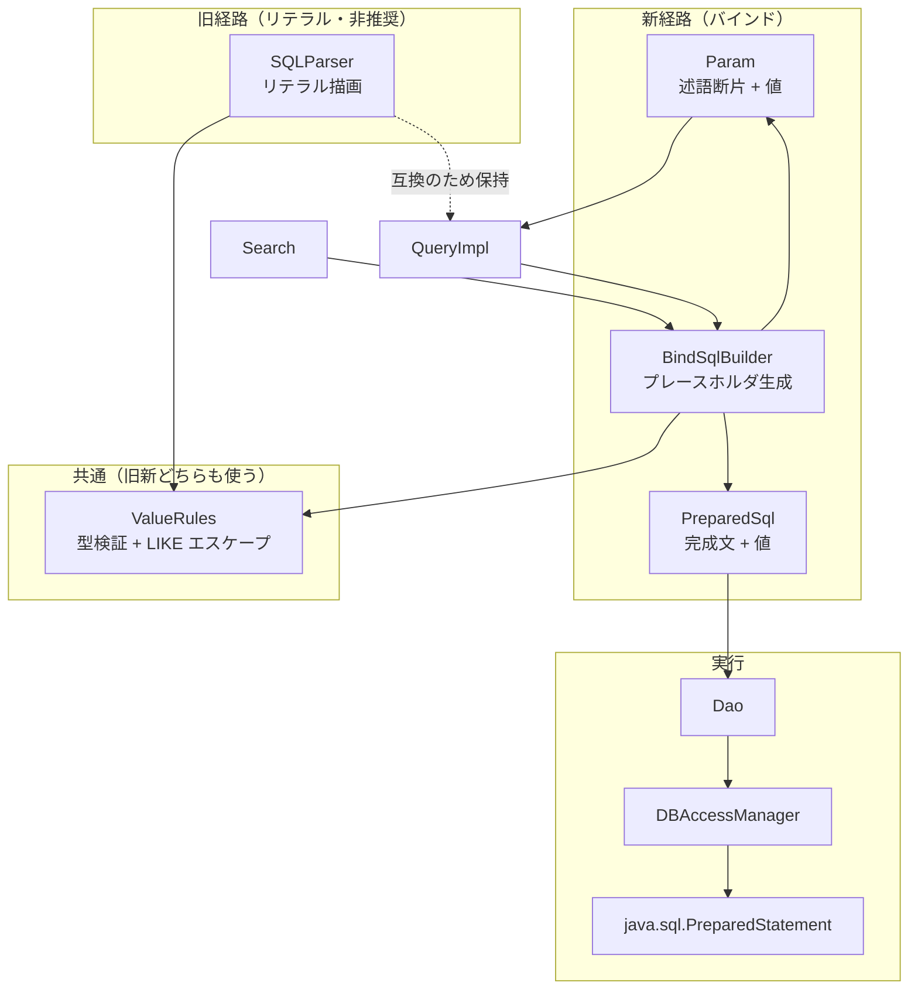

# Components — SQL パラメータ化（PreparedStatement 化）

## 上流成果物との関係

- **`requirements.md`**（requirements-analysis, 2.3）— FR-1〜FR-8、NFR-1〜NFR-7、制約 CON-1〜CON-8、Open Questions OQ-1〜OQ-9。本設計は FR-1（値のパラメータ化）、FR-2（検証とエスケープ）、FR-3（API 互換）、FR-4（実行記録）、FR-5（方言）、FR-6（既存欠陥）、FR-7（raw 経路）、FR-8（検証手段）を実現する構成を定める。OQ-1 / OQ-2 / OQ-3 / OQ-5 を解き、OQ-9 は未解決のまま 2.7 に持ち越す。
- **`architecture.md`**（codekb）— 現行の 6 層構成、`SQLParser` の 2 プリミティブ、実行面（Execution Surface）、方言アーキテクチャ、raw-SQL エスケープハッチ。本設計はこの層構成を維持し、層をまたぐ「値の運搬」だけを追加する。
- **`component-inventory.md`**（codekb）— 各コンポーネントの責務・依存・SQL-bearing の別。本文書の「変更するコンポーネント」はこの一覧の項目に対応する。
- **`stories.md`**（user-stories, 2.4）— 本スコープで **SKIP** のため存在しない。要件は `requirements.md` から直接引き継ぐ。
- **`team-practices`**（practices-discovery, 2.2）— 同じく **SKIP**。`aidlc/spaces/default/memory/org.md` の既定に従う。

設計判断の出典は `application-design-questions.md` の Q0-a / Q0-b / Q1〜Q9、および同ファイルの Call-path trace の F1〜F6 を指す。

---

## 設計の骨子

現行アーキテクチャは「値を SQL リテラルに描画してから 1 本の文字列として実行する」構造である（`architecture.md` の中心的設計事実）。本設計はこの構造を置き換えるのではなく、**「SQL テキスト + 値の並び」を対で運ぶ第 2 の経路を層をまたいで通し、実行を新経路に切り替える**。旧経路は公開 API の互換のために残す（非推奨）。

<!-- Text fallback: 新経路では Search と QueryImpl が BindSqlBuilder を使い、BindSqlBuilder は Param（述語断片＋値）と PreparedSql（完成文＋値）を生成する。旧経路の SQLParser はリテラルを描画する。両者は共通の ValueRules（型検証と LIKE エスケープ）を使う。PreparedSql は Dao を経て DBAccessManager に渡り、java.sql.PreparedStatement として実行される。SQLParser は互換のため QueryImpl から引き続き到達できるが非推奨である。 -->

**この構成が満たすもの**

- FR-3.1 / NFR-3（破壊的変更をしない）— 既存の public / protected シグネチャを 1 つも削除・変更しない。追加のみ。
- FR-1（値のパラメータ化）— 実行に至る経路がすべて `PreparedSql` を通る。
- FR-2（検証とエスケープ）— `ValueRules` を旧新で共有するため、挙動が二重管理にならない。
- FR-8.1（検証可能性）— 値が `PreparedSql` に構造として載るため、テストからアサートできる。

---

## 新規コンポーネント

### C-1. `Param` — 述語断片とその値

| 項目 | 内容 |
|---|---|
| パッケージ | `org.tamacat.dao` |
| 種別 | public final class（不変） |
| 責務 | WHERE に渡す **1 つ以上の述語断片**の SQL テキストと、その中の `?` に対応する値の並びを対で保持する |
| 所有する状態 | SQL 断片テキスト（`?` を含む）、`BindValue` の順序付きリスト |
| 境界 | 実行できない。実行できるのは `PreparedSql` のみ。この区別を型で表すことが `Param` を分離する理由（Q1 = A） |
| 由来 | Q1 = A、Q0-a = A |

`Dao.prepare(...)` が返し、`Query.where(Param)` / `and(Param)` / `or(Param)` が受け取る。`Search` の内部でも述語の蓄積単位として使う。

### C-2. `PreparedSql` — 実行できる完成文とその値

| 項目 | 内容 |
|---|---|
| パッケージ | `org.tamacat.dao` |
| 種別 | public final class（不変） |
| 責務 | **実行可能な完成した SQL 文**（`?` を含む）と、`?` に対応する値の並びを対で保持する |
| 所有する状態 | SQL 文テキスト、`BindValue` の順序付きリスト |
| 境界 | `DBAccessManager` が受け取る唯一の型。断片は受け取らない |
| 由来 | Q1 = A、Q5 = A |

`Query.getSelectPreparedSql()` / `getInsertPreparedSql(T)` / `getUpdatePreparedSql(T)` / `getDeletePreparedSql(T)` が返し、`Dao` の実行メソッドと `DBAccessManager` の実行メソッドが受け取る。

既存サブクラスとの互換のために、**リテラル SQL から値ゼロの `PreparedSql` を作るファクトリ**（`PreparedSql.ofLiteral(String)`）を持つ。これが F2 の互換シムの土台になる。

### C-3. `BindValue` — 1 個のバインド値

| 項目 | 内容 |
|---|---|
| パッケージ | `org.tamacat.dao` |
| 種別 | public final class（不変） |
| 責務 | JDBC に渡す 1 個の値と、その値を `PreparedStatement` のどの `setXxx` で設定すべきかを決めるための型情報（`Column` の `DataType`）を保持する |
| 所有する状態 | `DataType`、値（`String` またはバイナリストリーム） |
| 境界 | 値の解釈（`setString` か `setBigDecimal` か等）を決める責務は持たない。決めるのは C-8 |
| 由来 | Q1 = A、FR-1.5（BLOB もこの型で表す） |

BLOB（`DataType.OBJECT`）もこの型で表現する。これにより FR-1.5 と FR-3.2（`getBlobIndex()` の契約）が同じパラメータ番号体系の上に乗る。

### C-4. `ValueRules` — 型検証と LIKE エスケープの共通規則

| 項目 | 内容 |
|---|---|
| パッケージ | `org.tamacat.sql` |
| 種別 | public class |
| 責務 | (1) NUMERIC / FLOAT の数値検証と `InvalidParameterException` による拒否（FR-2.1）、(2) `DataType` ごとの空値・`NULL`・`current_timestamp` の判定（FR-2.4）、(3) LIKE 値の組み立て — 条件（`LIKE_HEAD` / `LIKE_PART` / `LIKE_TAIL`）に応じた `%` ラッパーの適用、`%` / `_` のエスケープ、エスケープ文字の選択（FR-2.3） |
| 所有する状態 | なし（純関数の集合） |
| 境界 | SQL テキストを組み立てない。値の検査と変換だけを行う |
| 由来 | Q4 = C |

**このコンポーネントを切り出す理由**: FR-2.1 / FR-2.3 / FR-2.4 は「現行の挙動を維持する」ことを Must とする。しかし Q2 = C / Q3 = A によりリテラル系（`SQLParser`）は残るため、これらの規則が旧新の 2 か所に実装されると挙動が乖離しうる。`ValueRules` に 1 か所化し、`SQLParser`（旧）と `BindSqlBuilder`（新）の両方がこれを呼ぶ。

### C-5. `BindSqlBuilder` — プレースホルダ形式の SQL 断片生成

| 項目 | 内容 |
|---|---|
| パッケージ | `org.tamacat.sql` |
| 種別 | public class |
| 責務 | `Column` + `Conditions` + 値から、**`?` を含む述語テキストと `BindValue` の並び**を生成する。`SQLParser.value(...)` のバインド版に相当する |
| 所有する状態 | なし（`ValueRules` を保持するのみ） |
| 境界 | 完成した文を組み立てない。断片（`Param`）までを作る。文の組み立ては `QueryImpl` の責務 |
| 由来 | Q4 = C、Q7 = A |

**LIKE の扱い（Q7 = A）**: `escape 'X'` 句は SQL テキスト側の構文であり、エスケープ文字 `X` は値の内容から選ばれる。したがって `BindSqlBuilder` は **値を先に `ValueRules` に渡してエスケープ文字とエスケープ済み値を得てから**、テキストに `? escape 'X'` を埋め、エスケープ済み値を `BindValue` として返す。値がテキスト生成に影響するのはこの一点のみである。

### C-6. `PreparedStatementBinder` — `BindValue` を JDBC に適用する

| 項目 | 内容 |
|---|---|
| パッケージ | `org.tamacat.sql` |
| 種別 | package-private class（`org.tamacat.sql` 内部） |
| 責務 | `PreparedSql` の `BindValue` 並びを、`java.sql.PreparedStatement` の 1 始まりのパラメータ位置に順に適用する。`DataType` から `setString` / `setBigDecimal` / `setBinaryStream` 等を選ぶ |
| 所有する状態 | なし |
| 境界 | SQL テキストを見ない。値の適用だけを行う |
| 由来 | Q5 = A、FR-1.5 |

public にしない理由: 利用側がこれを直接呼ぶ必要はなく、公開すると FR-3.1 の互換維持対象が無用に増えるため。

### C-7. `ExecutedStatement` — 実行記録の 1 件

| 項目 | 内容 |
|---|---|
| パッケージ | `org.tamacat.sql` |
| 種別 | public final class（不変） |
| 責務 | 実行された SQL テキストと、その実行に渡されたバインド値を 1 件として保持する（FR-4.1） |
| 所有する状態 | SQL テキスト、`BindValue` の並び |
| 境界 | 値のマスクや秘匿を行わない（FR-4.2 により条件を付けない） |
| 由来 | Q6 = B、FR-4.1 / FR-4.2 |

### C-8. `RecordingMockPreparedStatement` / `RecordingMockConnection`（テスト検証基盤）

| 項目 | 内容 |
|---|---|
| パッケージ | `org.tamacat.mock.sql`（既存スタックの拡張） |
| 種別 | 既存 `MockPreparedStatement` / `MockConnection` の機能追加 |
| 責務 | `setXxx` で渡されたパラメータ位置と値を記録し、`prepareStatement(String)` に渡された SQL を保持してテストから取り出せるようにする（FR-8.1） |
| 由来 | Q8 = A |

**帰結（記録）**: `org.tamacat.mock.sql` は `src/main` にあるため、この記録機能も production jar に同梱される。`requirements.md` OOS-6 が mock の `src/test` 移動をスコープ外としているため、現状を変えない判断である。

---

## 変更する既存コンポーネント

### M-1. `Query`（interface, `org.tamacat.dao`）

| 変更 | 内容 |
|---|---|
| 追加 | `default PreparedSql getSelectPreparedSql()`、`getInsertPreparedSql(T)`、`getUpdatePreparedSql(T)`、`getDeletePreparedSql(T)`、`getDeleteAllPreparedSql(Table)` |
| 追加 | `default Query<T> where(Param)`、`and(Param)`、`or(Param)` |
| 非推奨 | `getSelectSQL()` / `getInsertSQL(T)` / `getUpdateSQL(T)` / `getDeleteSQL(T)` / `getDeleteAllSQL(Table)` に `@Deprecated`。**戻り値の中身は変更しない**（リテラル埋め込みのまま） |
| 不変 | 上記以外の 25 メソッドすべて |
| 由来 | Q2 = C、Q0-a = A |

`default` メソッドとして追加するため、`Query` を実装する外部クラスがあっても壊れない（Java 8）。既定実装は `UnsupportedOperationException` を投げるのではなく、**対応する旧メソッドの結果を `PreparedSql.ofLiteral(...)` で包んで返す**。これにより外部実装は現行どおりの（リテラルの）挙動で動き続ける。

### M-2. `QueryImpl`（`org.tamacat.dao.impl`）

| 変更 | 内容 |
|---|---|
| 追加 | `Query` の新 `default` メソッドをすべて override し、バインド版を実装する |
| 追加 | WHERE 断片の値を蓄積する内部リスト（`where` の `StringBuilder` と同じライフサイクル、CON-7 に従い単回使用） |
| 変更 | `addSearch`（`:455-461`）が `Search` からテキストと値の両方を引き取る（F4 の解消） |
| 変更 | `andIn` / `andNotIn` / `andExists` / `andNotExists`（`:389-406`）が子 `Query` の `getSelectPreparedSql()` を使い、子の値を親の値リストに差し込み位置で連結する（FR-1.6） |
| 変更 | `getUpdatePreparedSql` / `getDeletePreparedSql` で、主キー条件の値も値リストに載せる。テキスト順「SET 句 → WHERE」に一致させる（F5） |
| 修正 | `:268` の OBJECT ブランチで `.replaceFirst(tableName + ".", "")` を適用し、SET 句のテーブル修飾を他カラムと揃える（FR-6.2） |
| 不変 | 既存 public メソッドのシグネチャと、旧メソッドの戻り値の中身 |

### M-3. `Search`（`org.tamacat.dao`）

| 変更 | 内容 |
|---|---|
| 追加 | 述語の値を蓄積する内部リスト |
| 追加 | テキストと値を対で返す package-private アクセサ（`QueryImpl.addSearch` が使う） |
| 変更 | `and(Column, Conditions, String...)` / `or(Column, Conditions, String...)` が `BindSqlBuilder` を使い、テキストと値の両方を蓄積する。**シグネチャは不変**（①型付き入口） |
| 変更 | `and(Search)` / `or(Search)`（`:54-66`）が相手の値リストも取り込む |
| 非推奨 | `getSearchString()` に `@Deprecated`。**戻り値の中身は変更しない**（リテラル埋め込みのまま） |
| 不変 | `ValueConvertFilter` とその 3 実装、`Conditions`、start / max / unique |
| 由来 | Q3 = A |

`getSearchString()` がリテラルを返し続けるため、`Search` は**テキストを 2 系統保持する**（リテラル系とバインド系）。これは冗長だが、FR-3.1 を厳密に守るための代償として受け入れる（`decisions.md` ADR-003 参照）。

### M-4. `Dao` / `DaoAdapter`（`org.tamacat.dao`）

| 変更 | 内容 |
|---|---|
| 追加 | `public Param prepare(Column, Conditions, String...)` — `param()` のバインド版。**別名**である理由は戻り値型だけのオーバーロードが Java で作れないため（Q0-a） |
| 追加 | `protected PreparedSql getInsertPreparedSql(T)` / `getUpdatePreparedSql(T)` / `getDeletePreparedSql(T)` — 新しい拡張点。既定実装は旧 `getInsertSQL(T)` 等に委譲し `PreparedSql.ofLiteral(...)` で包む（F2 の互換シム） |
| 追加 | `protected ResultSet executeQuery(PreparedSql)` / `protected int executeUpdate(PreparedSql)` |
| 変更 | `search(Query)` / `searchList(Query,int,int)` が `query.getSelectPreparedSql()` を使う |
| 変更 | `create(T)` / `update(T)` / `delete(T)` が新しい `getXxxPreparedSql(T)` を呼ぶ |
| 不変 | `param()`、旧 `getInsertSQL(T)` 等の protected 拡張点、旧 `executeQuery(String)` 等 |
| 由来 | Q0-a = A、Q5 = A、F2 |

**既存サブクラスの動作**: 旧 `getInsertSQL(T)` だけを override しているサブクラス（`UserDao` 等の現行形）は、`Dao.create(T)` → 新 `getInsertPreparedSql(T)` の既定実装 → 旧 `getInsertSQL(T)`（サブクラスの override）→ `PreparedSql.ofLiteral(...)` という経路を通り、**リテラル SQL のまま従来どおり動作する**。再コンパイル不要（NFR-3）。

### M-5. `DBAccessManager`（`org.tamacat.sql`）

| 変更 | 内容 |
|---|---|
| 追加 | `public ResultSet executeQuery(PreparedSql)` / `public int executeUpdate(PreparedSql)` — 内部で `prepareStatement` し `PreparedStatementBinder` で値を適用して実行する |
| 追加 | `public List<ExecutedStatement> getExecutedStatements()` — バインド値を含む実行記録（FR-4.1） |
| 不変 | `getExecutedQuery()`（`List<String>`）。SQL テキストのみを保持し続ける（Q6 = B）。既存 e2e テストのアサーション形は変わらない |
| 不変 | `executeQuery(String)` / `executeUpdate(String)` / `preparedStatement(String)` |
| 由来 | Q5 = A、Q6 = B |

### M-6. `SQLParser`（`org.tamacat.sql`）

| 変更 | 内容 |
|---|---|
| 変更 | 型検証・空値判定・LIKE エスケープの実装を `ValueRules` へ委譲する（挙動は不変） |
| 非推奨 | `value(...)` / `parseValue(...)` に `@Deprecated`（リテラル描画は旧経路のため） |
| 不変 | シグネチャ、戻り値の中身、`ValueConvertFilter` の適用 |
| 由来 | Q4 = C、Q2 = C |

### M-7. 方言コンポーネント（`MySQLDao` / `OracleDao` / `MySQLSearch` / `OracleSearch`）

| 対象 | 変更 |
|---|---|
| `MySQLDao` | `searchList` が `PreparedSql` 経路を使う。LIMIT の `int` 直接連結（`:46`）をバインドに変える（FR-6.3）。`SQL_CALC_FOUND_ROWS` の `replaceFirst`（`:44`）はテキスト操作のため不変 |
| `OracleDao` | `searchListForOracle`（`:30-73`）を修正して有効化する。未バインドの `?` をバインドに変え、`max` をページング範囲の決定に使う（FR-6.1 / Q12） |
| `OracleSearch` | `OracleValueConvertFilter.convertValue` に null ガードを追加（FR-6.4）。バインド経路では `ValueConvertFilter` は適用されない（FR-2.2）が、旧経路が残るため修正は必要 |
| `MySQLSearch` | 変更なし |
| `MySQLCondition` / `PostgreSQLCondition` | 変更なし。`Conditions` の演算子とテンプレートは `BindSqlBuilder` からも同じように使われる（FR-5.3） |

`PostgreSQL` 専用の `Dao` / `Search` は追加しない（FR-5.2、Q9 = A of 2.3）。

### M-8. `BlobUtils`（`org.tamacat.dao.util`）

| 変更 | 内容 |
|---|---|
| 位置づけ | 現行の唯一のバインド経路。`PreparedStatementBinder` が `DataType.OBJECT` の `BindValue` を `setBinaryStream` で適用するため、責務が C-6 に移る |
| 不変 | 既存の public メソッド `executeUpdate(PreparedStatement, int, InputStream)` は互換のため残す |

---

## 変更しないコンポーネント

以下は本設計の対象外である。責務も依存も変わらない。

| コンポーネント | 理由 |
|---|---|
| `org.tamacat.dao.meta`（`Column` / `Table` / `DataType` / 各ファクトリ） | メタデータモデルは変更不要。`DataType` は `BindValue` の型情報としてそのまま使う |
| `org.tamacat.dao.orm`（`ORMapper` / `ORMappingSupport` / `MapBasedORMappingBean`） | 結果セットのマッピングは値のバインドと無関係 |
| `org.tamacat.dao.event` / `validation`（SPI） | 実行イベントは SQL テキストを渡す。`DaoEvent` の契約は不変 |
| `org.tamacat.dao.tx` / `sql/TransactionStateManager` | トランザクション制御は無関係 |
| `org.tamacat.pool` / `sql/ConnectionManager` / `JdbcConfig` 系 | 接続の取得とプールは無関係。`activateSQL` は設定由来の定数 SQL であり FR-1 の対象外 |
| `org.tamacat.dao.util/MappingUtils` / `JSONUtils` | カラム名解決と JSON 変換は無関係 |
| `Sort` | FR-1.7（識別子位置）の機構が未決（OQ-9 / Q9 = D）のため、本ステージでは変更対象としない |

---

## FR とコンポーネントの対応

| 要件 | 担当コンポーネント |
|---|---|
| FR-1.1〜FR-1.4（値のパラメータ化） | C-5 `BindSqlBuilder`、M-3 `Search`、M-2 `QueryImpl` |
| FR-1.5（BLOB） | C-3 `BindValue`、C-6 `PreparedStatementBinder`、M-2 `QueryImpl` |
| FR-1.6（サブクエリ） | M-2 `QueryImpl`（`andIn` / `andExists` 等） |
| FR-1.7（識別子位置、Should） | **未割当** — OQ-9 が未解決のため（Q9 = D） |
| FR-2.1 / FR-2.3 / FR-2.4（検証・エスケープ） | C-4 `ValueRules`（M-6 `SQLParser` と C-5 が共有） |
| FR-2.2（クォートエスケープの非適用） | C-5 `BindSqlBuilder`（`ValueConvertFilter` を呼ばない）、M-6 `SQLParser`（旧経路では呼び続ける） |
| FR-3.1 / FR-3.3（API 互換） | M-1 `Query`（`default` メソッド追加 + 非推奨）、M-4 `Dao`（既定実装による委譲） |
| FR-3.2（`getBlobIndex()`） | M-2 `QueryImpl`、C-3 `BindValue` |
| FR-4.1 / FR-4.2（実行記録） | C-7 `ExecutedStatement`、M-5 `DBAccessManager` |
| FR-5.1〜FR-5.3（方言） | M-7 方言コンポーネント、C-5 `BindSqlBuilder` |
| FR-6.1〜FR-6.4（既存欠陥） | M-7 `OracleDao` / `MySQLDao` / `OracleSearch`、M-2 `QueryImpl` |
| FR-7.1 / FR-7.2（raw 経路） | M-1 / M-4（旧 API を無変更で残す）、`decisions.md` ADR-002（差分の記録） |
| FR-8.1（バインド値の検証） | C-8 mock スタック拡張 |
| FR-8.2〜FR-8.5（テスト） | 本ステージの対象外（Build and Test 3.6） |
