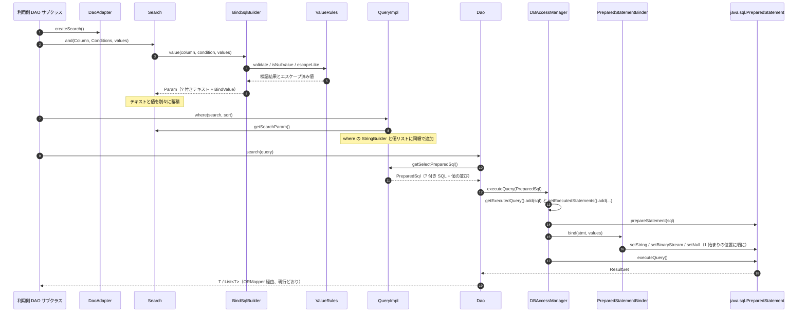

# Services — SQL パラメータ化（PreparedStatement 化）

## 上流成果物との関係

- **`requirements.md`**（requirements-analysis, 2.3）— CON-5（JDBC ドライバは利用側が供給）、CON-6（ORM フレームワーク非依存）、NFR-7（性能目標なし）、OOS-1（利用側アプリケーションは対象外）。これらが本文書の適用範囲を決める。
- **`architecture.md`**（codekb）— 「単一モジュールの層化ライブラリ」であり、ネットワーク面もデプロイ単位も持たないという事実。
- **`component-inventory.md`**（codekb）— ライブラリ内のコンポーネント一覧。デプロイ可能なプロセスは 1 つも含まれない。
- **`stories.md`**（user-stories, 2.4）/ **`team-practices`**（practices-discovery, 2.2）— 本スコープで **SKIP** のため存在しない。

---

## 本ステージにおける「サービス」の適用範囲

AI-DLC の用語（`stage-protocol.md` §9）では、**サービス**は「デプロイ可能なプロセスまたはコンテナ（API サーバ、ワーカー、フロントエンドアプリ等）」を指す。

**tamacat-dao にはサービスが存在しない。** これは設計判断ではなく、対象システムの性質である。

`business-overview.md` が記録するとおり、`org.tamacat:tamacat-dao` は Maven の `jar` パッケージングで配布される**スタンドアロンの Java データアクセスライブラリ**であり、アプリケーションでもサービスでもなく、ネットワーク面を一切持たない。利用者は jar をリンクしてクラスを継承する Java プログラムである。本取り組みはこのライブラリ内部の SQL 生成／実行経路のみを対象とし（CON-4 / OOS-1）、プロセス構成も配置も変更しない。

したがって、本ステージの stage 定義が求める以下の項目は**該当なし**である。

| 求められる項目 | 本プロジェクトでの状態 |
|---|---|
| サービス定義と責務 | 該当なし — デプロイ可能なプロセスが存在しない |
| オーケストレーションパターン（コレオグラフィ / オーケストレーション） | 該当なし — 協調すべきサービスが 2 つ以上存在しない |
| サービス間通信契約 | 該当なし — サービス境界を越える通信が存在しない |
| サービスのライフサイクルとスケーリング特性 | 該当なし — ライブラリはホストプロセスのライフサイクルに従う |

以下では、該当なしで済ませられない 2 点——**ライブラリが担う実行時の役割**と、**それが利用側プロセスに課す前提**——を記録する。これらは Construction 以降（とくに 3.6 Build and Test）が参照する。

---

## ライブラリが担う実行時の役割

サービスではないが、ライブラリは利用側プロセスの中でいくつかの**実行時の役割**を持つ。本取り組みが変えるもの・変えないものを明示する。

### R-1. SQL 組み立て（本取り組みで変わる）

| 項目 | 内容 |
|---|---|
| 担当 | `Search` / `QueryImpl` / `BindSqlBuilder` / `SQLParser` |
| 実行文脈 | 呼び出し側スレッド。状態は `Query` / `Search` インスタンスに閉じる |
| 変更 | 値を SQL テキストに描画する代わりに、`?` と `BindValue` の対で保持するようになる |
| 並行性 | 現行と同じ。`QueryImpl` は単回使用（CON-7）であり、インスタンスをスレッド間で共有しない前提は変わらない。値リストも同じライフサイクルに従う |

### R-2. JDBC セッション管理（本取り組みで変わらない）

| 項目 | 内容 |
|---|---|
| 担当 | `DBAccessManager` |
| 実行文脈 | 名前ごとのシングルトン（静的 `MANAGER` マップ）上の `ThreadLocal` フィールド（`architecture.md` の Cross-Cutting Concerns） |
| 変更 | 実行メソッドが `PreparedSql` を受け取る版を追加するのみ。セッションの保持形態・スレッドモデルは不変 |
| 注意 | 現行の `release()` が静的マップを instance ロックで変更する問題（`code-quality-assessment.md` #8）は `requirements.md` OOS-6 によりスコープ外。本取り組みはこれを変えない |

### R-3. 接続プーリング（本取り組みで変わらない）

| 項目 | 内容 |
|---|---|
| 担当 | `ConnectionManager` / `StackObjectPool` / `JdbcConfig` 系 |
| 変更 | なし。`PreparedStatement` はプールされた `Connection` から都度生成される |
| 注意 | `PreparedStatement` のキャッシュは行わない（OOS-2 / NFR-7）。バインド化により本来得られる再利用の利点は、本取り組みでは取りに行かない |

### R-4. トランザクション制御（本取り組みで変わらない）

| 項目 | 内容 |
|---|---|
| 担当 | `Transaction` / `TransactionStateManager` |
| 変更 | なし。`PreparedStatement` も同じ `Connection` 上で実行されるため、コミット単位は不変 |

### R-5. 実行の観測（本取り組みで拡張される）

| 項目 | 内容 |
|---|---|
| 担当 | `DBAccessManager.getExecutedQuery()` / `getExecutedStatements()`、`DaoExecuteHandler` SPI |
| 変更 | バインド値を含む記録（`ExecutedStatement`）が追加される（FR-4.1）。`getExecutedQuery()` は SQL テキストのみを保持し続ける（Q6 = B） |
| 注意 | FR-4.2 により、記録されるバインド値にマスクや既定オフの条件は設けない。この記録は `ThreadLocal` のリストであり、利用側プロセスのメモリ内に平文で存在する |

---

## 利用側プロセスに課す前提

ライブラリとして、利用側に課す前提が本取り組みでどう変わるかを記録する。**変わらないことの確認**が主目的である。

| 前提 | 現行 | 変更後 | 根拠 |
|---|---|---|---|
| JDBC ドライバの供給 | 利用側が classpath に置く | 変わらない | CON-5 |
| ドライバが `PreparedStatement` を実装していること | BLOB 経路でのみ必要 | **すべての実行経路で必要になる** | FR-1、`architecture.md` の Execution Surface |
| Java 実行環境 | Java 8 以上 | 変わらない | CON-1 / NFR-4 |
| 追加の第三者ライブラリ | `tamacat-core` と JSON-P のみ | 変わらない（Q8 = A により新規依存を追加しない） | CON-6 |
| 再コンパイル | — | **不要**（既存 API を一切削除・変更しないため） | NFR-3 |
| DAO サブクラスの改修 | — | **不要**（旧 `getInsertSQL(T)` 等の override はそのまま動く） | F2 の互換シム |

**「すべての実行経路で `PreparedStatement` が必要になる」ことの意味**: 現行は BLOB 経路だけが `Connection.prepareStatement` を使い、他はすべて `Statement` を使う。変更後は `Dao` の実行が `PreparedSql` 経路に切り替わるため、通常の SELECT / INSERT / UPDATE / DELETE も `prepareStatement` を通る。`java.sql.Connection` の実装として `prepareStatement` は必須メソッドであり、実用的な JDBC ドライバで未実装のものはない。ただし**現行のテスト用 `MockConnection` は `prepareStatement` の `sql` 引数を破棄している**ため、テスト実行の観点ではこの変更が効く。これが FR-8.1（mock 拡張、Q8 = A）を必須にする理由の一つである。

---

## 実行フローの変化

本取り組みの前後で、1 回の SELECT がたどる経路がどう変わるかを示す。

<!-- Text fallback: 利用側 DAO が Search を作り and(Column, Conditions, values) を呼ぶと、Search は BindSqlBuilder に委譲する。BindSqlBuilder は ValueRules に型検証・空値判定・LIKE エスケープを依頼し、? 付きテキストと BindValue を対にした Param を返す。Search はテキストと値を別々に蓄積する。Query.where(search, sort) が呼ばれると QueryImpl は Search の getSearchParam() からテキストと値を対で取り、自身の where StringBuilder と値リストに同じ順序で追加する。Dao.search(query) は query.getSelectPreparedSql() を呼んで PreparedSql を得て、DBAccessManager.executeQuery(PreparedSql) に渡す。DBAccessManager は SQL テキストを getExecutedQuery に、SQL と値を getExecutedStatements に記録してから prepareStatement し、PreparedStatementBinder が値を 1 始まりの位置に順に適用して execute する。ResultSet の ORMapper によるマッピングは現行どおり変わらない。 -->

**現行との差分**: 手順 5〜7（`ValueRules` への委譲と `Param` の生成）、手順 13〜15（`prepareStatement` + `bind`）が新規である。手順 1〜4 と手順 17（マッピング）は現行と同一であり、利用側のコードは変わらない。

---

## 段階的な移行の可能性

`requirements.md` の Sequencing Approach（`scope-document.md` 由来の walking-skeleton-first）に対して、本設計が許す分割の性質を記録する。実際の Bolt 順序の確定は Delivery Planning（2.8）が行う。

本設計は**新経路を旧経路と並置する**構造であるため、経路単位で段階的に切り替えられる。

| 切り替え単位 | 独立して動くか | 根拠 |
|---|---|---|
| SELECT（`Search` 経由） | 独立して動く | `Dao.search` / `searchList` だけを新経路にしても、INSERT/UPDATE/DELETE は旧経路のまま動作する |
| SELECT（`prepare()` 経由） | SELECT（`Search` 経由）に依存 | `Param` と `BindSqlBuilder` を共有するため |
| INSERT / UPDATE / DELETE | 独立して動く | 新しい protected 拡張点を override しないサブクラスは互換シム経由で旧挙動を維持する |
| サブクエリ（FR-1.6） | SELECT に依存 | 子 `Query` の `getSelectPreparedSql()` を使うため |
| 方言個別（MySQL / Oracle） | 汎用経路に依存 | 方言クラスは `Dao` / `Search` を継承するため |
| 既存欠陥の是正（FR-6.1〜6.4） | 独立して動く | いずれもバインド化とは別の修正 |

**walking skeleton の最小単位**: `scope-document.md` は「1 経路（単純な WHERE の比較条件）を SQL 組み立てから実行まで端から端まで通す」としている。本設計では、これは `ValueRules` + `BindSqlBuilder` + `Param` + `PreparedSql` + `BindValue` + `PreparedStatementBinder` + `Search.and` の値蓄積 + `QueryImpl.getSelectPreparedSql` + `Dao.search` + `DBAccessManager.executeQuery(PreparedSql)` + mock 拡張を通す範囲に相当する。これが最小の縦切りである。
