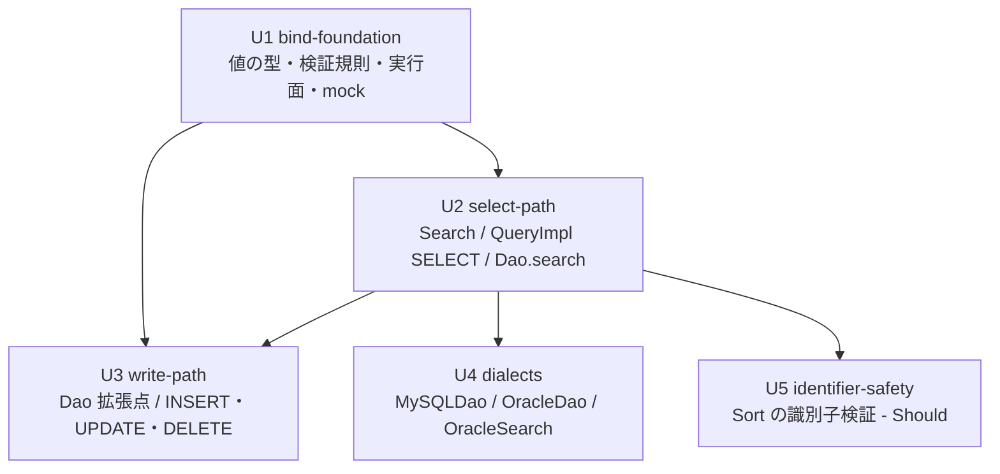

# Unit of Work Dependency — SQL パラメータ化（PreparedStatement 化）

## 上流成果物との関係

- **`component-dependency.md`**（application-design, 2.6）— 依存マトリクス（C-1〜C-7 / M-2〜M-7）、順序の不変条件、共有される可変状態、ブラストレーダス。本文書の Unit 依存は、この**コンポーネント依存の射影**である。Unit 境界が現行の依存方向（dao → sql → pool）に逆行しないことをここで確認する。
- **`components.md`**（同上）— 各 Unit がどのコンポーネントを所有するかの対応は `unit-of-work.md` を参照。
- **`component-methods.md`**（同上）— Unit 間の統合点は、この文書が確定させた公開メソッドシグネチャそのものである。本ステージが新たな契約を作ることはない。
- **`services.md`**（同上）— 「段階的な移行の可能性」表。本文書の並行可能性はこの表の「独立して動くか」列と整合する。
- **`decisions.md`**（同上）— ADR-011（値アキュムレータの分離と結合順）が Unit をまたぐ不変条件を定めている。「Unit をまたぐ不変条件」節で扱う。
- **`requirements.md`**（requirements-analysis, 2.3）— FR-1.6（サブクエリ）、CON-7（`QueryImpl` の単回使用）。
- **`stories.md`**（user-stories, 2.4）— 本スコープで **SKIP** のため存在しない。Unit と要件の対応は `unit-of-work-story-map.md` を参照。

**本文書はトポロジーのみを記述する。** 実装順序の推奨もクリティカルパスの特定も行わない。それらは Delivery Planning（2.8）が本 DAG を入力として決定する経済的判断である。

---

## 依存 DAG



<!-- Text fallback: U1 bind-foundation は依存を持たない。U2 select-path は U1 に依存する。U3 write-path は U1 と U2 の両方に依存する。U4 dialects は U2 に依存する。U5 identifier-safety は U2 に依存する。閉路はない。 -->

**辺の意味**: 「A --> B」は「B が A に依存する」——B の実装が A の提供する型・メソッド・状態を必要とする、という意味である。

### 各辺の根拠

| 辺 | 根拠 |
|---|---|
| U1 → U2 | `Search` と `QueryImpl` は `BindSqlBuilder.value(...)` で `Param` を得る。`Dao.search` は `DBAccessManager.executeQuery(PreparedSql)` を呼ぶ。いずれも U1 が新設する型とメソッド |
| U1 → U3 | `getInsertPreparedSql` / `getUpdatePreparedSql` は `PreparedSql` を組む。BLOB は `BindValue` と `PreparedStatementBinder` の `setBinaryStream` 経路を使う（FR-1.5） |
| U2 → U3 | `getUpdatePreparedSql` は `setValues ++ whereValues` の順で値を結合する（ADR-011）。`whereValues` と `addWhere(String, Param)` は U2 が導入する。`getDeletePreparedSql` / `getDeleteAllPreparedSql` は `whereValues` のみを使う。加えて `Query` インターフェースの新 `default` メソッド宣言を U2 が一括して追加し、U3 は override を足すだけとする |
| U2 → U4 | `MySQLDao.searchList` / `OracleDao.searchListForOracle` は `query.getSelectPreparedSql()` を使い、WHERE より後ろに LIMIT / rownum を連結する。U2 の SELECT 経路が前提 |
| U2 → U5 | `Sort` は `Query.where(Search, Sort)` / `and(Search, Sort)` / `or(Search, Sort)` / `orderBy` を通じて SELECT 文に適用される。検証をどの層に置くかは、これらの経路がバインド版に切り替わった形の上で決まる |

### 存在しない辺（明示）

| 辺 | なぜ存在しないか |
|---|---|
| U3 → U4 | 方言クラスは `Dao` / `Search` を継承するが、`MySQLDao` / `OracleDao` が override するのは `searchList` 系のみである。INSERT / UPDATE / DELETE の経路は継承した実装をそのまま使い、方言側で書き換えない。U4 は U3 の成果物を必要としない |
| U4 → U3 | 同上。逆向きも成立しない |
| U3 → U5、U4 → U5 | `Sort` は SELECT 文の ORDER BY 位置にのみ現れる。書き込み経路にも方言固有のページング経路にも現れない |
| U1 → U4、U1 → U5 | 推移的（U1 → U2 → U4 / U5）であり、直接の辺としては冗長。下記のエッジブロックは**直接依存のみ**を宣言する |

---

## 機械可読なエッジブロック

下流のバッチ算出はこのブロックから行われる。散文ではなくこちらが正である。

```yaml
units:
  - name: bind-foundation
    kind: library
    depends_on: []
  - name: select-path
    kind: library
    depends_on: [bind-foundation]
  - name: write-path
    kind: library
    depends_on: [bind-foundation, select-path]
  - name: dialects
    kind: library
    depends_on: [select-path]
  - name: identifier-safety
    kind: library
    depends_on: [select-path]
```

**閉路がないことの確認**: `bind-foundation` は依存を持たない。`select-path` は `bind-foundation` のみに依存する。`write-path` / `dialects` / `identifier-safety` はいずれも先行する 2 つのみに依存し、互いを参照しない。したがって `bind-foundation → select-path → {write-path, dialects, identifier-safety}` の 3 階層で順序付けが完結し、閉路は存在しない。

---

## Unit 間の統合点

統合点はネットワーク契約でもイベントでもなく、**Java の型とメソッドシグネチャ**である。すべて `component-methods.md` が確定済みであり、本ステージが新たに定義したものはない。

### U1 が提供し、U2 / U3 / U4 が消費するもの

| 種別 | 要素 | 消費側 |
|---|---|---|
| 型 | `Param`（`getSql()` / `getValues()` / `size()` / `of(...)` / `and(Param)` / `or(Param)`） | U2、U3 |
| 型 | `PreparedSql`（`getSql()` / `getValues()` / `getBindIndexOf(DataType,int)` / `of(...)` / `ofLiteral(...)` / `hasUnboundPlaceholders()`） | U2、U3、U4 |
| 型 | `BindValue`（`getType()` / `getValue()` / `getStream()` / `isNull()` / `of` / `ofStream` / `ofNull`） | U2、U3 |
| メソッド | `BindSqlBuilder.value(Column, Conditions, String...)` / `placeholder(Column, String)` / `sqlFunction(Column, String)` | U2、U3 |
| メソッド | `ValueRules.validate` / `isNumeric` / `isNullValue` / `isSqlFunction` / `isRequiredButEmpty` / `escapeLike` | U2、U3（U1 内の `SQLParser` も） |
| メソッド | `DBAccessManager.executeQuery(PreparedSql)` / `executeUpdate(PreparedSql)` / `getExecutedStatements()` | U2、U3、U4 |
| テスト基盤 | `MockPreparedStatement.getPreparedSql()` / `getBoundValue(int)` / `getBoundValues()` | U2、U3、U4 |

### U2 が提供し、U3 / U4 / U5 が消費するもの

| 種別 | 要素 | 消費側 |
|---|---|---|
| 内部状態 | `QueryImpl.whereValues`（WHERE テキストと 1 : 1 の値リスト） | U3 |
| メソッド | `QueryImpl.addWhere(String condition, Param param)`（protected） | U3 |
| メソッド | `Query.getSelectPreparedSql()` | U4 |
| インターフェース宣言 | `Query` の新 `default` メソッド 8 個（U2 が一括宣言、U3 が `getInsertPreparedSql` 等を override） | U3 |
| メソッド | `Dao.executeQuery(PreparedSql)`（protected） | U4 |
| 経路 | `Query.where(Search, Sort)` / `and(Search, Sort)` / `or(Search, Sort)` / `orderBy` のバインド版 | U5 |

### 共有される可変状態

`component-dependency.md`「共有される可変状態」表のうち、**Unit をまたいで共有されるのは 1 つだけ**である。

| 状態 | 導入 Unit | 消費 Unit | 並行性 |
|---|---|---|---|
| `QueryImpl.whereValues` | U2 | U3 | `QueryImpl` インスタンスに閉じる。スレッド間共有なし前提（現行と同じ、CON-7） |

`setValues` / `insertValues` は U3 内のメソッドローカルに近い生存期間であり、Unit をまたがない。`Search` の 3 状態は U2 に閉じる。`DBAccessManager` の `ThreadLocal` は U1 が導入し、以降の Unit は読み書きの経路を増やさない。

---

## 並行開発の機会

Q6 = A により、同時に着手できる Unit の組を明示する。

| 段 | 同時に着手できる Unit | 前提 |
|---|---|---|
| 1 | `{U1}` | なし |
| 2 | `{U2}` | U1 完了 |
| 3 | `{U3, U4, U5}` | U2 完了 |

**段 3 の 3 Unit が互いに独立である根拠**:

- **触るファイルが重ならない。** U3 は `Dao.java` / `DaoAdapter.java` / `QueryImpl.java`、U4 は `MySQLDao.java` / `OracleDao.java` / `OracleSearch.java`、U5 は `Sort.java`。**U4 は `QueryImpl` を変更せず、`getSelectPreparedSql()` という公開 API の呼び出し側として利用するだけである。** U3 は書き込み経路の担当であり `getSelectPreparedSql()` を呼ばない。したがって段 3 で `QueryImpl.java` に書き込むのは U3 のみであり、書き込みの競合はない。
- **`services.md`「段階的な移行の可能性」表と整合する。** 同表は「INSERT / UPDATE / DELETE」を独立、「方言個別」を汎用経路に依存、「既存欠陥の是正」を独立と記録しており、本 DAG の段 3 はこれをそのまま Unit に写したものである。
- **U5 は Should Have であり、落としても段 3 の他 2 つに影響しない。**

**有効なトポロジカル順序が複数存在する。** 段 3 の 3 Unit の並べ方だけで 6 通りあり、さらに並行実行を許せばバッチの組み方はそれ以上になる。**どれを選ぶかは Delivery Planning（2.8）の判断**であり、本文書は選ばない。

---

## Unit をまたぐ不変条件

DAG の辺だけでは表現できないが、Unit の実装が守らなければ壊れる規則が 2 つある。いずれも `decisions.md` と `component-dependency.md` が定めたものであり、ここでは「どの Unit の境界をまたぐか」を明示する。

### 不変条件 1 — 値リストはテキストアキュムレータと 1 : 1（ADR-011）

**またぐ境界**: U2 → U3

U2 が `whereValues` を導入し、U3 が `setValues` / `insertValues` を追加して `setValues ++ whereValues` の順で結合する。U2 が `whereValues` を「生成順に append する単一リスト」として実装すると、U3 の `getUpdatePreparedSql` で**全ての値が 1 つずつずれる**。

このずれは例外を起こさない。`?` の個数（5）と値の個数（5）が一致するため `PreparedSql.of(...)` の個数検査を通り、JDBC のパラメータ数検査も通る。誤った値が誤ったカラムに書き込まれた UPDATE が正常終了する。

```
最終テキスト:  UPDATE users SET password=?,dept_id=?,update_date=?,age=? WHERE users.user_id=?
? の順序:      [password, dept_id, update_date, age, user_id]
単一リストの順: [user_id, password, dept_id, update_date, age]
```

**検出できるのは U1 が用意した mock の位置・値アサートだけである。** U2 の完了時点では SELECT しか通らないためこのずれは現れず、U3 の完了時点で初めて現れる。

### 不変条件 2 — `Search` の 3 状態は単一の append メソッドを経由する

**またぐ境界**: U2 の内部（ただし U4 が `MySQLSearch` / `OracleSearch` を継承するため境界に接する）

`Search` は `search`（リテラル系）/ `bindSearch`（バインド系）/ `bindValues` を保持し、3 つのうち 1 つだけを変更する経路を作ってはならない（`component-methods.md` M-3「同期規則」）。`Param.of(...)` の個数検査は個数のずれを検出するが、「両方とも append し忘れた」場合は個数が一致したまま述語が欠落する。

U4 が扱う `MySQLSearch` / `OracleSearch` は `Search` を継承するが、`and` / `or` を override しない（`components.md` M-7 が「`MySQLSearch` 変更なし」と記録）。したがって U2 が private な `append(String literal, Param bind, String connector)` に閉じ込めれば、U4 側で破られる経路はない。

### `?` 個数の数え方の前提

新経路（`of(...)` で作られた `PreparedSql`）は生成時に個数検査を通るため `hasUnboundPlaceholders()` は常に偽であり、走査コストは旧経路にのみかかる。旧経路（`ofLiteral` で作られたもの）は値がリテラルとして埋め込まれており値の中に `?` を含みうるため、**引用符の外にある `?` のみを数える**（ADR-012）。走査規則の詳細は Functional Design（3.1）で確定する。この規則は U1 が実装し、U3 の互換シム経路が実際に依存する。

---

## ブラストレーダスと Unit の対応

`component-dependency.md`「変更の影響範囲」表を Unit 別に射影する。1 つのファイルを複数の Unit が触るケースを明示するためである。

| 変更ファイル | 影響度 | 触る Unit | 重複の扱い |
|---|---|---|---|
| `Query.java`（interface） | 高 | **U2**（`default` 8 個の宣言と `@Deprecated` 5 個を一括追加） | U3 はこのファイルを変更しない。override は `QueryImpl.java` 側 |
| `QueryImpl.java` | 高 | **U2**（`whereValues` / SELECT 系 / サブクエリ）、**U3**（`setValues` / `insertValues` / 書き込み系 / FR-6.2） | **重複あり。** U2 → U3 の依存辺により逐次化されるため競合しない |
| `Search.java` | 高 | **U2** | 単独 |
| `Dao.java` / `DaoAdapter.java` | 高 / 中 | **U2**（`prepare` / `executeQuery(PreparedSql)` / `search` / `searchList`）、**U3**（新 protected 拡張点 / `executeUpdate(PreparedSql)` / `create`・`update`・`delete`） | **重複あり。** 同上、逐次化される |
| `DBAccessManager.java` | 高 | **U1** | 単独 |
| `SQLParser.java` | 中 | **U1**（`ValueRules` への委譲化と `@Deprecated`） | 単独 |
| `MySQLDao.java` / `OracleDao.java` / `OracleSearch.java` | 中 | **U4** | 単独 |
| `MockConnection.java` / `MockPreparedStatement.java` | 中（テストのみ） | **U1** | 単独 |
| `Sort.java` | 未評価（現行は変更対象外） | **U5** | 単独。`application-design` は `Sort` を「変更しないコンポーネント」としており、この Unit の設計は 3.1 が新規に行う |
| 新規 7 ファイル（C-1〜C-7） | 低 | **U1** | 単独 |

**重複が 2 ファイル（`QueryImpl.java` / `Dao.java`）にあり、いずれも U2 と U3 の間である。** U2 → U3 の依存辺がこの 2 ファイルを逐次化するため、段 3 の並行実行（U3 / U4 / U5）でファイル競合は生じない。段 3 で `QueryImpl.java` を触るのは U3 のみ、`Dao.java` を触るのも U3 のみである。

---

## テストへの影響と Unit の対応

`component-dependency.md`「テストへの影響」表を Unit 別に射影する。Q7 = B により、各テストの書き換えは対応する Unit の内部作業である。

| テストファイル | 影響 | 担当 Unit |
|---|---|---|
| `SQLParserTest.java` | 変更不要（`SQLParser` の戻り値不変）。ただし `ValueRules` 委譲後も挙動が変わらないことをこのテストが検証する | U1 |
| `SearchTest.java` | 変更不要（`getSearchString()` 不変）。バインド版のアサートを追加 | U2 |
| `QueryImplTest.java` | 変更不要（旧 `getSelectSQL()` 等の戻り値不変）。SELECT のバインド版を U2、書き込みのバインド版を U3 が追加 | U2 / U3 |
| `MySQLDaoTest.java` | `param()` のアサートは変更不要。`prepare()` 版を U2、LIMIT バインドのアサートを U4 が追加 | U2 / U4 |
| `UserDaoTest.java` | **変更が必要**。`getExecutedQuery().get(0)` のアサート文字列が `?` 入りに変わる。SELECT 経路ぶんを U2、INSERT / UPDATE / DELETE 経路ぶんを U3 | U2 / U3 |
| `QueryImplTest02` / `QueryImplTest03` / `UserDaoTest2` | FR-8.3 により実行対象に加える。BLOB プレースホルダのアサートは新経路で位置が変わりうる | Build and Test（3.6）が実行対象化を担当。アサート修正は U3 |

**FR-8.2 の対応表**は Q7 = B により U2 / U3 / U4 がそれぞれ該当行を起こし、**Build and Test（3.6）が集約する**。断片化が生じるため、3.6 は各 Unit が起こした行の合流を明示的な作業として扱う必要がある。
